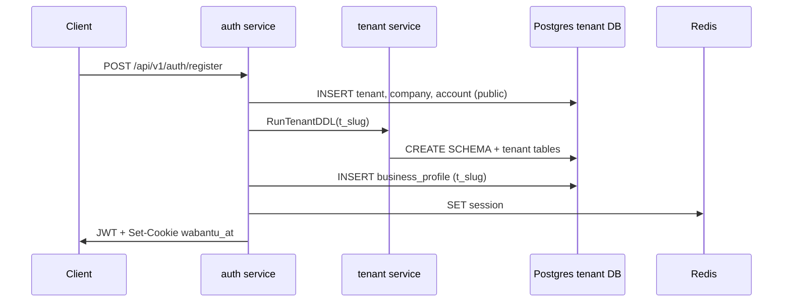
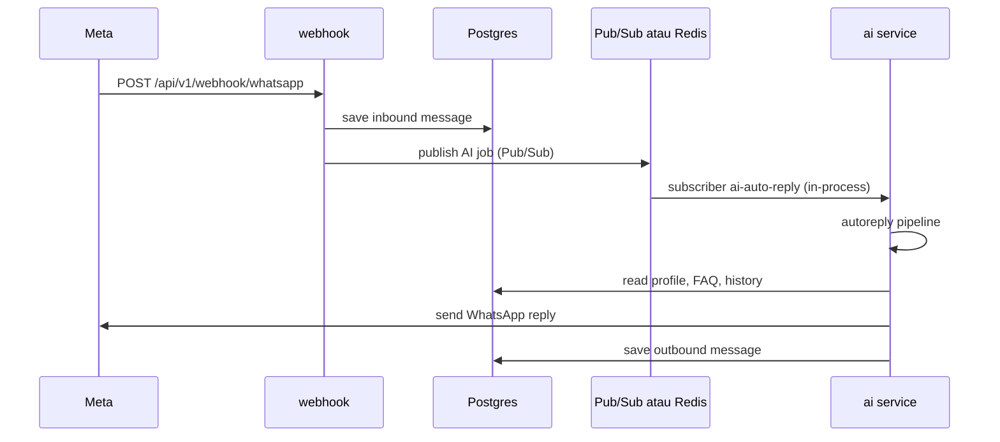

# WABantu Flow Guide (Encore.go)

Panduan ini untuk kamu yang baru dengan **Encore** dan **Go**. Fokus: **cara kerja dari ujung ke ujung**, **perintah yang harus dijalankan**, dan **perbedaan dengan NestJS** di `api/`.

Referensi paralel (stack lama): `api/APP_FLOW_GUIDE.md` (NestJS). **Frontend aktif:** `web-frontend/` → **hanya** `api-go/` (bukan port 3001).

---

## 0) Checklist persiapan (wajib sebelum `encore run`)

| Prasyarat | Kenapa | Verifikasi |
|-----------|--------|------------|
| Docker Desktop | Encore provision Postgres lokal | `docker info` |
| Go 1.24+ | Build service Go | `go version` |
| Encore CLI | `encore run`, secrets, migrasi | `encore version` |
| Redis (`infra`) | Session JWT, rate limit, import staging, pub inbox SSE | `redis-cli ping` |
| `encore auth login` | Set/baca secrets lokal | tidak error saat `encore secret set` |
| App di Encore Cloud | `encore.app` terdaftar | tidak `app_not_found` |
| Secrets minimal | Auth + Redis | `encore secret list` → `JWTSecret`, `DataEncryptionKey`, `RedisURL` |
| `../api/.env` | Sumber untuk `setup-secrets-from-env.sh` | file ada |
| `encore check` | Validasi graph API | exit 0 |

**Tidak perlu untuk dev api-go + web-frontend:**

- Nest `api/` (`npm run start:dev` port 3001)
- `ai-worker/` (BullMQ Node → Nest)
- `ai-worker-go/` (eksperimen terpisah; AI production = Pub/Sub di `encore run`)
- Postgres `infra/postgres` untuk data Nest (DB Encore terpisah)

---

## 1) Gambaran besar monorepo

```
WABantu/
├── infra/              Redis (+ Postgres opsional untuk stack Nest lama)
├── api/                NestJS — referensi saja (port 3001) — JANGAN dipakai FE
├── api-go/             Encore Go — port 4000, path /api/v1/..., Encore secrets
├── ai-worker/          Hanya untuk stack Nest (abaikan jika pakai api-go)
├── ai-worker-go/       Opsional / eksperimen — bukan jalur default api-go
└── web-frontend/       Next.js :3000 → rewrite /api/v1 → api-go :4000
```

**Stack dev yang benar (3 terminal):**

| # | Terminal | Perintah | Port |
|---|----------|----------|------|
| 1 | `infra/` | `docker compose up -d redis` | 6379 |
| 2 | `api-go/` | `encore run` (setelah secrets) | 4000, 9400 |
| 3 | `web-frontend/` | `npm run dev` (Node 18+) | 3000 |

| Langkah sekali per laptop | Perintah | Di mana |
|---------------------------|----------|---------|
| Login Encore | `encore auth login` | mana saja |
| Daftar/link app | `encore app link` atau init (lihat README) | `api-go/` |
| Import secrets | `./scripts/setup-secrets-from-env.sh` | `api-go/` |

---

## 2) Apa itu Encore? (mental model)

NestJS = satu proses Node + kamu wiring module manual.

Encore = **banyak service Go** dalam satu app (`encore.app`), framework yang:

1. Membaca komentar `//encore:api ...` → generate routing HTTP.
2. Membaca `sqldb.NewDatabase` → provision Postgres + migrasi.
3. Membaca `pubsub.NewTopic` → antrian/message bus.
4. Membaca `var secrets struct { ... }` → inject secret saat runtime.
5. Menyediakan **dev dashboard** di `http://localhost:9400`.

Kamu **tidak** menjalankan `go run auth/auth.go`. Selalu:

```bash
cd api-go
encore run
```

Itu compile **semua** service sekaligus.

---

## 3) Config: `.env` vs Encore Secrets

### NestJS (`api/`)

```bash
cp api/.env.example api/.env
# edit api/.env
npm run start:dev
```

### Encore (`api-go/`)

File `api/.env` **tidak dibaca otomatis**. Nilai yang sama harus masuk ke Encore:

```bash
encore auth login
cd api-go
chmod +x scripts/setup-secrets-from-env.sh
./scripts/setup-secrets-from-env.sh
```

Atau satu per satu:

```bash
printf '%s' 'nilai-rahasia' | encore secret set --type local NamaSecret
```

**Mengapa harus login?** CLI Encore menyimpan secret (termasuk `--type local`) lewat akun Encore Cloud — gratis, sekali login per mesin.

---

## 4) URL & port

| | NestJS `api/` (legacy) | Encore `api-go/` (aktif) |
|---|------------------------|---------------------------|
| Base URL dev | `http://localhost:3001` | `http://localhost:4000` |
| Prefix path | `/api/v1` | **`/api/v1`** (sama) |
| Login | `POST /api/v1/auth/login` | `POST /api/v1/auth/login` |
| Inbox | `GET /api/v1/inbox/conversations` | `GET /api/v1/inbox/conversations` |
| Dev UI | — | `http://localhost:9400` (trace, API explorer) |
| Frontend | proxy ke 3001 (dulu) | Next rewrite `/api/v1/*` → `:4000` |

Contoh curl login (langsung ke api-go):

```bash
curl -i -X POST http://localhost:4000/api/v1/auth/login \
  -H 'Content-Type: application/json' \
  -d '{"email":"owner@example.com","password":"secret123"}'
```

Respons: JSON (sering `{ "success": true, "data": { ... } }`) + header `Set-Cookie: wabantu_at=...`.

Endpoint auth butuh auth:

```bash
curl http://localhost:4000/api/v1/auth/me \
  -H "Authorization: Bearer <accessToken_dari_body_login>"
```

Dari browser lewat Next: `http://localhost:3000/api/v1/auth/me` (rewrite ke api-go).

---

## 5) Cara path endpoint terbentuk (Encore)

Path **langsung** dari komentar di atas fungsi Go:

```go
//encore:api auth method=GET path=/api/v1/inbox/conversations
func ListConversations(ctx context.Context, p *ListConversationsParams) (*ListConversationsResponse, error)
```

| Tag | Arti |
|-----|------|
| `public` | Tanpa login |
| `auth` | Wajib JWT + session Redis valid |
| `private` | Hanya service internal Encore (bukan internet publik) |
| `raw` | Handler `http.ResponseWriter` (cookie, webhook, dll) |
| `tag:owner` / `tag:super_admin` | Role guard (custom) |

**Aturan query GET (penting):** parameter query hanya boleh tipe dasar (`string`, `int`, `bool`) — **bukan pointer** `*string`. Filter opsional = string kosong.

**Aturan path `:id`:** parameter path harus argumen terpisah:

```go
//encore:api auth method=PATCH path=/api/v1/inbox/conversations/:id
func UpdateConversation(ctx context.Context, id string, p *UpdateConversationParams) (*UpdateConversationResponse, error)
```

---

## 6) Arsitektur request (contoh login)

```
Browser / curl
    │
    ▼ POST /api/v1/auth/login  (port 4000)
┌─────────────────┐
│  auth service   │
│  - cek email_hash│
│  - bcrypt password│
│  - insert session│──► Redis (RedisURL secret)
│  - sign JWT      │
│  - Set-Cookie    │
└────────┬────────┘
         │
         ▼ GET /api/v1/auth/me  (header Bearer atau cookie)
┌─────────────────┐
│ AuthHandler     │──► validasi JWT + cek session Redis
│ auth.Data()     │──► *types.AuthUser { TenantSchema: "t_slug", ... }
└─────────────────┘
```

File kunci: `auth/auth.go`, `auth/session.go`, `shared/types/auth.go`.

---

## 7) Multi-tenant & database

### NestJS (lama)

- `jb_system` → tabel tenant, account
- `jb_tenant` → banyak schema `t_*`

### Encore (api-go) — selaras 2 DB Nest

| Nest | Encore | Isi |
|------|--------|-----|
| `jb_system` | DB **`system`** | `tenant`, `tenant_account`, `tenant_company`, `audit_log`, `feature_flag`, `payment_webhook_map`, … |
| `jb_tenant` | DB **`tenant`** | Schema **`t_<slug>`** per bisnis (inbox, katalog, order, …) |

Saat **register**:

1. Transaksi di **`system`**: insert `tenant`, `tenant_company`, `tenant_account`.
2. `tenant.RunTenantDDL("t_slug")` di DB **`tenant`**: `CREATE SCHEMA` + tabel.
3. Seed `business_profile` + cabang default (`branch.EnsureDefaultBranch`).
4. Akun pelanggan hasil register selalu punya tenant; akun platform admin internal dibuat terpisah lewat bootstrap API.

Akses data tenant:

```go
conn, _ := appdb.TenantConn(ctx, tenant.DataDB.Stdlib(), user.TenantSchema)
```

Perintah DB:

```bash
encore db conn-uri system
encore db conn-uri tenant
encore db shell system
encore db shell tenant --write
```

**DB `encore run` ≠ `infra/postgres` (Nest)** kecuali Anda proxy manual. Data Nest tidak otomatis pindah.

### Rate limiting & kuota

**Dokumen lengkap:** [LIMITS_AND_QUOTAS.md](./LIMITS_AND_QUOTAS.md).

- Middleware global: **400 req/menit/IP** (Redis).
- Login/register: **20 req/menit/IP**; platform bootstrap: **5/menit/IP**.
- Kuota bulanan per plan di `usage/usage.go`; trial = semua fitur + cap ketat.
- Checkout: invoice `pending` → QRIS → `paid` → subscription aktif (`billing` + `payment` webhook).

### Import file (staging)

1. `POST /api/v1/import/preview` — parse CSV/XLSX, simpan **semua baris** di Redis `import:staging:<jobId>` (TTL 24 jam).
2. `POST /api/v1/import/execute` — body: `{ jobId, columnMapping }` → Pub/Sub `file-import`.
3. **Roadmap prod:** staging pindah ke **S3/R2** (seperti Jubelio); API tetap `jobId`.

### Super admin

- Akun internal dibuat lewat `POST /api/v1/internal/platform-admin/bootstrap` (lihat README).
- API: `/api/v1/admin/*`, UI: `/dashboard/admin`.
- Konsol admin: list tenant dengan search/pagination, pantau tenant, override paket, delete tenant dengan konfirmasi schema, dan migrasi schema tenant.

---

## 8) Peta endpoint (api-go)

> Semua path memakai prefix **`/api/v1`**. Base: `http://localhost:4000`.

### Auth (`auth/`)

| Method | Path | Auth | Catatan |
|--------|------|------|---------|
| POST | `/api/v1/auth/register` | public | raw — set cookie + JSON |
| POST | `/api/v1/auth/login` | public | raw |
| POST | `/api/v1/auth/logout` | auth | raw |
| GET | `/api/v1/auth/me` | auth | profil + tenant |
| GET | `/api/v1/team/members` | auth (owner) | `auth/team.go` |
| POST | `/api/v1/team/members` | auth (owner) | undang staff |
| DELETE | `/api/v1/team/members/:id` | auth (owner) | |

### Business (`business/`)

| Method | Path | Auth |
|--------|------|------|
| GET | `/api/v1/business/profile` | auth |
| PATCH | `/api/v1/business/profile` | auth |
| POST | `/api/v1/business/profile/import-preview` | auth |

### Knowledge base (`kb/`)

| Method | Path | Auth |
|--------|------|------|
| GET | `/api/v1/knowledge-base` | auth |
| POST | `/api/v1/knowledge-base` | auth |
| PATCH | `/api/v1/knowledge-base/:id` | auth |
| DELETE | `/api/v1/knowledge-base/:id` | auth |

Query GET: `search`, `category`, `page`, `pageSize` (string kosong = tidak filter).

### Inbox (`inbox/` + `inbox/realtime.go`)

| Method | Path | Auth |
|--------|------|------|
| GET | `/api/v1/inbox/unread-summary` | auth |
| GET | `/api/v1/inbox/stream` | auth (SSE) |
| GET | `/api/v1/inbox/conversations` | auth |
| PATCH | `/api/v1/inbox/conversations/:id` | auth |
| PATCH | `/api/v1/inbox/conversations/:id/read` | auth |
| POST | `/api/v1/inbox/conversations/:id/handoff` | auth |
| POST | `/api/v1/inbox/conversations/:id/ai-resume` | auth |
| GET | `/api/v1/inbox/conversations/:id/messages` | auth |
| POST | `/api/v1/inbox/conversations/:id/messages` | auth |
| GET | `/api/v1/inbox/contacts/:id` | auth |
| PATCH | `/api/v1/inbox/contacts/:id` | auth |

Query daftar percakapan:

- `search` — string
- `unreadOnly` — `"true"` untuk filter unread
- `aiHandled` — `"true"` \| `"false"` \| kosong
- `limit`, `cursor`

Query pesan: `limit`, `offset`, `cursor` (base64).

**Query boolean:** filter `unreadOnly` / `aiHandled` di api-go pakai string `"true"` / `"false"` (bukan boolean JSON di query).

### WhatsApp (`whatsappapi/` + `webhook/`)

| Method | Path | Auth | Catatan |
|--------|------|------|---------|
| GET | `/api/v1/whatsapp/channels` | auth | daftar channel |
| POST | `/api/v1/whatsapp/meta/connect/init` | auth | OAuth URL |
| POST | `/api/v1/whatsapp/meta/connect/callback` | public | tukar `code` |
| DELETE | `/api/v1/whatsapp/channels/:id` | auth | putuskan |
| GET, POST | `/api/v1/webhook/whatsapp` | public raw | webhook Meta |
| GET, POST | `/api/v1/whatsapp/webhook/meta` | public raw | alias sama |
| GET, POST | `/webhook/whatsapp` | public raw | legacy (tanpa prefix) |

Verify token: secret `WebhookVerifyToken`. Saat daftar app Meta, pilih path yang sudah dikonfigurasi di dashboard Meta.

### Layanan lain (ringkas — lihat API Explorer :9400)

| Area | Contoh path |
|------|-------------|
| Billing | `GET /api/v1/billing/overview`, `POST /api/v1/billing/select-plan`, `POST /api/v1/billing/top-up` (invoice `pending`, lihat [LIMITS_AND_QUOTAS.md](./LIMITS_AND_QUOTAS.md)) |
| Payment | `POST /api/v1/payment/create-qris` (wajib `invoiceId` pending), webhook Midtrans → aktivasi paket |
| Orders | `GET/POST /api/v1/orders`, … |
| Catalog | CRUD di `business/catalog.go` |
| Catalog image (AI) | `POST .../import-image/preview`, `GET .../import-image-limits`, `GET/POST .../import-image/draft/:jobId` — [docs/CATALOG_IMAGE_IMPORT.md](./docs/CATALOG_IMAGE_IMPORT.md) |
| Broadcast | `POST /api/v1/broadcast/...` (Business+ berbayar; **trial** boleh dengan kuota 20 kontak/bulan) |
| Import CSV | `POST /api/v1/import/preview`, `/import/execute` |
| Branches | `GET/POST /api/v1/branches` (Pro) |
| Workflow | `GET/POST/PATCH/DELETE /api/v1/workflows` |
| Admin | `GET /api/v1/admin/tenants?q=&page=&pageSize=`, impersonation, override paket, delete tenant (`super_admin`) |
| Finance | `GET /api/v1/finance/dashboard`, `/finance/wallets`, `/finance/transactions`, `/finance/budgets`, `/finance/investments/portfolio`, `/finance/recurring`, `/finance/checklist/today`, `/finance/reports/export` |
| Usage | `GET /api/v1/usage/summary` |
| Health | `GET /api/v1/health`, `/api/v1/health/ready` |

### AI internal (`ai/`)

| Method | Path | Auth |
|--------|------|------|
| POST | `/api/v1/internal/ai/auto-reply` | public + header token |
| POST | `/api/v1/internal/ai/auto-reply/fallback` | public + header token |

Header wajib: `X-Ai-Internal-Token: <AiInternalToken secret>`.

### Leads, billing, analytics, orders, payment, shipping, flags, admin, import

Lihat `README.md` atau jalankan `encore run` → buka **API Explorer** di `http://localhost:9400`.

### Internal / private (service-to-service)

| Path | Pemanggil |
|------|-----------|
| `/internal/tenant/create` | auth saat register |
| `/audit/log` | service lain |
| `/usage/record` | metering |
| `/leads/capture` | pipeline AI / webhook |

---

## 9) Auth flow detail

### Register — `POST /api/v1/auth/register`

Body JSON:

```json
{
  "email": "toko@example.com",
  "password": "minimal-8-char",
  "name": "Owner Name",
  "businessName": "Toko Saya",
  "slug": "toko-saya"
}
```

Alur (`auth/auth.go`):

1. Normalisasi email + `email_hash` (SHA-256).
2. Cek duplikat di `tenant_account`.
3. Buat slug unik → schema `t_<slug>`.
4. Transaksi: insert `tenant`, `tenant_company`, `tenant_account`.
5. `tenant.RunTenantDDL(schema)` + seed `business_profile`.
6. Session Redis + JWT + cookie `wabantu_at`.

### Login — `POST /api/v1/auth/login`

Sama seperti Nest: bcrypt, session baru, JWT, cookie.

### Me — `GET /api/v1/auth/me`

`AuthHandler` validasi token → load session Redis → return user + tenant slug/name.

---

## 10) Enkripsi data sensitif

Sama konsep dengan Nest: field tertentu dienkripsi dengan `DataEncryptionKey` (`shared/crypto/aes.go`). Email lookup pakai `email_hash`.

---

## 11) Alur WhatsApp webhook

```
Meta Cloud API
    │ POST /api/v1/webhook/whatsapp (atau alias legacy)
    ▼
webhook.HandleWhatsAppWebhook (raw)
    │ verify signature (MetaAppSecret, opsional)
    │ parse payload
    ▼
ingestMessage()
    │ resolve tenant via system.whatsapp_inbound_map (unik per meta_phone_number_id)
    │ SET search_path → schema tenant
    │ upsert contact, conversation, message (inbound)
    ▼
pubsub AIJobs.Publish (topic "ai-jobs")
```

File: `webhook/webhook.go`, `whatsapp/whatsapp.go`.

**OAuth / connect channel:** service `whatsappapi/` — init + callback; kirim pesan memakai library `whatsapp/`.

---

## 12) Alur AI auto-reply (jalur default — tanpa `ai-worker/`)

1. Webhook simpan pesan masuk → `ai.PublishInboundJob` → topic Pub/Sub **`ai-jobs`**.
2. Subscriber **`ai-auto-reply`** (`ai/inbound_jobs.go`) jalan **di proses yang sama** dengan `encore run` (bukan proses Node terpisah).
3. Retry Encore + counter Redis; gagal berulang → fallback internal.
4. `ai/autoreply.go` — orchestrator: greeting, order flow (Redis + katalog DB), **catalog_reply** (list/harga dari DB), scope/classifier, FAQ, routing model (Haiku/Sonnet), Anthropic, kirim WhatsApp. Modul: `order_flow.go`, `order_catalog.go`, `catalog_reply.go`, `greeting.go`, `product_scope.go`, `safety.go`, `classifier_routing.go`.
5. **Workflow** (`workflow/`) bisa intercept sebelum AI (keyword → balasan / handoff). CRUD: `GET/POST/PATCH/DELETE /api/v1/workflows` (PATCH/DELETE owner).
6. Log AI (super_admin): `GET /api/v1/admin/tenant/:id/ai-activity` (+ summary); FE `/dashboard/admin/ai-activity`.

Debug manual (opsional):

```bash
curl -X POST http://localhost:4000/api/v1/internal/ai/auto-reply \
  -H "Content-Type: application/json" \
  -H "X-Ai-Internal-Token: $AI_INTERNAL_TOKEN" \
  -d '{"tenantId":"...","tenantSchema":"t_slug","conversationId":"...","inboundMessageId":"..."}'
```

Secret: `AiInternalToken` (sama nilai `AI_INTERNAL_TOKEN` di `api/.env`).

**Stack lama:** `ai-worker/` + Nest — **jangan** dijalankan bersamaan untuk dev FE baru.

**`ai-worker-go/`:** eksperimen Asynq terpisah; bukan requirement `encore run`.

---

## 13) Perintah harian (cheat sheet)

### Hari pertama — setup

```bash
# 1. Tools
brew install go encoredev/tap/encore
docker --version

# 2. Redis (session)
cd /path/to/WABantu/infra
docker compose up -d redis

# 3. Encore login (browser)
encore auth login

# 4. Secrets dari api/.env
cd /path/to/WABantu/api-go
chmod +x scripts/setup-secrets-from-env.sh
./scripts/setup-secrets-from-env.sh
encore secret list

# 5. Run API
encore run
# Buka http://localhost:9400 dan http://localhost:4000
```

### Setiap hari development

```bash
# Terminal 1 — API
cd api-go && encore run

# Terminal 2 — Redis (jika belum)
cd infra && docker compose up -d redis

# Terminal 3 — frontend (Node 18+)
cd web-frontend
cp .env.example .env.local   # sekali
npm install && npm run dev   # :3000
```

### Debug

```bash
encore check                    # validasi graph tanpa full run
encore db shell tenant          # SQL
encore logs                     # jika tersedia di versi CLI
```

### Reset database lokal Encore

Hapus volume Docker yang dibuat Encore untuk Postgres, atau gunakan perintah reset di dokumentasi Encore terbaru — **data dev hilang**.

---

## 14) Mapping env Nest → Encore secret

| `api/.env` | Encore secret |
|------------|---------------|
| `JWT_ACCESS_SECRET` | `JWTSecret` |
| `DATA_ENCRYPTION_KEY` | `DataEncryptionKey` |
| `REDIS_HOST` + `REDIS_PORT` | `RedisURL` → `redis://host:port` |
| `ANTHROPIC_API_KEY` | `AnthropicApiKey` + `AnthropicAPIKey` |
| `AI_INTERNAL_TOKEN` | `AiInternalToken` |
| `META_WEBHOOK_VERIFY_TOKEN` | `WebhookVerifyToken` |

Yang **tidak** dipakai api-go dengan cara yang sama:

| `api/.env` | Catatan |
|------------|---------|
| `SYSTEM_DB_*`, `TENANT_DB_*` | Diganti DB Encore `system` + `tenant` |
| `APP_PORT=3001` | Encore pakai **4000** |
| `API_PREFIX` + `API_VERSION` | Sudah di path Go: **`/api/v1/...`** |

---

## 15) Integrasi `web-frontend/` (sudah dikonfigurasi)

| Variabel | Dev lokal | Fungsi |
|----------|-----------|--------|
| `NEXT_PUBLIC_API_URL` | `/api/v1` | Browser axios same-origin |
| `API_BACKEND_URL` | `http://localhost:4000` | Next rewrite target (`next.config.ts`) |
| `API_URL_INTERNAL` | `http://localhost:4000` | Server Components (`getServerUser`) — `/api/v1` ditambah otomatis di `lib/env.ts` |
| `NEXT_PUBLIC_SSE_API_URL` | opsional `http://localhost:4000` | Inbox SSE langsung ke API (hindari rewrite) |

Alur request:

```
Browser → GET http://localhost:3000/api/v1/inbox/...
       → Next rewrite → http://localhost:4000/api/v1/inbox/...
       → Encore api-go
```

**Jangan** set `API_BACKEND_URL=http://localhost:3001` kecuali sengaja debug Nest.

Detail UI: `../web-frontend/APP_FLOW_GUIDE.md`.

---

## 16) Troubleshooting

### `encore secret set` → not logged in

```bash
encore auth login
```

### `encore run` → fetch secrets failed

Secrets belum di-set. Jalankan `./scripts/setup-secrets-from-env.sh`.

### Register sukses tapi inbox kosong

Normal — tenant baru di DB Encore terpisah dari data Nest lama.

### AI tidak balas

1. Log `encore run`: webhook ingest + publish job.
2. Worker jalan? `AI_INTERNAL_TOKEN` = secret `AiInternalToken`.
3. `curl` internal endpoint (lihat Bagian 12).
4. `AnthropicApiKey` terisi.
5. Conversation `ai_handled = true`, channel connected.

### Meta webhook 403 verify

Secret `WebhookVerifyToken` harus sama dengan token di Meta Developer Console.

---

## 17) File yang paling penting untuk dipelajari

| Urutan | File |
|--------|------|
| 1 | `encore.app` |
| 2 | `auth/auth.go` |
| 3 | `tenant/tenant.go` + `tenant/db.go` |
| 4 | `shared/db/tenant.go` |
| 5 | `webhook/webhook.go` |
| 6 | `ai/api.go` + `ai/autoreply.go` |
| 7 | `inbox/inbox.go` |

Bandingkan dengan Nest: `api/src/auth/auth.service.ts`, `api/src/whatsapp/whatsapp.service.ts`, `api/src/ai/ai-auto-reply.service.ts`.

---

## 18) Diagram alur register (Mermaid)



---

## 19) Diagram alur pesan masuk + AI



---

## 20) Langkah belajar berikutnya

1. `encore auth login` + `setup-secrets-from-env.sh` + `encore run`.
2. Register user baru lewat curl atau API Explorer.
3. `GET /auth/me` dengan token.
4. `PATCH /business/profile` — lengkapi profil.
5. Uji `POST /api/v1/internal/ai/auto-reply` dengan token internal (opsional).
6. Jalankan `web-frontend` (`npm run dev`) — login owner untuk flow tenant, atau login akun bootstrap platform admin untuk `/dashboard/admin`.

Plan subscription: `starter` | `business` | `pro` (alias `basic` = business, tidak di UI). **Trial** (`is_trial`): semua fitur entitlement aktif, kuota di [LIMITS_AND_QUOTAS.md](./LIMITS_AND_QUOTAS.md). Berbayar: broadcast/workflow = business+, multi-branch = pro.
