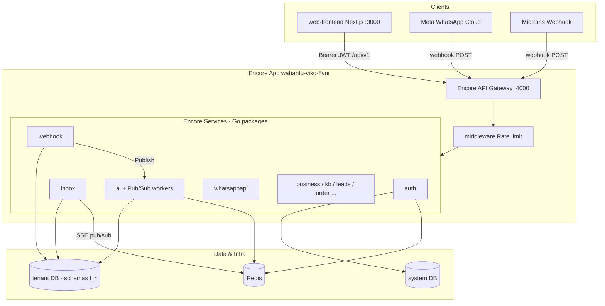
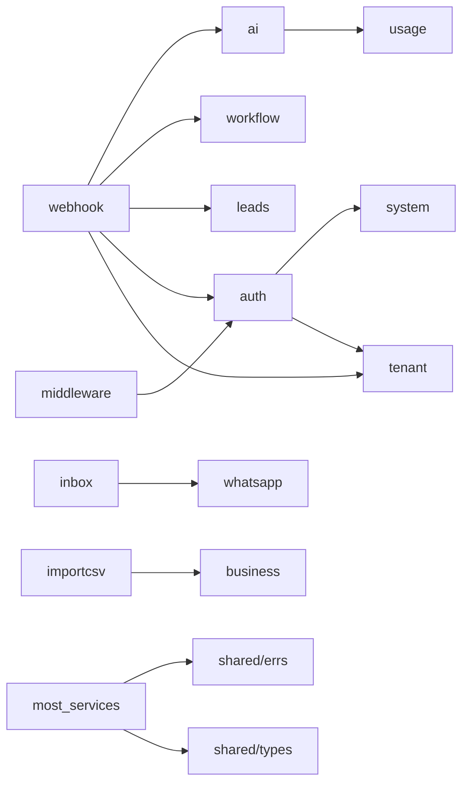
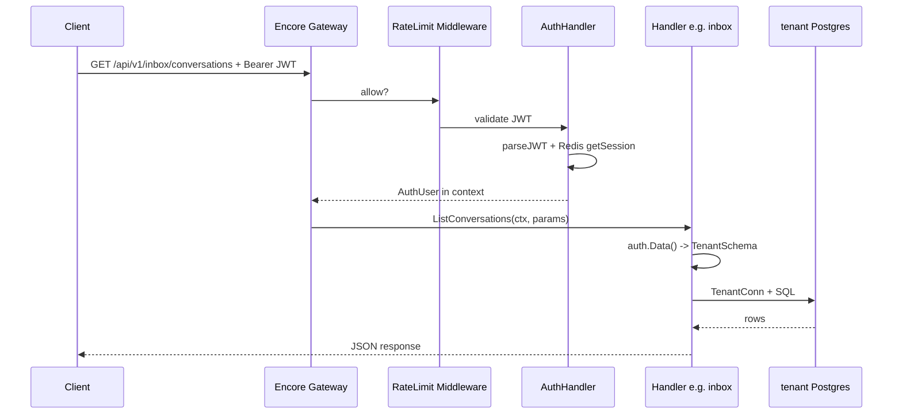
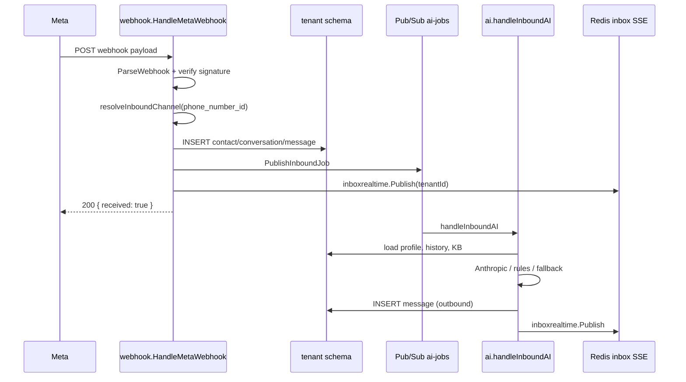
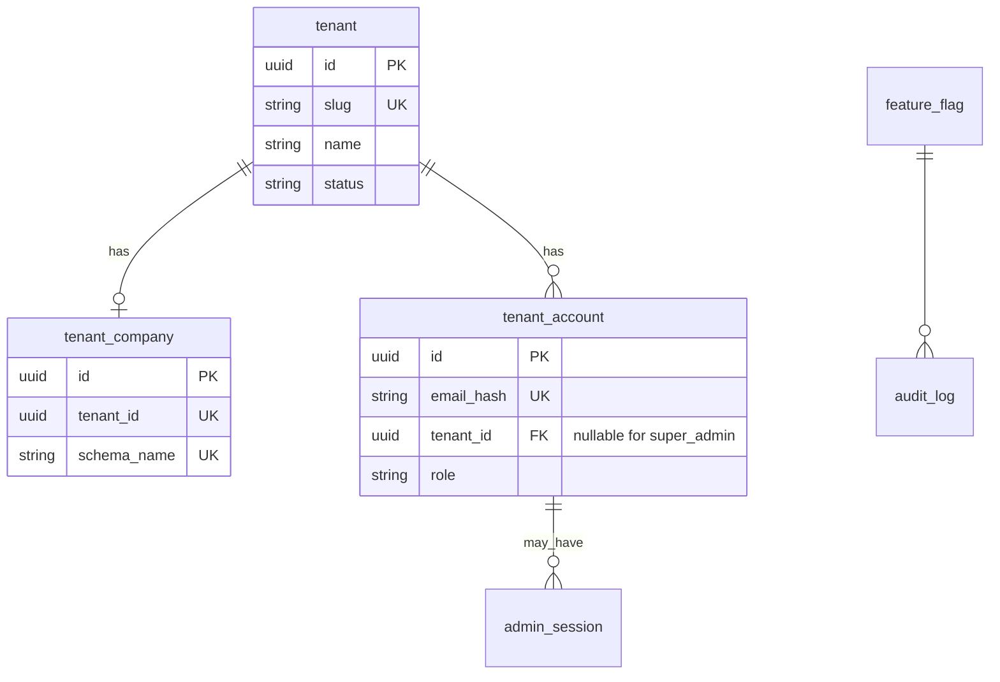
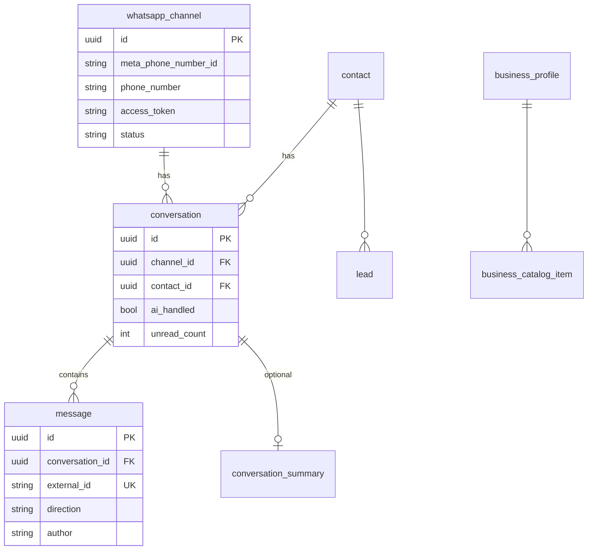
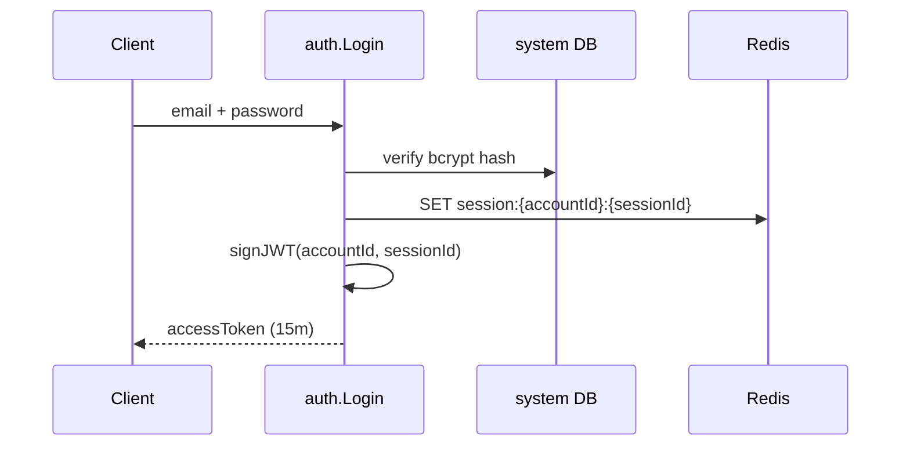
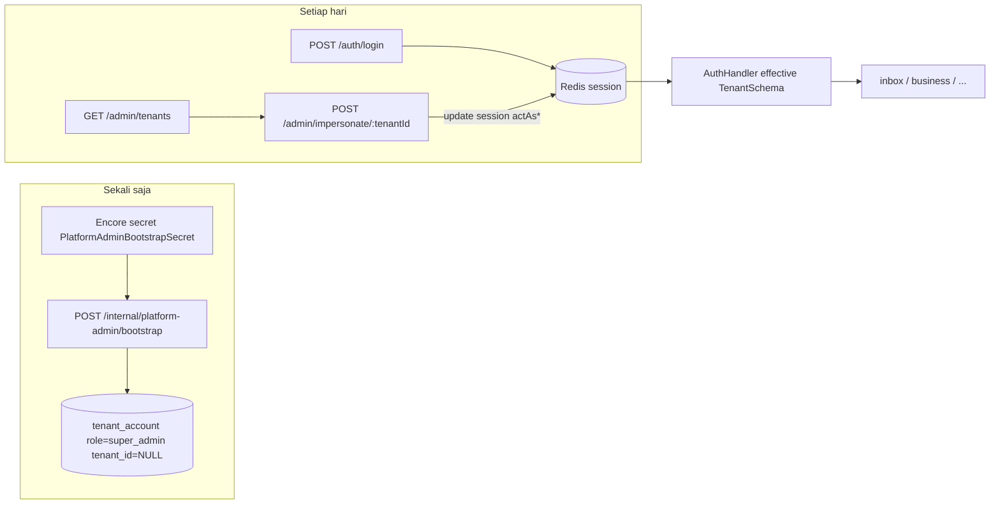
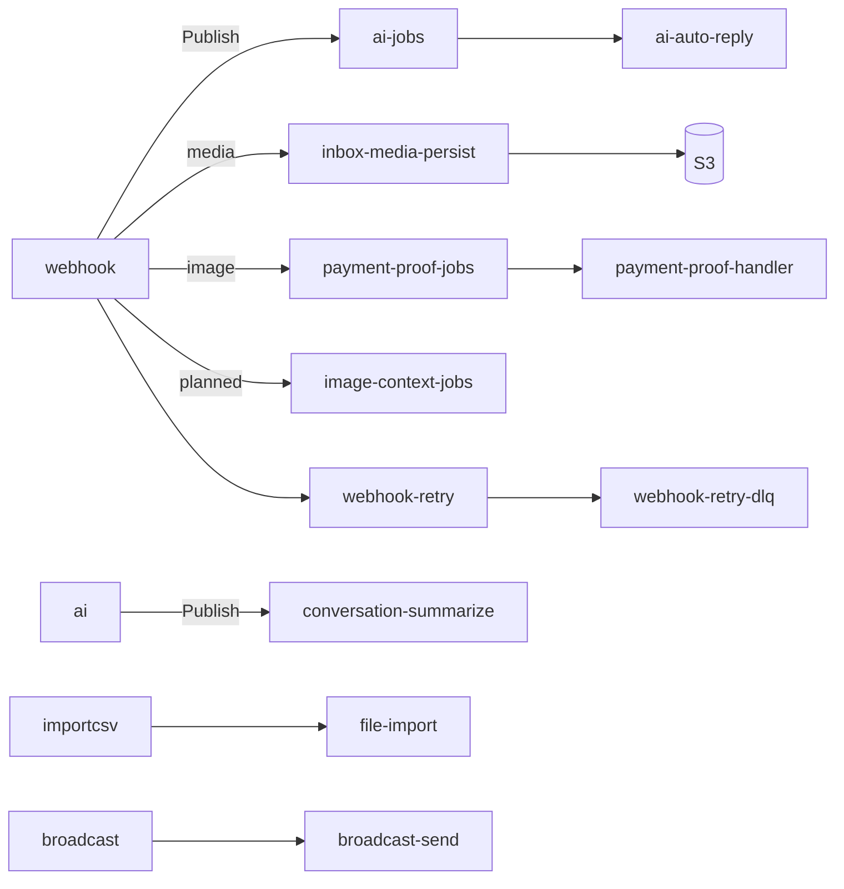

# WABantu API-Go — Developer Technical Documentation

> **Audience:** Senior full-stack developers from Node.js/TypeScript (Express, NestJS, Prisma/TypeORM) learning **Go** and **Encore**.  
> **Codebase:** `api-go/` — Encore rewrite of NestJS `api/`.  
> **Companion docs:** [README.md](./README.md) · [APP_FLOW_GUIDE.md](./APP_FLOW_GUIDE.md) · [ENDPOINT_COMPATIBILITY.md](./ENDPOINT_COMPATIBILITY.md) · **[docs/README.md](./docs/README.md)** (indeks docs) · **[docs/WHATSAPP_AI_ROUTING.md](./docs/WHATSAPP_AI_ROUTING.md)** (webhook → AI routing) · **[docs/WHATSAPP_INBOX_MEDIA_PAYMENT_STOCK.md](./docs/WHATSAPP_INBOX_MEDIA_PAYMENT_STOCK.md)** (roadmap media/bukti/stok) · **[docs-development-shipped/inbox-media-fase1.md](./docs-development-shipped/inbox-media-fase1.md)** (media inbox proxy Meta) · **[docs-development-shipped/inbox-media-s3.md](./docs-development-shipped/inbox-media-s3.md)** (persist media S3) · **[docs-development-shipped/payment-proof-fase2.md](./docs-development-shipped/payment-proof-fase2.md)** (bukti transfer, limit 5x) · **[docs-development-shipped/ai-image-caption.md](./docs-development-shipped/ai-image-caption.md)** (caption gambar → teks) · **[docs-development-shipped/ai-stock-guard-fase4.md](./docs-development-shipped/ai-stock-guard-fase4.md)** (stok per gudang) · **[docs-development-shipped/ai-order-chat-lookup.md](./docs-development-shipped/ai-order-chat-lookup.md)** (order lookup scoped chat) · **[docs-development-shipped/ai-image-context.md](./docs-development-shipped/ai-image-context.md)** (vision katalog, planned) · **[LIMITS_AND_QUOTAS.md](./LIMITS_AND_QUOTAS.md)** (rate limit, trial/paid kuota, billing checkout) · **[docs/FINANCE_MODULE.md](./docs/FINANCE_MODULE.md)** (modul keuangan) · **[docs/ORDER_CUSTOMER_CHAT.md](./docs/ORDER_CUSTOMER_CHAT.md)** (nomor pesanan, cancel & status via chat)

**Baru belajar Go?** Langsung ke **[Bagian 18 Go untuk developer Node.js](#18-go-language-guide-for-nodejs-developers-with-wabantu-examples)** — penjelasan pointer, error, context, interface, dll. dengan contoh nyata dari repo ini.

**Buat akun operator internal (super admin tanpa toko)?** Langsung ke **[Bagian 8.1 Platform Admin — panduan lengkap](#81-platform-admin-internal-operator-wabantu-owner)**.

**Setup secret Encore (`encore secret set`)?** Langsung ke **[Bagian 4.1 Encore Secrets — panduan developer](#41-encore-secrets--panduan-developer)**.

---

# 1. Project Overview

## What this project does

**WABantu** is a multi-tenant SaaS backend for Indonesian SMBs (“UMKM”) that:

1. Connects **WhatsApp Business (Meta Cloud API)** per tenant.
2. Receives inbound messages via **webhooks**.
3. Stores conversations in a **per-tenant PostgreSQL schema**.
4. Runs **AI auto-reply** (Anthropic) with guardrails, knowledge base, and usage metering.
5. Exposes a **REST API** (`/api/v1/...`) consumed by `web-frontend/` (Next.js).

## Main business purpose

- **Inbox:** staff read/reply to WhatsApp threads, hand off from AI to human.
- **AI:** automated replies based on business profile + KB + conversation history.
- **Growth:** leads capture, broadcast campaigns, orders, payments (Midtrans QRIS), shipping quotes (RajaOngkir).
- **Platform:** billing plans, usage quotas, feature flags, super-admin impersonation.

## High-level architecture



## Main technologies

| Layer | Technology |
|-------|------------|
| Language | Go 1.26+ |
| Framework | [Encore.go](https://encore.dev) |
| HTTP | Encore-generated routes + some `raw` handlers |
| DB | PostgreSQL via `encore.dev/storage/sqldb` |
| Cache / session / rate limit / SSE | Redis (`github.com/redis/go-redis/v9`) |
| Auth | JWT (short-lived) + Redis session payload |
| AI | Anthropic API |
| Payments | Midtrans |
| Shipping | RajaOngkir |
| Observability | `encore.dev/rlog`, optional Sentry (`platform` package) |

## Why Encore is used

| NestJS pain | Encore benefit in this project |
|-------------|-------------------------------|
| Manual wiring of modules, queues, DB pools | **Declarative** APIs, DBs, Pub/Sub, cron via code + `encore run` |
| Separate `ai-worker` process (BullMQ) | **Pub/Sub subscribers** run inside same `encore run` |
| Two Postgres DBs + env files | Encore provisions **`system`** and **`tenant`** DBs + migrations |
| Scattered route registration | `//encore:api` comments → typed clients & OpenAPI |

**Node analogy:** Encore ≈ Nest monorepo + built-in infrastructure-as-code, but **compiled**, **explicit errors**, and **no runtime decorator magic**.

---

# 2. Architecture Explanation

## Overall pattern

**Modular monolith** — one Encore application (`encore.app`), many **service packages** (Go packages = Encore services), **not** microservices deployed separately in dev.

- **No heavy “repository layer”** everywhere: handlers often call `database/sql` directly with small helpers (`shared/db`, `tConn`).
- **Cross-cutting** logic in `shared/*`, `middleware/`, `auth/`.
- **Multi-tenancy:** row data in **schema-per-tenant** (`t_<slug>`) inside the `tenant` database; control plane in `system` DB.

Compare to **NestJS:** one `AppModule` with feature modules — similar boundaries, but Go uses **packages** instead of `@Module()`, and **no DI container** (explicit constructors / package-level `var db`).

## Encore service structure

Each folder like `auth/`, `inbox/`, `webhook/` is an Encore **service** when it contains `//encore:api` endpoints.

```
api-go/
├── encore.app              # app id + lang
├── auth/                   # service: auth + team
├── inbox/                  # service: inbox + SSE
├── webhook/                # service: Meta webhooks
├── ai/                     # service: AI HTTP + Pub/Sub consumers
├── system/                 # NOT a service — defines system DB
├── tenant/                 # service: internal tenant APIs + DDL
├── shared/                 # libraries (not services)
└── middleware/             # global middleware
```

**Go convention:** package name = folder name (`package inbox`). **Exported** identifiers start with uppercase (public to other packages). **Unexported** = lowercase (package-private). This replaces TypeScript `export` / file-private.

## API layer

Endpoints are declared with struct tags and comments:

```go
//encore:api auth method=GET path=/api/v1/inbox/conversations
func ListConversations(ctx context.Context, p *ListConversationsParams) (*ListConversationsResponse, error)
```

| Encore tag | Meaning | Nest equivalent |
|------------|---------|-----------------|
| `auth` | Requires `AuthHandler` — JWT in `Authorization: Bearer` | `@UseGuards(JwtAuthGuard)` |
| `public` | No auth | public route |
| `public raw` | You implement `http.ResponseWriter` | `@Res()` bypass |
| `private` | Only other Encore services (or internal calls) | internal microservice RPC |
| `tag:owner` | **Convention only** — handlers call `requireOwner()` | custom `@Roles('owner')` |

**Errors:** return `error` from handlers; use `shared/errs` wrapping `encore.dev/beta/errs` → HTTP status mapping (like Nest `HttpException`).

## Business / domain layer

Business logic lives **in the same package** as the API (e.g. `ai/autoreply.go`, `webhook/webhook.go`). There is no mandatory `XxxService` interface per domain — sometimes a struct (`AutoReplyService`) is used when state/dependencies exist.

**Why simpler than Nest:** Go culture favors **flat packages** and **explicit functions** over deep abstraction until duplication hurts.

## Data layer

| DB | Encore name | Contents |
|----|-------------|----------|
| Control plane | `system` | `tenant`, `tenant_account`, `tenant_company`, flags, audit, admin |
| Tenant data | `tenant` | All tables in schema `t_<slug>` per business |

Access pattern:

```go
conn, err := appdb.TenantConn(ctx, db.Stdlib(), user.TenantSchema)
defer conn.Close()
// SET search_path TO "t_omah_apparel", public
conn.QueryRowContext(ctx, `SELECT ... FROM conversation ...`)
```

**vs Prisma:** no code-generated client; **raw SQL** strings with `$1` placeholders. **vs TypeORM:** no entity decorators; schema from `tenant.RunTenantDDL` + `RunSchemaPatches`.

## Background jobs & events

| Mechanism | Use in WABantu |
|-----------|----------------|
| **Pub/Sub** (`pubsub.NewTopic`) | AI jobs, import, broadcast send, webhook retry |
| **Cron** (`cron.NewJob`) | Monthly usage reset |
| **Goroutines** | Not used heavily for request path; Pub/Sub handlers run concurrently |

**Node:** BullMQ + `ai-worker` → **`ai-jobs` topic** + `handleInboundAI` subscriber.

## Dependency graph (simplified)



## Request lifecycle (authenticated API)



## Idiomatic Go choices (vs Node)

| Topic | Go / this codebase | Node habit |
|-------|-------------------|------------|
| Errors | `if err != nil { return err }` | `try/catch` |
| Null | `sql.NullString`, pointers `*string` | `null` / `undefined` |
| Context | `context.Context` on every IO call | `AsyncLocalStorage` / request scope |
| Concurrency | goroutines + Pub/Sub (framework) | `async/await` event loop |
| Typing | compile-time structs | interfaces at runtime |

---

# 3. Folder & File Structure

## Root

| Path | Responsibility |
|------|----------------|
| `encore.app` | App ID for Encore Cloud (`wabantu-viko-8vni`) |
| `go.mod` | Module `encore.app/wabantu` |
| `Dockerfile` | Production container build |
| `scripts/setup-secrets-from-env.sh` | Map `../api/.env` → `encore secret set` |

## Services (API packages)

| Folder | Domain |
|--------|--------|
| `auth/` | Register, login, logout, me, JWT, Redis sessions, team CRUD, **platform admin bootstrap** |
| `admin/` | Super-admin tenant list, impersonation (session Redis) |
| `inbox/` | Conversations, messages, contacts, unread, handoff, **SSE stream** |
| `webhook/` | Meta WhatsApp ingest, reliability retry |
| `whatsappapi/` | Channel list, Meta OAuth connect, test message |
| `whatsapp/` | **Library** — parse webhook, send text (no HTTP APIs) |
| `ai/` | Auto-reply pipeline, Anthropic, Pub/Sub workers, summarization |
| `business/` | Business profile, catalog, website import |
| `kb/` | Knowledge base CRUD |
| `leads/` | Lead pipeline + `CaptureFromMessage` (private) |
| `order/` | Orders |
| `payment/` | Midtrans QRIS + webhook |
| `shipping/` | RajaOngkir provinces/cities/cost |
| `billing/` | Plans, invoices overview |
| `usage/` | Metering, quotas, monthly cron reset |
| `broadcast/` | Campaigns + async send |
| `importcsv/` | CSV/XLSX import preview/execute |
| `workflow/` | Rule-based auto-replies before AI |
| `branch/` | Multi-branch (Pro plan) |
| `analytics/` | Dashboard metrics |
| `audit/` | Audit log write (private) + read |
| `flag/` | Feature flags (system DB) |
| `health/` | Liveness/readiness |
| `tenant/` | Internal tenant CRUD, **RunTenantDDL**, schema patches |

## Infrastructure packages

| Folder | Role |
|--------|------|
| `system/` | `sqldb.NewDatabase("system")` + SQL migrations |
| `tenant/db.go` | `sqldb.NewDatabase("tenant")` |
| `middleware/` | Global rate limit |
| `platform/` | Blank import → Sentry init from `auth` |
| `shared/db/` | `TenantConn`, `QuoteIdent` |
| `shared/errs/` | Typed API errors |
| `shared/types/` | `AuthUser`, soft-delete helpers |
| `shared/inboxrealtime/` | Redis pub/sub + SSE framing |
| `shared/ratelimit/` | Sliding window |
| `shared/entitlement/` | Plan limits |
| `shared/response/` | JSON envelope helpers |
| `shared/crypto/` | AES for sensitive fields |
| `shared/sentry/` | Sentry DSN secret |

## Important files

| File | Purpose |
|------|---------|
| `auth/auth.go` | Register/login, `AuthHandler`, JWT |
| `auth/httpauth.go` | `AuthenticateHTTP` for raw routes (SSE, logout) |
| `auth/session.go` | Redis session CRUD + impersonation fields |
| `auth/platform_bootstrap.go` | One-time internal `super_admin` account (secret-gated) |
| `auth/impersonation.go` | `StartImpersonation` / `StopImpersonation` (Redis) |
| `auth/userctx.go` | `buildAuthUser` — effective tenant from session |
| `tenant/tenant.go` | `tenantDDL` (all per-tenant tables), `RunTenantDDL` |
| `tenant/schema_patch.go` | Idempotent `ALTER` for existing tenants |
| `webhook/webhook.go` | Ingest pipeline |
| `ai/inbound_jobs.go` | Pub/Sub `ai-jobs` |
| `ai/autoreply.go` | Orchestrator: scope, classifier, LLM send, counters |
| `ai/order_flow.go` | Order state machine, purchase/payment follow-up helpers |
| `ai/greeting.go` | Time-of-day greetings, casual openers |
| `ai/product_scope.go` | Off-business product detection (apparel tenants) |
| `ai/safety.go` | Scope, question-like, retail/payment keywords |
| `ai/classifier_routing.go` | Haiku vs Sonnet + FAQ direct bypass |
| `ai/reply_meta.go` | Outbound metadata paths + `LogAndRecord` |
| `ai/payment_proof.go` | Pipeline bukti transfer, limit 5x penolakan, outbound WA pembeli |
| `ai/payment_proof_jobs.go` | Pub/Sub `payment-proof-jobs` |
| `ai/order_stock_guard.go` | Stok per gudang, tolak qty order jika tidak ada gudang tunggal cukup |
| `inbox/media.go` | `GetMessageMedia` — proxy Meta / stream S3 |
| `inbox/media_persist_jobs.go` | Pub/Sub `inbox-media-persist` → S3 |
| `shared/mediastorage/s3.go` | Put/Get/Delete object storage (inbox media) |
| `order/payment_proof.go` | API verify / reject / unblock bukti transfer |
| `order/payment_proof_meta.go` | Helper `rejectionCount`, `proofBlocked`, `PaymentProofMaxRejections` |
| `usage/ai_activity.go` | Tenant AI activity log API |

**Node comparison:** instead of `src/modules/inbox/inbox.controller.ts` + `.service.ts` + `.module.ts`, you get **one package** with handlers + SQL. Encore replaces `main.ts` bootstrap.

---

# 4. Encore-Specific Concepts

## Defining services & APIs

```go
//encore:api auth method=GET path=/api/v1/business/profile
func GetProfile(ctx context.Context) (*ProfileResponse, error) {
    user, err := currentUser() // auth.Data().(*types.AuthUser)
    ...
}
```

Encore generates:
- HTTP router
- Optional TypeScript/Go **client** (`encore.gen.go` per service)
- Tracing, API explorer in dev dashboard `:9400`

## Authentication

**Two paths:**

1. **Tagged endpoints (`auth`):** `AuthHandler` receives token string, returns `*types.AuthUser`.
2. **Raw endpoints (`public raw`):** call `auth.AuthenticateHTTP(ctx, r)` — supports Bearer, cookie `wabantu_at`, query `access_token` (for SSE).

```go
//encore:authhandler
func AuthHandler(ctx context.Context, token string) (encoreAuth.UID, *types.AuthUser, error)
```

**Session model:** JWT (15 min) encodes `accountId` + `sessionId`; **authoritative state** in Redis `session:{accountId}:{sessionId}`.

**Impersonation (platform admin):** Redis session may include `impersonating`, `actAsTenantId`, `actAsTenantSchema`, etc. `AuthHandler` exposes **effective** `TenantID` / `TenantSchema` to all services (no separate JWT).

**Frontend (current):** Bearer-only in `sessionStorage` — no reliance on `Set-Cookie`.

## Middleware

```go
//encore:middleware global target=all
func RateLimit(req encoremw.Request, next encoremw.Next) encoremw.Response
```

400 req/min/IP globally; auth routes also 20/min in `auth.allowAuthRate`; platform bootstrap 5/min/IP.

**Nest:** `@Injectable()` middleware class → Encore function with `next(req)`.

**Tabel lengkap kuota trial/Starter/Business/Pro, entitlement, checkout QRIS, top-up AI, routing AI:** [LIMITS_AND_QUOTAS.md](./LIMITS_AND_QUOTAS.md).

## Secrets

Encore menyimpan konfigurasi rahasia **per environment** (`local`, `development`, `production`, …), **bukan** file `api-go/.env`.

```go
// Setiap service/package mendeklarasikan sendiri:
var secrets struct {
    JWTSecret string
}
```

**Panduan lengkap (wajib baca developer baru):** [Bagian 4.1 Encore Secrets — panduan developer](#41-encore-secrets--panduan-developer) — daftar semua secret, mapping dari `api/.env`, `--type local` vs `dev`, troubleshooting `invalid bootstrap secret`.

Ringkasan cepat:

| Secret | Package | Wajib dev? |
|--------|---------|------------|
| `JWTSecret` | `auth` | Ya |
| `RedisURL` | `auth` | Ya |
| `DataEncryptionKey` | `auth` | Ya |
| `PlatformAdminBootstrapSecret` | `auth` | Hanya untuk bootstrap platform admin ([Bagian 8.1](#81-platform-admin-internal-operator-wabantu-owner)) |
| `AnthropicApiKey` / `AnthropicAPIKey` | `ai`, `business`, `finance` | Untuk AI, import katalog/transaksi gambar (`AnthropicAPIKey`; struct wajib bernama `secrets`) |
| `AiInternalToken` | `ai` | Untuk internal AI HTTP |
| `WebhookVerifyToken` | `webhook` | Meta webhook GET challenge (`hub.verify_token`) |
| `Midtrans*` | `payment` | Payment |
| `RajaOngkir*` | `shipping` | Shipping |
| `SentryDSN` | `shared/sentry` | Opsional |

```bash
cd api-go && ./scripts/setup-secrets-from-env.sh   # impor dari ../api/.env → --type local
encore secret list                                 # cek kolom Local ✓
```

## Pub/Sub

```go
var InboundAIJobs = pubsub.NewTopic[*InboundAIJob]("ai-jobs", pubsub.TopicConfig{
    DeliveryGuarantee: pubsub.AtLeastOnce,
})
pubsub.NewSubscription(InboundAIJobs, "ai-auto-reply", pubsub.SubscriptionConfig[*InboundAIJob]{
    Handler: handleInboundAI,
    RetryPolicy: &pubsub.RetryPolicy{MaxRetries: 3},
})
```

**At-least-once:** handlers must be **idempotent** (e.g. check `message.external_id` before insert).

## Cron

```go
var _ = cron.NewJob("reset-monthly-usage", cron.JobConfig{
    Title:    "Reset monthly usage",
    Schedule: "0 0 1 * *",
    Endpoint: ResetMonthlyUsage,
})
```

## Service-to-service

- **`private` APIs** — e.g. `tenant.CreateTenant`, `leads.CaptureFromMessage`, `usage.Record`.
- Called from Go: `leads.CaptureFromMessage(ctx, &leads.CaptureRequest{...})` — Encore generates RPC (no HTTP overhead in prod).

## Deployment model

- **Dev:** `encore run` — single process, local Postgres provisioned by Encore, Redis from `infra/`.
- **Prod:** Encore Cloud or Docker image (`Dockerfile`) — compiled binary, secrets from Encore/env.

---

# 4.1 Encore Secrets — Panduan Developer

> **Ringkasan:** `encore run` di laptop memakai secret bertipe **`local`**. Bukan `dev`. Kalau secret hanya di-set `--type dev`, aplikasi lokal melihat nilai **kosong** → login gagal, bootstrap `invalid bootstrap secret`, AI 401, dll.

## Mengapa tidak pakai `api-go/.env`?

| NestJS `api/` | Encore `api-go/` |
|---------------|------------------|
| `api/.env` dibaca saat start | Tidak ada `.env` di `api-go/` |
| Satu file per mesin | Secret disimpan di **Encore Cloud** (terikat akun `encore auth login`) |
| | CLI: `encore secret set --type <env> <NamaSecret>` |

Nilai sumber tetap bisa di **`../api/.env`** (Nest) lalu diimpor lewat script — lihat di bawah.

## Environment Encore (`--type`)

| `--type` | Kapan dipakai | Perintah tipikal |
|----------|---------------|------------------|
| **`local`** | **`encore run` di laptop Anda** | `encore secret set --type local JWTSecret` |
| `dev` | Deploy / environment **Development** di Encore Cloud | `encore secret set --type dev ...` |
| `prod` | Production | `encore secret set --type prod ...` |

**Cek apa yang terisi:**

```bash
cd api-go
encore secret list
```

Contoh output (perhatikan kolom **Local**):

```
Secret Key                     Production   Development   Local   Preview
JWTSecret                      ✗            ✗             ✓       ✗
PlatformAdminBootstrapSecret   ✗            ✓             ✗       ✗   ← salah: hanya Development, Local kosong!
```

Untuk development lokal, semua secret yang dipakai **`encore run`** harus punya **✓ di kolom Local**.

## Prasyarat (sekali per laptop)

```bash
encore auth login
cd api-go
encore app link    # jika pernah app_not_found
```

Tanpa login, `encore secret set` gagal.

---

## Cara 1 — Impor otomatis dari `api/.env` (disarankan)

Script membaca `../api/.env` dan menulis ke **`--type local`**:

```bash
cd api-go
# Pastikan ../api/.env ada (copy dari api/.env.example)
./scripts/setup-secrets-from-env.sh
encore secret list
```

**Yang diimpor** (lihat `scripts/setup-secrets-from-env.sh`):

| Encore secret | Sumber di `api/.env` |
|---------------|----------------------|
| `JWTSecret` | `JWT_ACCESS_SECRET` |
| `DataEncryptionKey` | `DATA_ENCRYPTION_KEY` |
| `RedisURL` | `redis://{REDIS_HOST}:{REDIS_PORT}` (default `localhost:6379`) |
| `AnthropicApiKey` | `ANTHROPIC_API_KEY` |
| `AnthropicAPIKey` | `ANTHROPIC_API_KEY` (nama duplikat untuk package `business`) |
| `AiInternalToken` | `AI_INTERNAL_TOKEN` |
| `WebhookVerifyToken` | `META_WEBHOOK_VERIFY_TOKEN` |
| `MidtransServerKey` | `MIDTRANS_SERVER_KEY` |
| `MidtransClientKey` | `MIDTRANS_CLIENT_KEY` |
| `MidtransIsProduction` | `MIDTRANS_IS_PRODUCTION` (default `false`) |
| `RajaOngkirAPIKey` | `RAJAONGKIR_API_KEY` |
| `RajaOngkirAccountType` | `RAJAONGKIR_ACCOUNT_TYPE` (default `starter`) |
| `SentryDSN` | `SENTRY_DSN` |

**Tidak diimpor oleh script** — set manual (lihat Cara 2):

| Encore secret | Alasan |
|---------------|--------|
| `PlatformAdminBootstrapSecret` | Khusus internal WABantu; tidak ada di Nest `.env` |
| *(tidak ada Encore secret)* | `webhook` | Verifikasi `X-Hub-Signature-256` memakai `whatsapp_channel.meta_app_secret` dari OAuth connect |

---

## Cara 2 — Set manual per secret (`--type local`)

Format aman (tanpa newline di akhir string):

```bash
cd api-go

printf '%s' 'nilai-rahasia-anda' | encore secret set --type local NamaSecret
```

Contoh minimal agar API jalan:

```bash
printf '%s' 'ganti-dengan-jwt-access-secret-panjang' | encore secret set --type local JWTSecret
printf '%s' 'ganti-dengan-32-byte-encryption-key' | encore secret set --type local DataEncryptionKey
printf '%s' 'redis://localhost:6379' | encore secret set --type local RedisURL
```

**Platform admin bootstrap** (min. 32 karakter — **bukan** password login):

```bash
printf '%s' 'wabantu-internal-bootstrap-2026-sangat-rahasia' | encore secret set --type local PlatformAdminBootstrapSecret
```

Header curl harus **sama persis** dengan string di atas:

```bash
-H 'X-Platform-Bootstrap-Secret: wabantu-internal-bootstrap-2026-sangat-rahasia'
```

Detail bootstrap: [Bagian 8.1](#81-platform-admin-internal-operator-wabantu-owner).

**Webhook signature Meta:** tidak perlu secret Encore terpisah. Saat owner menghubungkan WhatsApp (`meta/connect`), `meta_app_secret` disimpan di tabel `whatsapp_channel` per tenant. Webhook POST memverifikasi signature dari secret channel tersebut.

---

## Cara 3 — Mode interaktif

```bash
encore secret set --type local JWTSecret
# paste nilai saat diminta
```

---

## Setelah mengubah secret

1. **Hentikan** `encore run` (Ctrl+C)
2. Jalankan lagi: `encore run`

Secret tidak hot-reload. Lupa restart = perilaku aneh (nilai lama/kosong).

---

## Katalog lengkap secret per package

| Encore secret | Package / file | Fungsi | Wajib lokal? |
|---------------|----------------|--------|--------------|
| `JWTSecret` | `auth/auth.go` | Tanda tangan JWT login | Ya |
| `DataEncryptionKey` | `auth/auth.go` | Enkripsi field sensitif | Ya |
| `RedisURL` | `auth/auth.go`, `ai/api.go` | Session, rate limit, SSE, AI retry counter | Ya |
| `PlatformAdminBootstrapSecret` | `auth/auth.go` | Header bootstrap akun `super_admin` internal | Hanya jika pakai bootstrap |
| `AnthropicApiKey` | `ai/api.go` | Model AI auto-reply | Untuk fitur AI |
| `AnthropicAPIKey` | `business/business.go`, `finance/transaction_image.go` | Import website, import katalog/transaksi gambar | Struct wajib `secrets` per service |
| `AiInternalToken` | `ai/api.go` | `X-Ai-Internal-Token` pada internal AI HTTP | Jika panggil internal AI |
| `WebhookVerifyToken` | `webhook/webhook.go` | Verifikasi GET challenge Meta | Untuk webhook WA |
| *(per channel)* `meta_app_secret` | `whatsapp_channel` (tenant DB) | `X-Hub-Signature-256` setelah OAuth connect | Disarankan prod |
| `MidtransServerKey` | `payment/payment.go` | QRIS | Untuk payment |
| `MidtransClientKey` | `payment/payment.go` | Client Midtrans | Untuk payment |
| `MidtransIsProduction` | `payment/payment.go` | `"true"` / `"false"` | Untuk payment |
| `RajaOngkirAPIKey` | `shipping/shipping.go` | Ongkir | Untuk shipping |
| `RajaOngkirAccountType` | `shipping/shipping.go` | `starter` / `basic` / `pro` | Untuk shipping |
| `SentryDSN` | `shared/sentry/sentry.go` | Error tracking | Opsional |
| `AWSS3Bucket` | `shared/mediastorage/s3.go` | Bucket persist media inbox | Opsional (kosong = skip S3) |
| `AWSS3Region` | `shared/mediastorage/s3.go` | Region AWS S3 | Opsional |
| `AWSS3AccessKeyID` | `shared/mediastorage/s3.go` | IAM access key | Opsional |
| `AWSS3SecretAccessKey` | `shared/mediastorage/s3.go` | IAM secret | Opsional |

Detail persist media: [docs-development-shipped/inbox-media-s3.md](./docs-development-shipped/inbox-media-s3.md).

---

## Production

```bash
encore secret set --type prod JWTSecret
encore secret set --type prod PlatformAdminBootstrapSecret
# ... secret lain ...
```

Jangan pakai nilai dev di prod. Rotate secret jika pernah bocor.

---

## Troubleshooting secret

| Gejala | Penyebab | Solusi |
|--------|----------|--------|
| `invalid bootstrap secret` | Header curl ≠ nilai di Encore, atau secret hanya di `dev` bukan **`local`** | `printf '%s' '...' \| encore secret set --type **local** PlatformAdminBootstrapSecret` lalu restart `encore run` |
| `PlatformAdminBootstrapSecret not configured (min 32 chars)` | Secret kosong atau &lt; 32 karakter di environment aktif | Set string ≥ 32 char, `--type local`, restart |
| `fetch secrets ... failed` / login aneh | Secret belum di-set | `./scripts/setup-secrets-from-env.sh` atau set manual |
| `not logged in: run encore auth login` | CLI Encore belum login | `encore auth login` |
| `app_not_found` | App belum link ke cloud | `encore app link` / `encore app init` |
| AI / internal 401 | `AiInternalToken` kosong atau beda dengan caller | Samakan dengan `AI_INTERNAL_TOKEN` di `.env` |
| Session selalu expired | `RedisURL` salah / Redis mati | `docker compose up -d redis`; set `redis://localhost:6379` |
| Secret sudah di-set tapi masih gagal | `encore run` belum di-restart | Ctrl+C → `encore run` lagi |
| Kolom **Local** ✗ di `secret list` | Hanya set `--type dev` | Ulangi dengan `--type local` |

---

## Checklist developer baru

```bash
encore auth login
cd api-go
./scripts/setup-secrets-from-env.sh
printf '%s' 'bootstrap-secret-min-32-chars........' | encore secret set --type local PlatformAdminBootstrapSecret
encore secret list    # semua yang dipakai harus ✓ di Local
encore run
```

---

# 5. API Documentation

> Full parity checklist: [ENDPOINT_COMPATIBILITY.md](./ENDPOINT_COMPATIBILITY.md).  
> Below: grouped reference (~89 routes). Validation is mostly **manual** in handlers (not `go-playground/validator` everywhere).

## Auth (`auth/`)

| Method | Path | Auth | Body / notes |
|--------|------|------|----------------|
| POST | `/api/v1/auth/register` | public raw | `{ email, password, name, businessName, slug? }` → `{ accessToken, user, expiresInSeconds }` |
| POST | `/api/v1/auth/login` | public raw | `{ email, password }` |
| POST | `/api/v1/auth/logout` | public raw | Bearer/cookie → `{ ok }` |
| GET | `/api/v1/auth/me` | public raw | Bearer → user profile |
| POST | `/api/v1/internal/platform-admin/bootstrap` | public raw | **Internal only** — see [Bagian 8.1](#81-platform-admin-internal-operator-wabantu-owner) |
| GET/POST/DELETE | `/api/v1/team/members` | auth owner | Team CRUD |
| GET | `/api/v1/admin/tenants?q=&page=&pageSize=` | auth `super_admin` | List tenants with search + pagination |
| GET | `/api/v1/admin/tenant/:id` | auth `super_admin` | Tenant detail + counts |
| PUT | `/api/v1/admin/tenant/:id/plan` | auth `super_admin` | Internal package override (`starter`, `business`, `pro`) |
| DELETE | `/api/v1/admin/tenant/:id?confirmSchemaName=...` | auth `super_admin` | Permanently drop tenant schema + soft-delete metadata; requires schema confirmation |
| POST | `/api/v1/admin/impersonate/:tenantId` | auth `super_admin` | Switch session to tenant |
| POST | `/api/v1/admin/stop-impersonation` | auth `super_admin` | Clear impersonation |
| POST | `/api/v1/admin/migrate-tenant-schemas` | auth `super_admin` | `RunMigrateAllTenantSchemas` — patch DDL + finance seed per tenant |

**Register flow:** system TX → `RunTenantDDL` → seed `business_profile` → `branch.EnsureDefaultBranch` → JWT.

**Platform admin login:** account with `role = super_admin` and `tenant_id IS NULL` — no register, no tenant DDL. See [Bagian 8.1](#81-platform-admin-internal-operator-wabantu-owner).

## Inbox (`inbox/`)

| Method | Path | Auth | Purpose |
|--------|------|------|---------|
| GET | `/api/v1/inbox/conversations` | auth | List + search + cursor |
| GET | `/api/v1/inbox/conversations/:id/messages` | auth | Message history (`media` field per image/video/doc) |
| GET | `/api/v1/inbox/messages/:messageId/media` | auth raw | Stream bytes — S3 jika `metadata.s3Key`, else proxy Meta |
| POST | `/api/v1/inbox/conversations/:id/messages` | auth | Staff outbound (calls Meta via `whatsapp`) |
| PATCH | `/api/v1/inbox/conversations/:id/read` | auth | Zero unread |
| POST | `.../handoff` | auth | Pause AI, system message |
| POST | `.../ai-resume` | auth | Re-enable AI |
| GET | `/api/v1/inbox/stream` | public raw | **SSE** — `access_token` query, Redis pub/sub |

## Webhook (`webhook/`)

| Method | Path | Auth | Purpose |
|--------|------|------|---------|
| GET/POST | `/api/v1/webhook/whatsapp` | public raw | Meta verify + ingest |
| GET/POST | `/api/v1/whatsapp/webhook/meta` | public raw | Nest-compatible alias |
| * | `/whatsapp/webhook/meta`, `/webhook/whatsapp` | public raw | Legacy paths |

## WhatsApp (`whatsappapi/`)

| Method | Path | Auth |
|--------|------|------|
| GET | `/api/v1/whatsapp/channels` | auth |
| POST | `/api/v1/whatsapp/meta/connect/init` | auth owner |
| POST | `/api/v1/whatsapp/meta/connect/callback` | public |
| DELETE | `/api/v1/whatsapp/channels/:id` | auth owner |
| POST | `/api/v1/whatsapp/channels/:id/test-message` | auth owner |

## AI (`ai/`)

| Method | Path | Auth |
|--------|------|------|
| POST | `/api/v1/internal/ai/auto-reply` | public (token in practice) |
| POST | `/api/v1/internal/ai/auto-reply/fallback` | public |

Production path: **Pub/Sub** `ai-jobs`, not HTTP.

## Other domains (summary)

| Service | Base path | Auth |
|---------|-----------|------|
| business | `/api/v1/business/profile`, `/catalog?q=&page=&pageSize=`, `/catalog/import-image/*` (vision preview + commit); `PATCH profile` termasuk `paymentVerificationMode` | auth; katalog write owner |
| kb | `/api/v1/knowledge-base` | auth |
| inbox contacts | `/api/v1/inbox/contacts?q=&page=&pageSize=` + POST/PATCH/DELETE + batch status/delete | auth |
| leads | `/api/v1/leads` | auth; internal CRM capture pipeline |
| order | `/api/v1/orders?q=&status=&page=&pageSize=`, `/api/v1/order-status/batch`, `/api/v1/order-delete/batch`, `POST .../payment-proof/verify|reject|unblock` | auth; write owner |
| payment | `/api/v1/payment/*`, webhook | mixed |
| shipping | `/api/v1/shipping/*` | auth |
| billing | `/api/v1/billing/*` (`overview`, `select-plan`, `top-up`) | auth |
| usage | `/api/v1/usage/summary`, `/api/v1/usage/ai-activity` (super_admin impersonate) | auth — kuota tenant |
| broadcast | `/api/v1/broadcast/campaigns` | auth |
| importcsv | `/api/v1/import/*` | auth owner |
| workflow | `GET/POST/PATCH/DELETE /api/v1/workflows` | auth (PATCH/DELETE owner) |
| branch | `/api/v1/branches` | auth |
| analytics | `/api/v1/analytics/overview` | auth |
| admin | `/api/v1/admin/*`, `GET .../tenant/:id/ai-activity` (+ summary), **`/admin/ai-triage/*`** (loop engineering) | super_admin |
| flag | `/api/v1/flags` | auth |
| health | `/api/v1/health`, `/ready` | public |
| tenant | `/api/v1/internal/tenant/*` | private |

## Example sequence: inbound WhatsApp message



---

# 6. Database Documentation

## Database topology

| Encore DB | Nest name | Migration files |
|-----------|-----------|-----------------|
| `system` | `jb_system` | `system/migrations/*.up.sql` |
| `tenant` | `jb_tenant` | `tenant/migrations/1_init.up.sql` (placeholder) + **runtime DDL** |

**Schema-per-tenant:** `tenant_company.schema_name` = `t_<slug>` (e.g. `t_omah_apparel`).

## Why raw SQL (not GORM/Prisma)

- Encore `sqldb` integrates with `database/sql`.
- Multi-schema `search_path` switching is explicit.
- Team ported from Nest TypeORM entities → SQL strings in Go.
- **Tradeoff:** no compile-time query checking unless you add sqlc later.

## System DB ERD (core)



## Tenant schema ERD (core inbox)



## Table catalog (tenant schema)

| Table | Purpose |
|-------|---------|
| `business_profile` | AI context, tone, timezone |
| `business_catalog_item` | Products/services (`source`: `manual`, `import`, `image_import`) |
| `knowledge_base_entry` | Q&A for AI |
| `whatsapp_channel` | Meta connection |
| `contact` | Customer phone |
| `conversation` | Thread per channel+contact |
| `message` | Inbound/outbound messages |
| `lead` | Sales leads |
| `subscription`, `invoice` | Billing |
| `usage_event`, `usage_aggregate` | Metering |
| `payment_transaction` | Midtrans |
| `broadcast_campaign`, `broadcast_recipient` | Mass send |
| `order` | Orders (quoted identifier) |

`business_catalog_item` list API wajib memakai pagination (`page`, `pageSize`) dan search (`q`) dari server. UI tidak boleh mengambil semua SKU sekaligus karena tenant bisa punya puluhan ribu item. Schema tenant punya index `idx_catalog_name` dan `idx_catalog_barcode`; jalankan migrasi schema tenant setelah deploy jika schema lama belum memiliki index ini.

Contacts dan orders memakai pola yang sama: list endpoint wajib menerima search + pagination dari server. Contacts memakai tabel `contact` via `/api/v1/inbox/contacts`, status `active`/`inactive`, field `price_type_id` (opsional), batch status/delete. **Tipe harga:** `business_price_type`, `business_catalog_item_price` — lihat `docs/PRICE_TYPES_AND_CATALOG_PRICING.md`. Orders: harga item di-resolve dari tipe kontak; status `completed` mencatat pemasukan finance (`finance/order_income.go`); `draft`/`cancelled` menghapus transaksi terkait. Index SKU katalog unik hanya untuk baris aktif (`deleted_at IS NULL`).
| `conversation_summary` | AI memory |
| `webhook_event` | Outbound webhook reliability |
| `branch`, `workflow_rule` | Added via `schema_patch.go` |
| `fin_*` (finance) | `tenantDDL` on register; `tenant/finance_schema.go` via `RunSchemaPatches` for existing tenants |

## Migrations strategy

1. **New tenants:** `RunTenantDDL` runs full `tenantDDL` constant on register (+ `finance_seed`).
2. **Existing tenants:** `tenant.RunMigrateAllTenantSchemas` → `RunSchemaPatches` + `runFinanceSchemaAndSeed` (idempotent).
   - **Ops:** `encore exec ./cmd/migrate-tenant-schemas` (CLI v1.57+ — tidak ada `encore call`).
   - **UI:** `POST /api/v1/admin/migrate-tenant-schemas` (super_admin).
   - **Private RPC:** `POST /api/v1/internal/tenant/migrate-schemas` (service-to-service only).
3. **System:** standard Encore SQL migrations on deploy.
4. **Platform admin:** `system/migrations/4_platform_admin.up.sql` — `tenant_id` nullable for `super_admin`; CHECK: `owner`/`staff` must have `tenant_id`.

**Billing / tenant APIs:** `GET /api/v1/billing/overview` and tenant-scoped handlers return **403** if `TenantSchema` kosong (super_admin belum impersonate).

## Connection handling

```go
// Per-request tenant isolation
conn, err := appdb.TenantConn(ctx, pool, schema)
defer conn.Close()
```

Uses one connection from pool with `SET search_path` — **not** a separate physical DB per tenant (same as Nest `TenantConnectionService`).

## Transactions

Used where needed (e.g. `auth` register system TX). Many handlers use single-statement autocommit.

**Risk:** `ai.withTenantDB` sets `search_path` on **pool** — potential cross-request leakage if connection returned to pool without reset. Prefer `TenantConn` pattern for new code.

## Indexing

Defined in `tenantDDL` — e.g. `idx_message_conv_created`, `idx_wa_channel_phone`, `idx_lead_status_created`.

---

# 7. Business Logic Flow

## 7.1 User registration

1. **Trigger:** `POST /auth/register`
2. Validate body; rate limit IP
3. Check `email_hash` unique in `system.tenant_account`
4. Generate unique slug → schema `t_<slug>`
5. **Transaction:** insert `tenant`, `tenant_company`, `tenant_account`
6. `tenant.RunTenantDDL(schema)` — create all tables
7. Seed `business_profile`, default `branch`
8. `createSession` + `signJWT` → JSON response

## 7.2 WhatsApp OAuth connect

1. Owner calls `meta/connect/init` → OAuth URL + state in Redis
2. Meta redirects to frontend → `meta/connect/callback` with code
3. Exchange code for access token; `fetchMetaWaba` for `meta_phone_number_id`
4. `upsertChannel` in tenant schema
5. `tenant.RegisterWhatsAppInbound` → baris di `system.whatsapp_inbound_map` (**satu** `meta_phone_number_id` global)

**Penting:** Beberapa tenant **tidak boleh** menyimpan `meta_phone_number_id` / nomor Meta yang **sama**. Meta mengirim webhook hanya dengan `phone_number_id`; jika duplikat di DB, pesan masuk ke tenant pertama yang kebetulan ter-scan (bug lama) atau error **ambiguous** (perilaku baru). Satu nomor WA Cloud API = satu tenant di WABantu.

## 7.3 Inbound webhook → AI reply

**Dokumen kanonik (decision tree, tabel deteksi, debug):** [docs/WHATSAPP_AI_ROUTING.md](./docs/WHATSAPP_AI_ROUTING.md).

See sequence in Bagian 5. Key branches:

- `workflow.TryRun` — keyword rules may skip AI
- `ai.PublishInboundJob` — async
- AI pipeline (`ai/autoreply.go` + helpers):
  1. Greeting / injection guards (`greeting.go`, `safety.go`)
  2. Active **order flow** (Redis, `order_flow.go` + `order_catalog.go`) — match `business_catalog_item` → size/color → qty → recipient → alamat lengkap + kode pos → draft `order` dengan `items` + `shipping_address` JSON. Draft hanya dipersist setelah produk katalog, varian, qty, penerima/HP, jalan, kota, provinsi, dan kode pos valid; jika kurang, AI bertanya ke customer untuk field yang belum lengkap.
  3. **Katalog DB** (`catalog_reply.go`) — minta list/harga: jawab dari `business_catalog_item` (path `catalog_db`), penanda `[Katalog WABantu: kosong]`; FAQ tidak mengalahkan list katalog
  4. Business scope + keyword classifier (`product_scope.go`, `safety.go`) — off-topic products (e.g. food at apparel shop), purchase intent (`pesen`, `mau` + pcs)
  5. Post-checkout context (`IsActiveCheckoutFromHistory`) — payment/transfer/ongkir after order without re-classifying as out-of-scope
  6. FAQ cache / KB direct answer / hybrid KB retrieval (`retrieveHybridKB`; skip untuk pertanyaan list katalog)
  7. LLM reply (Haiku/Sonnet per plan) with history + **katalog DB** di konteks + conversation summary (`memory.go`)
  8. Activity logging per tenant (`usage.RecordAIActivity`, paths in `reply_meta.go` incl. `catalog_db`)

**Import katalog dari gambar (dashboard, bukan WA):** `business/catalog_image.go` + `ai/vision.go` — lihat [docs/CATALOG_IMAGE_IMPORT.md](./docs/CATALOG_IMAGE_IMPORT.md).

**Import transaksi dari gambar:** `finance/transaction_image.go` + `aivision/vision.go` (hindari import cycle ke package `ai`) — lihat [docs/TRANSACTION_IMAGE_IMPORT.md](./docs/TRANSACTION_IMAGE_IMPORT.md).

### Inbound media, bukti transfer & stock guard

Roadmap: [docs/WHATSAPP_INBOX_MEDIA_PAYMENT_STOCK.md](./docs/WHATSAPP_INBOX_MEDIA_PAYMENT_STOCK.md).

| Fase | Alur singkat | Shipped doc |
|------|--------------|-------------|
| 1 | Webhook media → `GetMessages.media` → `GET .../media` proxy Meta | [inbox-media-fase1.md](./docs-development-shipped/inbox-media-fase1.md) |
| 1b | Pub/Sub `inbox-media-persist` → `shared/mediastorage` S3 | [inbox-media-s3.md](./docs-development-shipped/inbox-media-s3.md) |
| 2 + 3b | Pub/Sub `payment-proof-jobs` → `ai/payment_proof.go` → owner verify/reject | [payment-proof-fase2.md](./docs-development-shipped/payment-proof-fase2.md) |
| 3a | Caption gambar/video/doc sebagai teks inbound | [ai-image-caption.md](./docs-development-shipped/ai-image-caption.md) |
| 3c/3d | Vision match katalog + fallback gambar (planned) | [ai-image-context.md](./docs-development-shipped/ai-image-context.md) |
| 4 | `order_stock_guard.go` — stok per gudang, tolak qty | [ai-stock-guard-fase4.md](./docs-development-shipped/ai-stock-guard-fase4.md) |
| 4b | Order lookup scoped chat, deny third-party | [ai-order-chat-lookup.md](./docs-development-shipped/ai-order-chat-lookup.md) |

- Failures: retry Pub/Sub → `FallbackAutoReply`

AI activity log (super_admin): `GET /api/v1/admin/tenant/:id/ai-activity` (+ `/summary`). Saat impersonate: juga `GET /api/v1/usage/ai-activity` (tenant efektif). Owner tenant **tidak** punya akses.

**AI Triage Loop** (super_admin, cold path): `GET/POST /api/v1/admin/ai-triage/*` — analyze routing mismatch per percakapan, dispatch GHA regression + optional Composer fix. Analyzer embed **catalog snapshot** tenant ke auto-gen test (`triageAutoGenSnapshotJSON`). Lihat [docs/AI_TRIAGE_LOOP_NEXT_DEV.md](./docs/AI_TRIAGE_LOOP_NEXT_DEV.md).

## 7.4 Staff sends message from inbox

1. `POST .../messages` with body
2. Load channel token + `meta_phone_number_id`
3. `whatsapp.SendText` → Meta API
4. Insert `message` row; update `conversation` preview

---

# 8. Authentication & Security

## Auth flow



## Permission model

| Role | Capabilities |
|------|----------------|
| `owner` | Full tenant; team management; connect WA |
| `staff` | Inbox, most read/write |
| `super_admin` (with `tenant_id`) | Legacy/dev account tied to a store — same as owner for that tenant + `admin/*` |
| `super_admin` ( **`tenant_id` NULL** ) | **Platform operator** — `admin/*`, login without store; tenant APIs only while **impersonating** |

`tag:owner` endpoints use `user.CanPerformOwnerActions()` (owner, or `super_admin` during impersonation).

Inbox/SSE: `user.CanAccessInbox()` (owner, staff, or impersonating platform admin).

---

## 8.1 Platform Admin (Internal Operator — WABantu Owner)

> **Bahasa Indonesia — ringkasan:** Akun ini **bukan** untuk klien UMKM. Dipakai **hanya internal** tim WABantu untuk login **tanpa register toko**, melihat daftar tenant, lalu **“Pantau”** satu tenant (impersonation). Klien **tidak bisa** jadi `super_admin` lewat halaman Register.

### Apa bedanya dengan user biasa?

| | Klien (owner/staff) | Platform admin (`super_admin`, tanpa tenant) |
|--|---------------------|-----------------------------------------------|
| Cara daftar | `POST /auth/register` (+ nama bisnis) | `POST /internal/platform-admin/bootstrap` (sekali, pakai secret) |
| `tenant_id` di DB | Wajib ada | **NULL** |
| Login | Email + password | Email + password (sama) |
| Setelah login | Dashboard toko (inbox, katalog, …) | **Konsol platform** → pilih tenant → baru bisa inbox/dll. |
| JWT | `accountId` + `sessionId` | Sama — tidak ada token impersonation terpisah |

### Arsitektur singkat



**File penting:**

| File | Fungsi |
|------|--------|
| `auth/platform_bootstrap.go` | Buat akun platform admin |
| `auth/impersonation.go` | Tulis/hapus `actAs*` di Redis session |
| `auth/userctx.go` | `buildAuthUser` — isi `TenantSchema` efektif saat impersonate |
| `admin/admin.go` | List tenant + panggil impersonation + audit `admin_session` |
| `shared/types/auth.go` | `CanPerformOwnerActions`, `CanAccessInbox` |
| `system/migrations/4_platform_admin.up.sql` | `tenant_id` nullable untuk `super_admin` |

### Langkah 1 — Secret Encore (wajib, min. 32 karakter)

> **Penting:** `encore run` memakai **`--type local`**, bukan `dev`. Lihat [Bagian 4.1](#41-encore-secrets--panduan-developer).

Dari folder `api-go`:

```bash
# Secret standar (dari api/.env)
./scripts/setup-secrets-from-env.sh

# Bootstrap platform admin — min. 32 karakter, BUKAN password login
printf '%s' 'wabantu-internal-bootstrap-2026-sangat-rahasia' | encore secret set --type local PlatformAdminBootstrapSecret

encore secret list   # PlatformAdminBootstrapSecret harus ✓ di kolom Local
```

| Environment | `--type` untuk `encore secret set` |
|-------------|-------------------------------------|
| Laptop (`encore run`) | **`local`** |
| Encore Cloud Development | `dev` |
| Production | `prod` |

**Ini bukan password login** — hanya untuk header `X-Platform-Bootstrap-Secret` saat `curl` bootstrap.

Setelah set secret: **restart** `encore run`.

### Langkah 2 — Jalankan API + migrasi

```bash
cd api-go
encore check    # pastikan compile OK
encore run      # :4000 — migrasi 4_platform_admin otomatis
```

Redis harus jalan (session). Lokal: `cd ../infra && docker compose up -d redis`.

### Langkah 3 — Bootstrap akun (sekali per email)

Ganti nilai di bawah sesuai tim Anda:

```bash
curl -s -X POST http://localhost:4000/api/v1/internal/platform-admin/bootstrap \
  -H "Content-Type: application/json" \
  -H "X-Platform-Bootstrap-Secret: PASTE_SECRET_ANDA_DISINI" \
  -d '{
    "email": "owner@wabantu.internal",
    "password": "PasswordMinimal10Karakter",
    "name": "Viko Owner"
  }'
```

**Request:**

| Field / header | Wajib | Keterangan |
|----------------|-------|------------|
| `X-Platform-Bootstrap-Secret` | Ya | Harus **sama persis** dengan `PlatformAdminBootstrapSecret` di Encore |
| `email` | Ya | Dipakai untuk **login web** |
| `password` | Ya | Min. **10** karakter — dipakai untuk login web |
| `name` | Ya | Nama tampilan |

**Response sukses (201):** envelope `{ success, data }` berisi `accessToken`, `user` dengan `role: "super_admin"`, `platform: true`, **tanpa** `tenant`.

Anda bisa langsung pakai token itu atau login ulang lewat frontend.

### Langkah 4 — Login di web-frontend

1. `npm run dev` di `web-frontend` (proxy `/api/v1` → `:4000`).
2. Buka `/login` — email + password dari langkah 3 (**bukan** secret bootstrap).
3. Diarahkan ke **`/dashboard/admin`** (Konsol Platform).
4. Klik **Pantau** pada tenant, atau pakai dropdown tenant di topbar.
5. Banner kuning = mode internal aktif; **Keluar** = `POST /admin/stop-impersonation`.

### Endpoint admin (setelah login sebagai `super_admin`)

| Method | Path | Efek |
|--------|------|------|
| `GET` | `/api/v1/admin/tenants?q=&page=&pageSize=` | Daftar tenant dengan search + pagination |
| `GET` | `/api/v1/admin/tenant/:id` | Detail + jumlah akun/pesan |
| `PUT` | `/api/v1/admin/tenant/:id/plan` | Override paket tenant dari konsol internal |
| `DELETE` | `/api/v1/admin/tenant/:id?confirmSchemaName=...` | Hapus tenant permanen: drop schema + soft-delete metadata; query wajib `confirmSchemaName` |
| `POST` | `/api/v1/admin/impersonate/:tenantId` | Update Redis session → API lain pakai schema tenant itu |
| `POST` | `/api/v1/admin/stop-impersonation` | Hapus `actAs*` dari session |
| `POST` | `/api/v1/admin/migrate-tenant-schemas` | Patch DDL semua tenant (finance + schema_patch) |

**Tidak ada** token impersonation terpisah di response — client cukup `GET /auth/me` ulang setelah impersonate.

**Workflow / Cabang / Finance** hanya bisa dipakai setelah **Pantau** (tenant context). Tanpa impersonate, billing overview mengembalikan 403.

### Bentuk session Redis

Key: `session:{accountId}:{sessionId}`

```json
{
  "accountId": "...",
  "tenantId": "",
  "tenantSchema": "",
  "role": "super_admin",
  "email": "owner@wabantu.internal",
  "name": "Viko Owner",
  "impersonating": true,
  "actAsTenantId": "uuid-tenant-klien",
  "actAsTenantSchema": "t_slug_toko",
  "actAsTenantName": "Nama Toko",
  "actAsTenantSlug": "slug-toko"
}
```

`AuthHandler` memetakan ini ke `types.AuthUser` dengan `TenantSchema` = `actAsTenantSchema` saat impersonate.

### Response `GET /auth/me` (contoh)

**Platform home (belum pilih tenant):**

```json
{
  "id": "...",
  "email": "owner@wabantu.internal",
  "role": "super_admin",
  "platform": true
}
```

**Sedang memantau tenant:**

```json
{
  "id": "...",
  "role": "super_admin",
  "tenant": { "id": "...", "slug": "toko-a", "name": "Toko A" },
  "impersonation": {
    "active": true,
    "tenant": { "id": "...", "slug": "toko-a", "name": "Toko A" }
  }
}
```

### Keamanan — apa yang sengaja diblokir

| Ancaman | Mitigasi |
|---------|----------|
| Klien register jadi super admin | Register **selalu** `role = owner` — tidak ada promosi email khusus |
| Siapa saja panggil bootstrap | Header secret + rate limit 5/menit/IP + secret min. 32 char |
| Token impersonation bocor | Tidak ada token terpisah — hanya session Redis pada JWT yang sudah login |
| Super admin ubah data semua tenant tanpa jejak | Impersonation log + `admin_session` / `impersonation_log` di system DB |
| Super admin akses inbox tanpa sengaja | Inbox/SSE butuh `CanAccessInbox()` → impersonation aktif |
| Owner API saat hanya di konsol platform | `CanPerformOwnerActions()` false jika `TenantSchema` kosong |

**Production checklist:**

- [ ] Set `PlatformAdminBootstrapSecret` hanya di Encore prod; rotate jika pernah bocor
- [ ] Batasi siapa yang tahu secret bootstrap (founder/DevOps saja)
- [ ] Jangan commit secret ke git / chat publik
- [ ] Pertimbangkan nonaktifkan bootstrap di prod setelah akun operator dibuat (secret bisa di-rotate; endpoint tetap ada tapi secret tidak dibagikan)

### Troubleshooting

| Gejala | Penyebab umum | Solusi |
|--------|---------------|--------|
| `invalid bootstrap secret` | Header curl ≠ secret, atau secret hanya `--type dev` bukan **`local`** | [Bagian 4.1](#41-encore-secrets--panduan-developer): `encore secret set --type local`, restart `encore run` |
| `PlatformAdminBootstrapSecret not configured` | Secret kosong / &lt; 32 char di environment **local** | Set dengan `printf` + `--type local`, restart |
| `Email sudah terdaftar` | Email sudah dipakai owner lain | Login dengan email itu, atau pakai email baru |
| Login OK tapi 403 di inbox | Belum impersonate tenant | Admin → **Pantau** tenant |
| `encore check` gagal di `admin/` | Compile error | Pull terbaru; pastikan `requireSuperAdmin` dipanggil `_, err :=` |
| Akun lama `superadmin@gmail.com` masih punya toko | Dibuat sebelum fitur ini | Buat akun baru via bootstrap, atau manual SQL: `UPDATE tenant_account SET tenant_id = NULL WHERE ...` (hati-hati) |

### Membuat akun operator kedua

Ulangi **Langkah 3** dengan **email berbeda** (secret bootstrap sama). Tidak ada batas jumlah di kode, tetapi disarankan sedikit akun (auditable).

### Hubungan dengan `ai` internal token

`POST /api/v1/internal/ai/*` memakai header **`X-Ai-Internal-Token`** — **bukan** login platform admin. Itu service-to-service / worker, bukan UI dashboard.

---

## Security practices

| Area | Implementation |
|------|----------------|
| Passwords | bcrypt cost 12 |
| Email lookup | SHA-256 `email_hash` |
| JWT | Short TTL; session revocable via Redis delete on logout |
| Webhook | `X-Hub-Signature-256` with per-channel `meta_app_secret` (from OAuth) |
| Rate limit | Redis sliding window |
| Encryption | `DataEncryptionKey` for sensitive fields (`shared/crypto`) |

## Risks / gaps

- `public` internal AI endpoints should verify `AiInternalToken` (check handlers before prod).
- Raw SQL — watch for injection; use `$n` params and `QuoteIdent` for schema names only.
- `withTenantDB` pool `search_path` — see Bagian 6.
- CORS on SSE — origins reflected from request `Origin` header.

---

# 9. External Integrations

| Integration | Package | Purpose |
|-------------|---------|---------|
| Meta Graph API | `whatsapp/`, `whatsappapi/` | Webhook, send message, OAuth |
| Anthropic | `ai/anthropic.go`, `business/import.go` | Chat completion, website import |
| Midtrans | `payment/` | QRIS create + webhook |
| RajaOngkir | `shipping/` | Shipping cost |
| Redis | `auth/session.go`, `shared/ratelimit`, `shared/inboxrealtime` | Session, limits, SSE |
| Sentry | `platform/`, `shared/sentry/` | Error reporting |

## Retry patterns

- Pub/Sub: `MaxRetries: 3` (AI), `5` (webhook retry)
- Webhook reliability: `webhook-retry` topic + DLQ topic
- HTTP clients: `http.Client{Timeout: 15s}` typical

**Go vs Node:** blocking HTTP in goroutine managed by Encore subscriber — no `await`, but similar semantics.

---

# 10. Local Development Guide

## Prerequisites

See [README.md](./README.md) checklist: Docker, Go 1.24+, Encore CLI, Redis, `encore auth login`, secrets.

**Secrets (wajib):** [Bagian 4.1 Encore Secrets — panduan developer](#41-encore-secrets--panduan-developer).

## Run

```bash
cd ../infra && docker compose up -d redis
cd api-go
encore auth login
./scripts/setup-secrets-from-env.sh
# Opsional platform admin: lihat Bagian 4.1 + 8.1
encore secret list    # pastikan kolom Local ✓
encore check
encore run   # API :4000, dashboard :9400
```

## Encore Postgres

```bash
encore db conn-uri system
encore db conn-uri tenant
```

Separate from `infra/postgres` (Nest legacy).

## Common issues

| Symptom | Fix |
|---------|-----|
| `app_not_found` | `encore app link` / init |
| Login works but inbox empty | Connect WhatsApp; check `meta_phone_number_id` |
| AI errors on column | Run `migrate-schemas`; check table names (`message` not `messages`) |
| SSE not realtime | Point frontend `NEXT_PUBLIC_SSE_API_URL` to `:4000` |

## Testing

Run `encore check` for API/resource graph validation and `encore test ./...` for Go tests. Use Encore test runner because packages may declare `sqldb`, cache, and Pub/Sub resources at package level; plain `go test ./...` can panic outside the Encore runtime.

---

# 11. Deployment & Infrastructure

## Build

- `Dockerfile` — multi-stage Go build → single binary
- Encore Cloud — deploy via **git push** (`encore` remote or GitHub integration), not a standalone `encore deploy` command

**Step-by-step (Indonesian):** [docs/DEPLOY_ENCORE_CLOUD.md](./docs/DEPLOY_ENCORE_CLOUD.md) · Redis cloud: [docs/DEPLOY_REDIS.md](./docs/DEPLOY_REDIS.md)

## Environments

Secrets per Encore environment name (`staging`, etc.) via `encore secret set --env=<name>`, or by type (`local`, `dev`, `prod`) via `encore secret set --type <env>`.

## Scaling

- Stateless API handlers → horizontal scale
- Redis + Postgres are shared dependencies
- Pub/Sub consumers scale with Encore infrastructure

## Go vs Node deployment

| Go | Node |
|----|------|
| Single compiled binary | `node_modules` + interpreter |
| Lower memory per req | Event loop, higher baseline RAM |
| Faster cold start in containers | Nest bootstrap heavier |

---

# 12. Observability

| Tool | Usage |
|------|--------|
| `encore.dev/rlog` | Structured logs (`rlog.Info`, `Warn`, `Error`) |
| Encore dashboard `:9400` | Traces, API catalog, Pub/Sub |
| Sentry | Optional via `platform` import |
| Correlation | Pub/Sub passes `x_correlation_id` in traces |

**Debugging:** follow `trace_id` in logs; use dashboard request viewer.

---

# 13. Technical Debt & Code Quality Analysis

| Item | Severity | Notes |
|------|----------|-------|
| `ai.withTenantDB` SET on pool | Medium | Use `TenantConn` consistently |
| Mixed auth: Encore `auth` vs `AuthenticateHTTP` | Low | Document when to use which |
| No sqlc/ORM | Low | SQL string drift (e.g. past `messages` vs `message` bug) |
| AI outbound delivery | — | `sendAiMessage` calls `whatsapp.SendText` (Meta Cloud API) before persisting `message` |
| Webhook tenant routing | — | `system.whatsapp_inbound_map`: satu `meta_phone_number_id` → satu `tenant_schema`; duplikat ditolak saat OAuth connect |
| Internal AI endpoints `public` | High for prod | Protect with `AiInternalToken` |
| Duplicate Anthropic secret names | Low | `AnthropicApiKey` vs `AnthropicAPIKey` |
| Limited automated tests | Medium | Regression risk on schema patches |

**Non-idiomatic Go:** `autoreply.go` remains large; pipeline stages are partially split (`order_flow.go`, `greeting.go`, `product_scope.go`).

**Node habits to avoid:** deep DI hierarchies, excessive interfaces, `any` equivalents via `interface{}` without need.

---

# 14. Developer Onboarding Guide

## Learn first (Go + Encore)

1. Go tour: errors, pointers, structs, interfaces, packages
2. `context.Context` propagation
3. Encore: `//encore:api`, secrets, `sqldb`, Pub/Sub (docs.encore.dev)
4. Read [APP_FLOW_GUIDE.md](./APP_FLOW_GUIDE.md) sections 2–6

## Recommended reading order (code)

1. `encore.app` + [README.md](./README.md)
2. `auth/auth.go` — register + `AuthHandler`
3. `shared/db/tenant.go` + `tenant/tenant.go` (DDL)
4. `webhook/webhook.go` — ingest
5. `ai/inbound_jobs.go` + `ai/autoreply.go` + `ai/order_flow.go`
6. `inbox/inbox.go` + `inbox/realtime.go`
7. Domain you will work on (e.g. `payment/`)

## Adding a feature safely

1. Add types + `//encore:api` in correct service package
2. Use `auth.Data()` for tenant context
3. Use `appdb.TenantConn` for tenant SQL
4. Return errors via `shared/errs`
5. If schema change: update `tenantDDL` **and** `schema_patch.go`
6. Run `encore check`
7. Update [ENDPOINT_COMPATIBILITY.md](./ENDPOINT_COMPATIBILITY.md) if FE-facing

## Pitfalls

- Forgetting `RunSchemaPatches` for existing tenants
- Wrong table name singular/plural
- Publishing Pub/Sub without idempotent handler
- Testing only via Nest `api/` port 3001 — use **4000**

---

# 15. Request Flow Mapping

## `GET /api/v1/inbox/conversations`

| Step | Location |
|------|----------|
| Gateway | Encore |
| Middleware | `middleware.RateLimit` |
| Auth | `auth.AuthHandler` |
| Handler | `inbox.ListConversations` |
| User | `currentUser()` → `TenantSchema` |
| DB | `tConn` → SQL on `conversation`, `contact`, `whatsapp_channel` |
| Response | `ListConversationsResponse` JSON |

**Concurrency:** single goroutine per request.  
**Transaction:** none (read-only).  
**Validation:** query params parsed by Encore into struct.

## `POST` Meta webhook

| Step | Location |
|------|----------|
| Handler | `webhook.handleMetaWebhook` → `receiveWebhook` |
| Auth | Signature optional (`MetaAppSecret`) |
| Parse | `whatsapp.ParseWebhook` |
| Per message | `ingestMessage` |
| Resolve tenant | `resolveInboundChannel` |
| DB | `upsertContact`, `upsertConversation`, `insertMessage` |
| Side effects | `workflow.TryRun`, `ai.PublishInboundJob`, `inboxrealtime.Publish`, `leads.CaptureFromMessage` |

---

# 16. Diagrams

Included above: architecture (Bagian 1), service deps (Bagian 2), auth sequence (Bagian 8), webhook+AI (Bagian 5), ERDs (Bagian 6).

### Pub/Sub topics



---

# 17. Important Notes

## Anti-patterns found

- ~~Setting `search_path` on shared `*sql.DB` pool~~ — fixed in `ai.openTenantConn` (use `shared/db.TenantConn` like webhook/inbox)
- Swallowing Redis publish errors (`_ = rdb.Publish(...)`)
- Large `autoreply.go` orchestrator (helpers split into `order_flow.go`, `greeting.go`, `product_scope.go`)

## Hidden complexity

- Multi-tenant schema resolution on **every** webhook (linear scan of tenants)
- AI pipeline: classifier, order state machine, FAQ cache, usage limits — all in one service
- Encore **raw** vs **typed** APIs coexist — two auth paths

## Concurrency

- Pub/Sub handlers may run **parallel** for same tenant — rely on DB uniqueness (`external_id`)
- No in-process mutex for conversation state — Redis used for order/FAQ keys

## Performance-sensitive areas

- `ListConversations` with search JOINs
- Webhook burst → many AI jobs → Anthropic rate/cost (`usage` package)
- Broadcast send loop via Pub/Sub

## Assumptions & uncertainty

- Production deploy target (Encore Cloud vs k8s Docker) — confirm with team
- Whether `AiInternalToken` is enforced on all internal routes — verify before prod
- Exact Midtrans/RajaOngkir env mapping — see `scripts/setup-secrets-from-env.sh`

---

# 18. Go Language Guide for Node.js Developers (with WABantu Examples)

Bagian ini **bukan tutorial Go umum** — setiap konsep dijelaskan lalu ditunjukkan di kode `api-go/` yang benar-benar ada. Kalau kamu paham NestJS/TypeScript, gunakan kolom **“Di Node…”** sebagai jangkar.

## 18.0 Peta cepat: Node vs Go di project ini

| Konsep | Node / TypeScript (`api/`) | Go (`api-go/`) di WABantu |
|--------|---------------------------|---------------------------|
| Unit organisasi | file + `export` | **package** (folder) + huruf besar/kecil |
| Dependency injection | Nest `@Injectable()` | **Import package** + parameter function |
| Config rahasia | `process.env` / `.env` | `var secrets struct { ... }` + Encore |
| HTTP route | `@Get()` decorator | `//encore:api method=GET path=...` |
| Async | `async/await` | Function biasa + **`error` return**; queue = Pub/Sub |
| Null | `null` / `undefined` | **`nil`** + pointer `*T` / `sql.NullString` |
| ORM | TypeORM entities | **SQL string** + `database/sql` |
| Request scope | `req.user` (middleware) | `auth.Data().(*types.AuthUser)` |
| Background job | BullMQ + `ai-worker` | `pubsub.NewTopic` + subscription |

---

## 18.1 Package, module, dan visibilitas nama

### Apa itu?

Di Go, **satu folder = satu package** (biasanya nama folder = nama package: `package inbox`).

- Nama **huruf besar** = bisa di-import package lain: `TenantConn`, `AuthUser`.
- Nama **huruf kecil** = hanya untuk dalam package: `currentUser`, `tConn`, `upsertContact`.

**Di Node:** mirip `export function foo` vs function internal tanpa export — tapi di Go aturannya **lebih ketat** (per huruf pertama, bukan per `export` keyword).

### Contoh di codebase

```go
// File: inbox/inbox.go — package inbox
func ListConversations(...)  // huruf besar → endpoint Encore (exported)

func currentUser() (*types.AuthUser, error)  // huruf kecil → helper internal
func tConn(ctx context.Context, schema string) (*sql.Conn, error)
```

Module path di `go.mod`:

```text
module encore.app/wabantu
```

Import antar service:

```go
import (
    "encore.app/wabantu/auth"
    "encore.app/wabantu/shared/db"
)
```

**Mengapa tidak ada `src/`?** Go community menaruh kode langsung di root module atau subfolder package — tidak ada konvensi `src/modules/inbox` seperti Nest.

### Blank import (`_`)

```go
import _ "encore.app/wabantu/platform"  // di auth/auth.go
```

Hanya menjalankan `init()` side effect (mis. daftar Sentry), tanpa memakai nama package.

**Di Node:** seperti `import './instrumentation'` hanya untuk efek samping.

---

## 18.2 Struct: data + “bentuk JSON”

### Apa itu?

**Struct** = kumpulan field bertipe — mirip `interface` TypeScript atau class tanpa method wajib.

```go
type ConversationItem struct {
    ID          string     `json:"id"`
    Status      string     `json:"status"`
    AIHandled   bool       `json:"aiHandled"`
    UnreadCount int        `json:"unreadCount"`
    LastMessageAt *time.Time `json:"lastMessageAt"`  // pointer → bisa null di JSON
}
```

### Struct tags (backtick)

```go
`json:"aiHandled"`
```

Memberi tahu `encoding/json` nama field di JSON. Mirip `@Expose()` / serialization di Nest, tapi **deklaratif di struct**.

Encore juga memakai tag query:

```go
type ListConversationsParams struct {
    Search     string `query:"search"`
    UnreadOnly string `query:"unreadOnly"`
    Limit      int    `query:"limit"`
}
```

Encore mengisi struct ini dari query string HTTP — mirip `@Query()` DTO di Nest.

### Struct vs class

Go **tidak punya class**. Method bisa dilampirkan ke struct:

```go
func (s *AutoReplyService) ProcessAutoReply(ctx context.Context, payload AiReplyJobPayload) (bool, error)
```

`(s *AutoReplyService)` = receiver — mirip `this` di method class, tapi eksplisit.

**File:** `ai/autoreply.go` — `AutoReplyService` punya method `sendAiMessage`, `ProcessAutoReply`.

---

## 18.3 Pointer (`*T`) dan address-of (`&`)

### Apa itu?

- `*string` = “alamat ke string” atau “string opsional di heap”.
- `&x` = ambil alamat variabel `x`.
- `*p` = dereference (baca nilai yang ditunjuk `p`).

**Di Node:** semua object reference-by-reference; `null` mudah. Di Go, **string/int/bool biasanya disalin (copy)** — kalau perlu “nullable” atau ubah nilai di function lain, pakai pointer.

### Pola 1: JSON nullable (`omitempty`)

```go
type ContactDetail struct {
    DisplayName *string  `json:"displayName"`  // null di JSON jika nil
    PhoneNumber string   `json:"phoneNumber"` // selalu ada
}
```

**Di Node/TS:** `displayName?: string | null`.

### Pola 2: PATCH — “field dikirim atau tidak”

```go
type UpdateProfileRequest struct {
    BusinessName *string `json:"businessName"`
}
// di handler:
addStr := func(col string, val *string) {
    if val != nil {  // client mengirim field ini
        sets = append(sets, fmt.Sprintf("%s = $%d", col, idx))
        args = append(args, *val)  // dereference: ambil string dari pointer
        idx++
    }
}
```

**Di Nest:** mirip `Partial<Dto>` + cek `undefined` per field sebelum update.

**File:** `business/business.go` — `UpdateProfile`.

### Pola 3: Membuat pointer dari literal

```go
n := strings.TrimSpace(msg.FromDisplayName)
displayName := &n   // pointer ke variabel lokal
// INSERT ... display_name = $2 dengan displayName
```

**File:** `webhook/webhook.go` — `upsertContact`.

**Hati-hati:** jangan return pointer ke variabel loop tanpa copy — pola umum di Go; di codebase umumnya pointer ke hasil query atau field struct.

### Pola 4: Return pointer ke struct besar

```go
func GetProfile(ctx context.Context) (*GetProfileResponse, error) {
    ...
    return &GetProfileResponse{Profile: p}, nil
}
```

Encore meng-encode struct return ke JSON. Pointer ke struct = boleh, `nil` = masalah jika tidak dicek.

### Pola 5: Helper `strOrEmpty`

```go
func strOrEmpty(s *string) string {
    if s == nil {
        return ""
    }
    return *s
}
```

**File:** `ai/autoreply.go` — mengubah kolom DB nullable jadi string aman untuk prompt AI.

### `nil` pointer

`nil` = tidak menunjuk ke mana pun. Memanggil `*nil` → **panic** (crash). Selalu cek:

```go
if s == nil { return "" }
```

**Di Node:** seperti akses property dari `null` — di Go crash-nya lebih keras (panic), jadi idiomnya cek dulu.

---

## 18.4 `sql.NullString` vs `*string`

Keduanya bisa represent “NULL di database”, tapi dipakai di konteks berbeda.

| Tipe | Kapan dipakai | Contoh di WABantu |
|------|----------------|-------------------|
| `*string` | API JSON, optional field, INSERT nullable | `ContactDetail.DisplayName`, OAuth `MetaPhoneNumberID` |
| `sql.NullString` | **Scan langsung** dari `database/sql` | `auth` register: `accountName sql.NullString` |

```go
var accountName sql.NullString
err = tx.QueryRowContext(...).Scan(&accountID, &accountName, &accountRole)

func nullStr(ns sql.NullString) string {
    if ns.Valid {
        return ns.String
    }
    return ""
}
```

**Mengapa ada `NullString`?** Driver SQL perlu tahu “NULL” vs `""` string kosong. `Scan` ke `*string` bisa, tapi `NullString` lebih eksplisit untuk kolom DB.

**Di Prisma:** `string | null` — Go memisahkan concern DB vs concern API.

**File:** `auth/auth.go` (`nullStr`), `webhook/webhook.go` (`existingMeta sql.NullString` untuk backfill `meta_phone_number_id`).

---

## 18.5 Slice (`[]T`) dan map

### Slice

```go
sets := []string{}           // slice kosong
args := []interface{}{}      // args dinamis untuk SQL
sets = append(sets, "status = $1")
```

**Di Node:** `const arr = []; arr.push(...)`.

Slice **bukan** array fixed — mirip `Array` yang bisa grow.

### Map

```go
seen := map[string]bool{}
seen[id] = true
```

**Di Node:** `Record<string, boolean>` atau `Map`.

### Loop `range`

```go
for _, item := range items {
    id := fn(item)
}
```

`_` = buang index/value yang tidak dipakai (lihat Bagian 18.10).

---

## 18.6 Generics (Go 1.18+) — sedikit di codebase

```go
func uniqueIDs[T any](items []T, fn func(T) string) []string {
    seen := map[string]bool{}
    var out []string
    for _, item := range items {
        id := fn(item)
        if !seen[id] {
            seen[id] = true
            out = append(out, id)
        }
    }
    return out
}
```

**File:** `inbox/inbox.go`.

**Di TS:** `function uniqueIDs<T>(items: T[], fn: (t: T) => string)`.

Pub/Sub juga pakai generic pointer:

```go
pubsub.NewTopic[*InboundAIJob]("ai-jobs", ...)
```

Artinya message body di-deserialize ke tipe `*InboundAIJob`.

---

## 18.7 Multiple return values dan error handling

### Pola standar

Hampir setiap function I/O:

```go
func TenantConn(ctx context.Context, pool *sql.DB, schema string) (*sql.Conn, error) {
    conn, err := pool.Conn(ctx)
    if err != nil {
        return nil, fmt.Errorf("get connection: %w", err)
    }
    ...
    return conn, nil
}
```

**Di Node:** biasanya `throw` atau `return [data, null]` — Go **tidak punya exception** untuk flow control bisnis (panic hanya untuk bug fatal).

### Urutan return

```go
(user, err)  // data dulu, error terakhir — konvensi Go
```

### Named return (kadang)

```go
func parseJWT(tokenString string) (accountID, sessionID string, err error) {
```

**File:** `auth/auth.go`.

### Membandingkan error khusus

```go
if err == sql.ErrNoRows {
    // belum ada baris → insert
}
if errors.Is(err, sql.ErrNoRows) { ... }  // lebih aman untuk wrapped errors
```

**Di Node:** `if (err.code === 'P2025')` (Prisma) atau cek message.

**File:** `webhook/webhook.go` — upsert contact/conversation; `business/business.go` — create profile jika no rows.

### Encore errors → HTTP

```go
return nil, apperr.NotFound("Percakapan tidak ditemukan")
// shared/errs → encore.dev/beta/errs → status HTTP
```

**Di Nest:** `throw new NotFoundException(...)`.

**File:** `shared/errs/errors.go`.

### `%w` wrap error

```go
return nil, fmt.Errorf("get connection: %w", err)
```

Mempertahankan chain untuk `errors.Is` / logging — mirip `cause` di Error modern JS.

---

## 18.8 `context.Context` — “request scope” tanpa middleware magic

### Apa itu?

`context.Context` membawa **deadline**, **cancellation**, dan nilai request-scoped (jarang dipakai untuk data bisnis di project ini).

Setiap handler Encore:

```go
func ListConversations(ctx context.Context, p *ListConversationsParams) (*ListConversationsResponse, error)
```

Pass **selalu** ke DB:

```go
conn.QueryRowContext(ctx, `SELECT ...`, args...)
```

Kalau client putus, context bisa cancel → query berhenti.

**Di Node:** `AbortSignal` di fetch; di Express tidak selalu dipropagasi ke DB — Go lebih konsisten.

### Auth **bukan** disimpan di `context.Value` manual

Encore menyimpan user setelah `AuthHandler`:

```go
func currentUser() (*types.AuthUser, error) {
    data, ok := auth.Data().(*types.AuthUser)
    if !ok || data == nil {
        return nil, apperr.Unauthenticated("not authenticated")
    }
    return data, nil
}
```

**Di Nest:** `@Req() req` dengan `req.user` dari Passport.

**Type assertion:** `auth.Data()` mengembalikan `interface{}` (mirip `unknown`) → harus assert ke `*types.AuthUser`.

**File:** `inbox/inbox.go`, hampir semua service `auth`.

### Raw HTTP + context

```go
func Register(w http.ResponseWriter, req *http.Request) {
    ctx := req.Context()
    ...
}
```

**File:** `auth/auth.go`.

---

## 18.9 `defer` — cleanup seperti `finally`

```go
tx, err := system.DB.Stdlib().BeginTx(ctx, nil)
if err != nil { ... }
defer tx.Rollback()  // jalan saat function keluar — commit akan “menang” jika sukses

// ... banyak logic ...

if err := tx.Commit(); err != nil { ... }
```

```go
conn, err := tConn(ctx, user.TenantSchema)
if err != nil { return nil, err }
defer conn.Close()
```

**Di Node:** `try { ... } finally { conn.release() }` atau manual di setiap return.

**Mengapa `Rollback` di defer?** Kalau ada `return` error di tengah, transaction tetap di-rollback — hindari connection leak / partial TX.

**File:** `auth/auth.go` (register), `business/business.go`, `inbox/*`.

---

## 18.10 Blank identifier `_`

```go
_, err := conn.ExecContext(ctx, `UPDATE ...`)  // tidak peduli RowsAffected

_, _ = conn.ExecContext(ctx, `INSERT ...`)    // sengaja abaikan error (hati-hati)

_ = json.Unmarshal(tagsJSON, &c.Tags)        // abaikan error unmarshal

var _ = pubsub.NewSubscription(...)           // subscription terdaftar via side effect
```

**Di Node:** tidak ada padanan langsung — kamu “tidak assign” hasil.

**File:** `ai/inbound_jobs.go` — `var _ = pubsub.NewSubscription` mendaftarkan worker ke Encore saat package load.

---

## 18.11 Interface — kontrak kecil, implicit

### Apa itu?

```go
type scanner interface{ Scan(...any) error }

func scanProfile(scanner interface{ Scan(...any) error }) (ProfileResponse, error) {
    return scanner.Scan(&p.ID, &p.BusinessName, ...)
}
```

Siapa pun yang punya method `Scan` bisa dipakai — `*sql.Row`, `*sql.Rows`.

**Di TS:** `interface Scanner { scan(): ... }` — di Go **tidak perlu** kata `implements`; jika method ada, otomatis memenuhi.

### Interface kosong / `any`

```go
args := []interface{}{}  // slice argumen SQL dinamis (mirip any[])
```

```go
func writeJSON(w http.ResponseWriter, status int, v interface{}) {
    json.NewEncoder(w).Encode(v)
}
```

### Interface untuk abstraction minimal

```go
func WriteSSE(w interface{ Write([]byte) (int, error) }, data []byte) error
```

Hanya butuh method `Write` — tidak import `http.ResponseWriter` wajib di signature (duck typing).

**File:** `shared/inboxrealtime/realtime.go`.

**Filosofi Go:** interface kecil (1–3 method) — berbeda dari enterprise Node yang kadang interface besar.

---

## 18.12 `database/sql` dan pointer di `Scan`

`Scan` menulis **ke alamat** variabel:

```go
var tenantID string
err := row.Scan(&tenantID)  // & = pointer ke variabel
```

Untuk nullable column ke `*string`:

```go
err := scanner.Scan(&c.ID, &c.DisplayName, ...)  // DisplayName *string
```

**Di TypeORM:** `getRawOne()` mengisi object — di Go kamu urutkan field manual; salah urut = bug silent.

**File:** `business/scanProfile`, `inbox/scanContact`.

---

## 18.13 Variabel package-level dan `sync.Once`

```go
var db = sqldb.Named("tenant")  // di banyak service: inbox, webhook, ai, ...
```

Encore menginisialisasi DB saat startup — mirip singleton `DataSource` Nest.

Redis client:

```go
var (
    redisOnce sync.Once
    rdb       *redis.Client
)

func getRedis() *redis.Client {
    redisOnce.Do(func() {
        rdb = redis.NewClient(...)
    })
    return rdb
}
```

**`sync.Once`:** pastikan init hanya sekali meski banyak goroutine panggil `getRedis()` — thread-safe lazy init.

**Di Node:** module cache natural; di Go perlu eksplisit kalau ada race saat startup parallel.

**File:** `auth/session.go`.

---

## 18.14 Secrets Encore (bukan `process.env` langsung)

```go
var secrets struct {
    JWTSecret         string
    DataEncryptionKey string
    RedisURL          string
}
```

Encore inject nilai dari `encore secret set` ke struct ini saat runtime.

**Di Node:** `configService.get('JWT_SECRET')` — di Go tidak ada `process.env` di repo; field harus **exported capital** di struct untuk mapping nama secret.

---

## 18.15 Encore API comments — “decorator” Go

```go
//encore:api auth method=GET path=/api/v1/inbox/conversations
func ListConversations(ctx context.Context, p *ListConversationsParams) (*ListConversationsResponse, error)
```

| Tag | Arti |
|-----|------|
| `auth` | Panggil `AuthHandler` dulu |
| `public` | Tanpa login |
| `public raw` | Kamu tulis `http.ResponseWriter` sendiri |
| `private` | Hanya RPC antar service Encore |
| `tag:owner` | **Hanya dokumentasi** — tetap cek `user.Role` di kode |

```go
//encore:authhandler
func AuthHandler(ctx context.Context, token string) (encoreAuth.UID, *types.AuthUser, error)
```

**Di Nest:** `@Controller` + `@Get` + `@UseGuards` — di Go satu baris komentar + function.

---

## 18.16 Pub/Sub — “async worker” tanpa `async function`

**Tidak ada** `go func()` / channel di codebase untuk AI — Encore Pub/Sub yang menjalankan handler (framework spawn goroutine internal).

```go
var InboundAIJobs = pubsub.NewTopic[*InboundAIJob]("ai-jobs", pubsub.TopicConfig{
    DeliveryGuarantee: pubsub.AtLeastOnce,
})

func handleInboundAI(ctx context.Context, job *InboundAIJob) error {
    sent, procErr := ProcessAutoReplyJob(ctx, tenantID, job.TenantSchema, ...)
    if procErr != nil {
        return procErr  // Encore retry
    }
    return nil
}
```

**Di Node:** `queue.add('ai', payload)` + worker process terpisah — di sini worker = masih dalam `encore run`.

**Konsekuensi:** handler harus **idempotent** (cek `external_id` sudah ada, dll.) karena At-least-once = bisa diproses 2×.

---

## 18.17 Concurrency: apa yang perlu kamu khawatirkan

| Topik | Di WABantu |
|-------|------------|
| Goroutine manual | Hampir tidak dipakai di kode aplikasi |
| Channel | Tidak dipakai |
| Parallel request HTTP | Encore handle per request |
| Pub/Sub | Bisa parallel consumer — race pada row DB → unique constraint |
| `search_path` di pool AI | `ai.withTenantDB` set di `*sql.DB` — **hati-hati** jika 2 job beda schema bersamaan (technical debt Bagian 13) |

**Di Node:** event loop single-thread; race lebih jarang kecuali shared global. Di Go **banyak goroutine** — shared mutable state perlu mutex atau hindari (pakai Redis/DB).

---

## 18.18 Pola membaca file handler (cheat sheet)

Saat buka endpoint baru, baca berurutan:

1. Struct **request/response** di atas function.
2. `currentUser()` / `requireOwner()` — auth & role.
3. `tConn(ctx, user.TenantSchema)` + `defer conn.Close()`.
4. SQL + `if err == sql.ErrNoRows`.
5. Return `(*Response, error)` atau `error` saja.

Contoh minimal mental model **`GetProfile`:**

```text
auth.Data → TenantSchema → TenantConn → SELECT/INSERT → scanProfile → JSON
```

---

## 18.19 Kesalahan umum developer Node di codebase Go

| Kebiasaan Node | Masalah di Go | Perbaikan |
|----------------|---------------|-----------|
| Abaikan `error` return | Bug silent | Selalu `if err != nil` |
| Pakai `*string` tanpa cek nil | panic | Cek `== nil` sebelum `*s` |
| Nama tabel jamak (`messages`) | SQL error | Ikuti DDL: `message`, `conversation` |
| Expect `Set-Cookie` auth | FE pakai Bearer | Lihat `auth/completeLogin` — JSON token |
| Asumsi ORM migrate otomatis | Tenant lama perlu `migrate-schemas` | `tenant.RunSchemaPatches` |
| `async` di handler Encore | Tidak perlu; block OK | Pub/Sub untuk kerja panjang |

---

## 18.20 Latihan baca kode (urutan disarankan)

1. `shared/types/auth.go` — struct user (5 menit).
2. `auth/session.go` + `AuthHandler` — session + JWT (15 menit).
3. `shared/db/tenant.go` — multi-tenant DB (10 menit).
4. `webhook/webhook.go` — `upsertContact`, `resolveInboundChannel` (20 menit).
5. `inbox/inbox.go` — `currentUser`, `ListConversations` (20 menit).
6. `ai/inbound_jobs.go` + awal `autoreply.go` — queue + pipeline (30 menit).

Setiap file: tandai **`?` di pointer**, **`error` return**, dan **`ctx` pass-through**.

---

## 18.21 Referensi eksternal (pelengkap)

- [A Tour of Go](https://go.dev/tour/) — syntax dasar
- [Effective Go](https://go.dev/doc/effective_go) — idiom
- [Encore docs](https://encore.dev/docs) — `//encore:api`, databases, pubsub
- Project: [APP_FLOW_GUIDE.md](./APP_FLOW_GUIDE.md) — alur bisnis bahasa Indonesia

---

*Document generated from codebase analysis. For endpoint-level parity with Nest, always cross-check [ENDPOINT_COMPATIBILITY.md](./ENDPOINT_COMPATIBILITY.md).*
