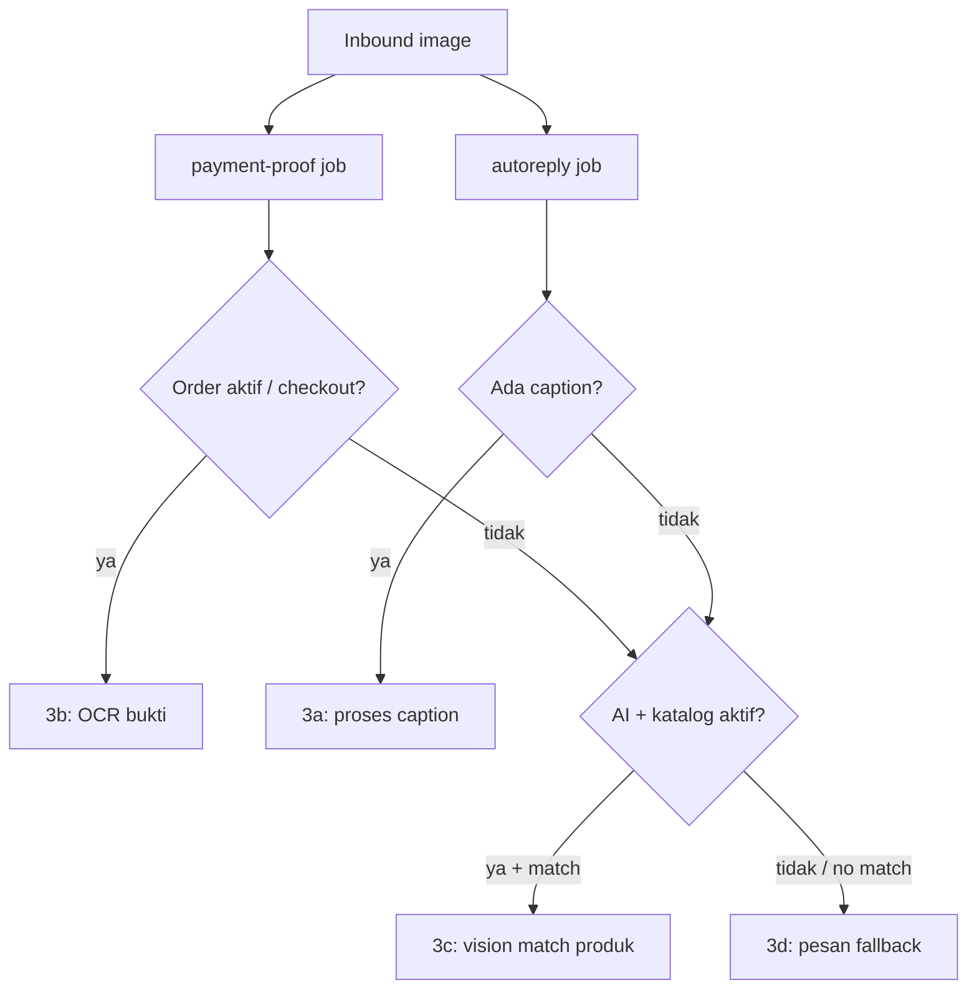

# Planned: AI Image Context — Fase 3c & 3d

**Status:** Planned — branch `feat/ai-image-context`  
**Roadmap terkait:** [`docs/WHATSAPP_INBOX_MEDIA_PAYMENT_STOCK.md`](../docs/WHATSAPP_INBOX_MEDIA_PAYMENT_STOCK.md) — Fase 3c, 3d  
**Prasyarat:** [ai-image-caption.md](./ai-image-caption.md) (3a), [payment-proof-fase2.md](./payment-proof-fase2.md) (3b)

---

## Konteks

Setelah Fase 3a/3b shipped, gambar inbound sudah di-route:

| Sub | Kondisi | Perilaku saat ini |
|-----|---------|-------------------|
| 3a | Image + caption | Caption diproses sebagai teks auto-reply |
| 3b | Image tanpa caption + order aktif | Pipeline bukti transfer (Fase 2) |
| **3c** | Image produk, tanpa order/bukti | **Belum** — butuh vision match katalog |
| **3d** | Image tidak relevan / tidak match | **Belum** — silent skip (payment proof L72 return nil) |

Fase 3c/3d menutup gap: AI tidak diam untuk gambar random tanpa caption dan tanpa order aktif.

---

## Routing gambar (setelah 3c/3d)



---

## Fase 3d — Fallback gambar (prioritas tinggi)

**Effort:** S  
**Tanpa vision** — hemat token.

### Trigger

Akhir `processPaymentProofJob` ketika `target == nil` (ganti silent return), dan autoreply sudah skip (no caption). Publish job `image-context-jobs` atau extend tail payment-proof handler.

### Perilaku

1. Kirim outbound WA:

   > Maaf kak, untuk gambar tanpa keterangan saya belum bisa bantu. Bisa ketik pertanyaannya, atau ketik *bantuan* untuk dihubungkan ke tim.

2. Record AI activity path `image_fallback`.
3. Opsional (config default **off** v1): set `conversation.ai_handled=false`, `handoff_reason='image_unhandled'` jika tenant enable handoff on image.

### File kunci (rencana)

| File | Peran |
|------|--------|
| `ai/image_context.go` | `processImageContextJob`, routing 3c vs 3d |
| `ai/image_context_jobs.go` | Topic `image-context-jobs`, publish dari payment-proof tail |

---

## Fase 3c — Vision match katalog

**Effort:** M  
**Memakai kuota token vision** — rate limit + quota guard wajib.

### Guard (semua harus lulus)

- `business_profile.ai_enabled = true`
- `usage.CheckQuota` / `RecordAIActivity` untuk purpose baru
- Inventory/katalog punya item aktif
- Rate limit: max **5 vision image per contact per jam** (Redis, selaras payment proof)

### Alur

1. Download bytes — reuse `inbox.FetchMessageMediaBytes`
2. `aivision.ExtractProductMatchFromImage` → JSON `{ productName, skuHint, confidence, visualDescription }`
3. Fuzzy match ke `ai/order_catalog.go` / `dbCatalogItem` by name/SKU
4. Match confidence ≥ **0.85** → balas `buildCatalogItemReply` + `formatStockLabel`
5. Tidak match / confidence rendah → fallback pesan 3d

### Usage

Purpose baru di `usage/ai_activity.go`:

```
PurposeProductImageMatch = "product_image_match"
```

### File kunci (rencana)

| File | Peran |
|------|--------|
| `aivision/vision.go` | Prompt `ExtractProductMatchFromImage` |
| `ai/image_context.go` | Match logic + reply builder reuse |
| `ai/order_catalog.go` | Lookup item by fuzzy name/SKU |

---

## Edge cases

| Risiko | Mitigasi |
|--------|----------|
| 3c false positive | Threshold tinggi (0.85+); ragu → 3d |
| Token abuse 3c | Rate limit per contact; respect `ai_token` quota |
| Double download (proof + 3c) | v2: share Redis cache key `inbox:media:*` (lihat [inbox-media-s3.md](./inbox-media-s3.md)) |
| Gambar bukti tanpa order | 3d fallback, bukan OCR bukti |
| Regresi 3b | Order aktif tetap masuk payment-proof sebelum 3c/3d |

---

## Test plan

```bash
cd api-go
encore test ./ai/... -run ImageContext
encore test ./aivision/... -run ProductMatch
```

- [ ] Payment proof no-order → outbound fallback 3d terkirim (mock)
- [ ] Image produk + katalog match → reply stok/harga
- [ ] Image produk + no match → fallback 3d
- [ ] Rate limit 6th image/contact/jam → skip 3c, 3d only
- [ ] `ai_enabled=false` → 3d only (no vision)
- [ ] Regresi: bukti transfer dengan order aktif → pipeline Fase 2 unchanged

---

## Staging manual (setelah deploy)

- [ ] Gambar random tanpa caption + tanpa order → AI balas fallback (3d)
- [ ] Foto produk yang ada di katalog → balasan stok/harga (3c)
- [ ] Bukti transfer dengan order draft → tetap `proof_submitted` (regresi 3b)
