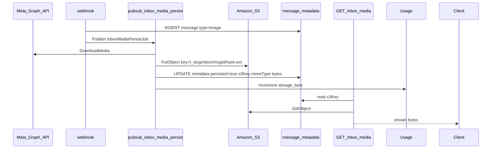

# Shipped: Persist Media Inbox ke Amazon S3 (Fase 1b)

**Status:** Shipped — merged PR [#58](https://github.com/vwijaya03/wabantu-api-go/pull/58)  
**Roadmap terkait:** [`docs/WHATSAPP_INBOX_MEDIA_PAYMENT_STOCK.md`](../docs/WHATSAPP_INBOX_MEDIA_PAYMENT_STOCK.md) — Fase 1b  
**Prasyarat:** [inbox-media-fase1.md](./inbox-media-fase1.md) (proxy Meta MVP sudah shipped)

---

## Masalah

Fase 1 MVP menyimpan `image.id` di `message.metadata` dan mengunduh on-demand lewat Meta Graph API + cache Redis (TTL 1 jam). Ketergantungan ini berarti:

- Media hilang jika `access_token` Meta kedaluwarsa atau media ID tidak lagi valid.
- Setiap tampilan inbox memicu unduh ulang ke Meta (meski ada cache singkat).
- Tidak ada akumulasi `storage_byte` di usage quota tenant.

Fase 1b menambahkan **persist async ke object storage** saat webhook menerima pesan media.

---

## Arsitektur



---

## Secrets Encore Cloud

Set via `encore secret set` (kosong di lokal = graceful degrade):

| Secret | Contoh | Keterangan |
|--------|--------|------------|
| `AWSS3Bucket` | `wabantu-staging-media` | Nama bucket |
| `AWSS3Region` | `ap-southeast-1` | Region AWS |
| `AWSS3AccessKeyID` | IAM user key | |
| `AWSS3SecretAccessKey` | IAM secret | |
| *(custom endpoint)* | — | AWS S3 native; R2/MinIO butuh perubahan kode terpisah |

**IAM policy minimal:** `s3:PutObject`, `s3:GetObject`, `s3:DeleteObject` pada prefix `*/inbox/*`.

---

## File kunci (implementasi)

| File | Peran |
|------|--------|
| `shared/mediastorage/s3.go` | `Put` / `Get` / `Delete`; key `{tenantSchema}/inbox/{messageID}/{sha256_prefix}.{ext}` |
| `inbox/media_persist_jobs.go` | Topic `inbox-media-persist`, handler download → S3 → patch metadata |
| `inbox/media.go` | `GetMessageMedia`: S3 jika `metadata.s3Key` ada, else fallback proxy Meta |
| `webhook/webhook.go` | Setelah insert message media → `PublishInboxMediaPersistJob` (non-blocking) |
| `usage/usage.go` | Increment `storage_byte` on put; reject persist jika over quota |

---

## Metadata setelah persist

Patch `message.metadata` (JSONB existing, tanpa migration baru):

```json
{
  "image": { "id": "..." },
  "persisted": true,
  "s3Key": "t_omah_apparel/inbox/uuid/abc123.jpg",
  "mimeType": "image/jpeg",
  "bytes": 12345,
  "persistedAt": "2026-07-09T10:00:00Z"
}
```

---

## Graceful degrade

| Kondisi | Perilaku |
|---------|----------|
| Secrets S3 kosong (lokal/dev) | Skip persist job; proxy Meta tetap jalan |
| Quota `storage_byte` habis | Log warn, skip persist; proxy on-demand tetap |
| Persist job gagal (Meta/S3 error) | Pub/Sub retry; GET media fallback proxy jika belum `persisted` |
| Message sudah `persisted=true` | GET media stream dari S3 tanpa Meta token |

---

## Quota & operasional

- Increment `usage.storage_byte` per object yang berhasil di-put.
- Reject persist (bukan reject pesan) jika tenant over quota — media tetap bisa di-proxy sekali dari Meta.
- **v2 (belum scope):** delete S3 object saat purge conversation/message.
- Lifecycle policy bucket opsional: expire object setelah 90 hari.

---

## Test plan

```bash
cd api-go
encore test ./inbox/... -run MediaPersist
encore test ./shared/mediastorage/...
```

- [ ] Webhook image → job publish → metadata `persisted=true`
- [ ] GET media setelah persist → bytes dari S3 (mock)
- [ ] Secrets kosong → tidak error, proxy Meta unchanged
- [ ] Over quota → persist skip, proxy tetap

---

## Staging manual (setelah deploy)

- [ ] Kirim gambar WA → object muncul di bucket prefix `{tenant}/inbox/`
- [ ] GET media tanpa token Meta valid (setelah persist) → gambar tetap load
- [ ] Regresi: inbox tanpa S3 configured (lokal) → proxy Meta seperti Fase 1
