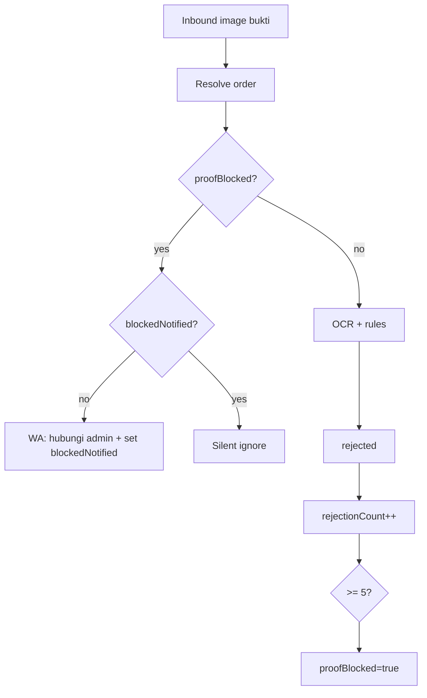

# Shipped: Bukti Transfer + Limit Penolakan (Fase 2)

**Status:** Siap merge  
**Branch:** `feat/order-payment-proof`  
**PR:** [#46](https://github.com/vwijaya03/wabantu-api-go/pull/46)  
**Tanggal:** 2026-06  
**Roadmap terkait:** [`docs/WHATSAPP_INBOX_MEDIA_PAYMENT_STOCK.md`](../docs/WHATSAPP_INBOX_MEDIA_PAYMENT_STOCK.md) — Fase 2  
**Frontend:** [web-frontend PR #32](https://github.com/vwijaya03/wabantu-web-frontend/pull/32) — [`web-frontend/docs-development-shipped/payment-proof-fase2.md`](../../web-frontend/docs-development-shipped/payment-proof-fase2.md)

---

## Apa yang di-ship

1. **Pipeline bukti transfer** — gambar WA terdeteksi, OCR, link ke order, `payment_status`, verifikasi manual/auto.
2. **Outbound WhatsApp** — pembeli mendapat balasan WA saat bukti diterima/ditolak/terverifikasi (bukan hanya insert DB).
3. **Skip AI** untuk gambar bukti (`IsPaymentProofInbound`) — hanya pipeline payment-proof yang memproses.
4. **Batas 5x penolakan per pesanan** — setelah 5 kali ditolak, upload berikutnya diabaikan (tanpa OCR).
5. **Unblock owner** — reset counter penuh; pembeli bisa kirim bukti lagi.

---

## `payment_status`

| Nilai | Arti |
|-------|------|
| `unpaid` | Belum ada bukti |
| `proof_submitted` | Bukti masuk, menunggu cek |
| `verified` | Pembayaran OK |
| `rejected` | Bukti ditolak |

Setelah `verified`, order bisa naik ke `processing` (manual verify owner atau auto-verify).

---

## `payment_proof_meta` (JSONB)

Selain field OCR (`amount`, `bank`, `accountNumber`, `confidence`, `flags`, `fileHash`, `rejectReason`):

| Field | Tipe | Keterangan |
|-------|------|------------|
| `rejectionCount` | `int` | Jumlah penolakan (sistem + owner Tolak) |
| `proofBlocked` | `bool` | `true` jika `rejectionCount >= 5` |
| `blockedNotified` | `bool` | Pesan WA batas sudah dikirim sekali |

Helper: [`order/payment_proof_meta.go`](../order/payment_proof_meta.go) — `PaymentProofMaxRejections = 5`.

Upload yang berhasil (`proof_submitted`) **tidak** menambah `rejectionCount`.

---

## Perilaku limit 5x penolakan



- **Penolakan dihitung:** auto-reject (duplikat hash, dll.) dan owner **Tolak** di dashboard.
- **Upload ke-6+ saat blocked:** tidak download media, tidak OCR; WA batas **sekali** lalu silent.
- **Caption `WB-xxxxxxxx` eksplisit:** order blocked tetap di-resolve agar pesan batas bisa terkirim.
- **Auto-pick order terbaru:** order blocked di-skip (`isPayablePaymentOrder` return false).
- **Owner Verifikasi:** selalu bisa tanpa unblock.
- **Rate limit 10 bukti/jam/contact** (Redis) tetap berlaku terpisah.

---

## API owner

| Method | Path | Aksi |
|--------|------|------|
| `POST` | `/api/v1/orders/:id/payment-proof/verify` | `verified` + `processing` (jika applicable) |
| `POST` | `/api/v1/orders/:id/payment-proof/reject` | `rejected` + `{ reason? }` + increment counter |
| `POST` | `/api/v1/orders/:id/payment-proof/unblock` | Reset counter; WA ke pembeli; `payment_status` tidak berubah |
| `PATCH` | `/api/v1/business/profile` | `paymentVerificationMode`, `paymentAutoVerifyMinConfidence` |

Semua endpoint payment-proof: **owner only** (`CanPerformOwnerActions`).

---

## Pipeline & routing

| File | Peran |
|------|--------|
| `ai/payment_proof.go` | Job processor, OCR, rules, blocked early-exit, outbound buyer messages |
| `ai/payment_proof_jobs.go` | Pub/Sub `payment-proof-jobs` |
| `ai/autoreply.go` | Skip AI jika `IsPaymentProofInbound` |
| `ai/order_customer.go` | `payment_status` di order lookup chat; `formatPaymentProofDetail` termasuk blocked |
| `order/payment_proof.go` | Verify / Reject / Unblock endpoints |
| `order/payment_proof_notify.go` | Kirim WA system message (unblock) tanpa import cycle ke `ai` |
| `aivision/vision.go` | OCR bukti transfer |
| `webhook/webhook.go` | Enqueue payment-proof job untuk gambar inbound |

---

## Pesan WA ke pembeli (contoh)

| Kejadian | Isi (ringkas) |
|----------|----------------|
| Bukti diterima | "Bukti transfer untuk pesanan WB-xxx sudah kami terima…" |
| Resubmit setelah reject | "Bukti transfer baru… sudah kami terima…" |
| Ditolak | "Maaf kak, bukti transfer… ditolak…" |
| Duplikat hash | Menyebut nomor pesanan lain yang sudah pakai screenshot sama |
| Batas 5x (upload berikutnya) | "…sudah ditolak 5 kali. Silakan hubungi admin toko…" |
| Owner unblock | "Admin sudah membuka batas upload bukti…" |

---

## Migration DB

Kolom di `"order"` dan `business_profile` — lihat [`tenant/tenant.go`](../tenant/tenant.go) + [`tenant/schema_patch.go`](../tenant/schema_patch.go). Field counter block **hanya** di JSONB `payment_proof_meta` (tanpa ALTER tambahan).

---

## Test

```bash
cd api-go
encore test ./ai/... ./order/...
```

Unit test khusus: `order/payment_proof_meta_test.go`, `ai/payment_proof_test.go` (blocked order, payable check).

### Manual QA

- [ ] 5x tolak → upload ke-6 diabaikan + 1x pesan WA batas
- [ ] Owner **Buka batas bukti** (FE) → upload diterima lagi
- [ ] Setelah blocked, owner **Verifikasi** → `verified` tanpa unblock
- [ ] Tanya status pembayaran di chat → detail menyebut batas 5/5 jika blocked

---

## Catatan operasional

- Unblock tidak mengubah `payment_status` — tetap `rejected` sampai bukti baru atau verify manual.
- Reset unblock: `rejectionCount=0`, `proofBlocked=false`, `blockedNotified=false` (bisa diblokir ulang dari nol).
- KB FAQ rekening wajib untuk auto-verify; mode manual tetap terima `proof_submitted`.
