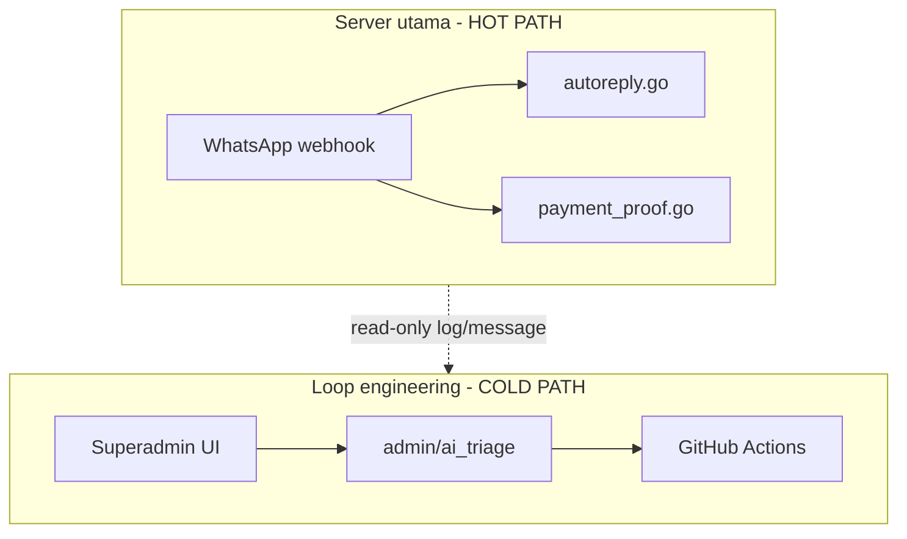
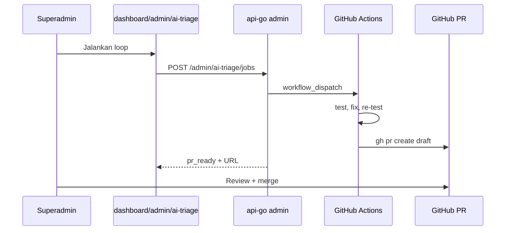

# Next Development: AI Triage Loop (Loop Engineering Otomatis)

Dokumen rencana pengembangan berikutnya untuk loop engineering otomatis WABantu.
Kamu hanya flag percakapan aneh di konsol superadmin; sistem analisa, generate test, fix, dan buat PR draft.

**Stack:** Encore Cloud gratis + GitHub Actions gratis. Tidak perlu Encore Pro atau Cursor Automation.

---

## Mengganggu server utama?

**Tidak**, dengan desain isolasi ini. Loop **tidak menyentuh hot path** WA (`webhook` → `ai-jobs` / `payment-proof-jobs`).

| Aktivitas | Dampak produksi |
|-----------|-----------------|
| `encore test` di GitHub Actions | Nol — runner terpisah |
| Analyzer fetch message | Read-only ringan, 1 conversation/job |
| Cron scan `usage_event` | Read-only, 1x/jam, LIMIT 50 |
| Simulator in-memory | CPU sementara, hanya superadmin |
| Merge PR fix + deploy | Sengaja — deploy bugfix normal |

**Guardrails wajib:**

1. Triage API = **SELECT only** pada schema tenant
2. Tidak publish ke Pub/Sub `ai-jobs` / `payment-proof-jobs`
3. Job async — handler return cepat, heavy work di GHA
4. Rate limit max 3 concurrent jobs, `tag:super_admin`
5. Cron batch kecil, bukan full table scan



---

## Requirement

| Yang diinginkan | Yang tidak diinginkan |
|-----------------|----------------------|
| UI di WABantu superadmin | Manual tambah case di `conversation_regression_test.go` |
| Klik aneh / pilih percakapan → jalan sendiri | Paste chat ke Cursor tiap bug |
| Full otomatis sampai PR draft | Hanya laporan tanpa fix |
| Kamu cuma **approve merge** di GitHub | — |

---

## Arsitektur

- **Encore Cloud gratis:** API triage + cron scan + job DB
- **GitHub Actions gratis:** test, fix, buat PR draft
- **Dua PR terpisah:** `api-go` (`feat/ai-triage-loop`) + `web-frontend` (`feat/ai-triage-console`)

### Alur UI



### Fondasi yang sudah ada

| Asset | Lokasi |
|-------|--------|
| Konsol superadmin | `web-frontend/app/(dashboard)/dashboard/admin/page.tsx` |
| Log AI per path | `api-go/usage/ai_activity.go` |
| Simulator routing | `api-go/ai/conversation_sim.go` |
| Async job polling | `api-go/tenant/migrate_jobs.go` |
| Regression runner | `api-go/scripts/run-ai-regression-tests.sh` |
| Golden regression | `api-go/ai/conversation_regression_test.go` |

---

## Fase implementasi

### Fase 1 — Analyzer (~1 hari, api-go)

**File:** `api-go/ai/triage.go`, `triage_test.go`

- `AnalyzeConversation` — read-only fetch messages, bandingkan `metadata.path` vs `ConversationSimulator.Turn()`
- `GenerateRegressionCases` — output Go untuk `conversation_regression_auto_gen_test.go`
- Allowlist path non-deterministik: `llm`, `llm_grounded`, `llm_tools`

### Fase 2 — Job API (~0.5 hari, api-go)

**File:** `api-go/admin/ai_triage.go`

- Migration `ai_triage_job` di public schema (`tenant/tenant.go` + `schema_patch.go`)
- `GET /api/v1/admin/ai-triage/anomalies`
- `POST /api/v1/admin/ai-triage/jobs`
- `GET /api/v1/admin/ai-triage/jobs/:id`
- Dispatch `workflow_dispatch` via secret `GITHUB_TOKEN`

### Fase 3 — GitHub Actions (~1 hari, api-go)

- `.github/workflows/ai-triage-fix.yml` — test, fix, PR draft
- `.github/workflows/ai-regression.yml` — gate tiap PR
- `scripts/triage-apply.go` — tulis auto-gen test file

### Fase 4 — UI Superadmin (~1 hari, web-frontend)

- `/dashboard/admin/ai-triage`
- Tab Mencurigakan + Investigasi + tombol Jalankan loop + link PR
- Link dari halaman AI Activity

### Fase 5 — Cron auto-scan (~0.5 hari, api-go)

- Scan `usage_event` type `ai_activity` 1x/jam (batas Encore free)
- Isi daftar mencurigakan di UI

---

## Urutan deploy

1. api-go Fase 1+2 → deploy Encore
2. GHA Fase 3 → test `workflow_dispatch` manual
3. web-frontend Fase 4 → E2E dari UI
4. Cron Fase 5

**Estimasi total:** ~4–5 hari kerja.

---

## Setup sekali (gratis)

```bash
# GitHub PAT: repo wabantu-api-go, permissions contents + pull_requests + actions
encore secret set --dev GITHUB_TOKEN
encore secret set --prod GITHUB_TOKEN
```

Branch protection `master`: require check AI Regression setelah Fase 3.

---

## Yang ditunda (bukan next dev)

- LLM-as-judge untuk assert teks balasan
- Auto-merge PR tanpa human
- Auto-deploy setelah merge
- Integration test 3280 di CI
- Tier 5 production closed-loop penuh

---

## Workflow manual (fallback darurat)

Jika GHA down atau hotfix cepat:

```bash
cd api-go
# tambah case di ai/conversation_regression_test.go
./scripts/run-ai-regression-tests.sh
```

Lihat juga: [WHATSAPP_BUYER_BEHAVIOR_TESTS.md](./WHATSAPP_BUYER_BEHAVIOR_TESTS.md)
