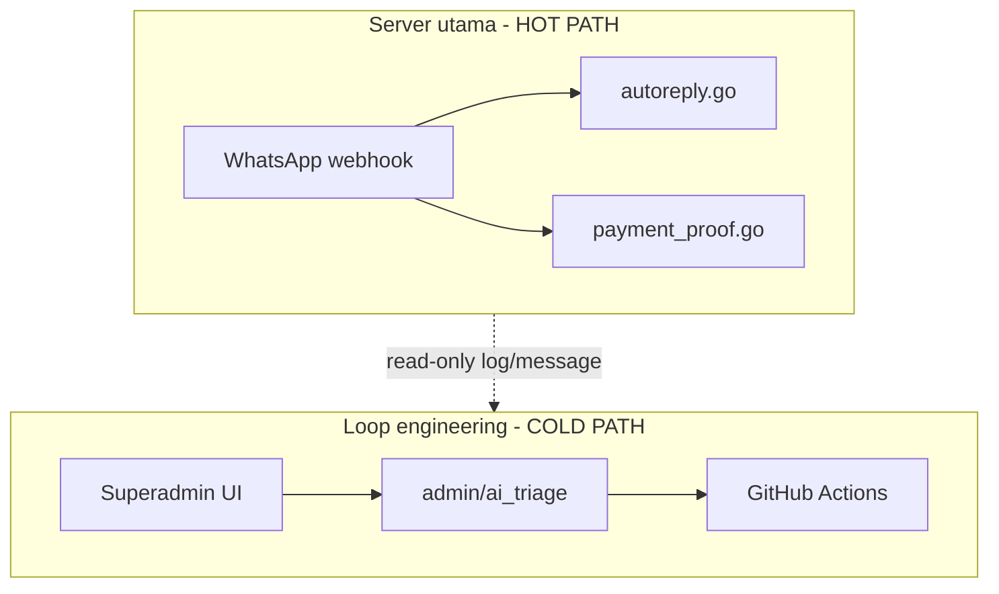
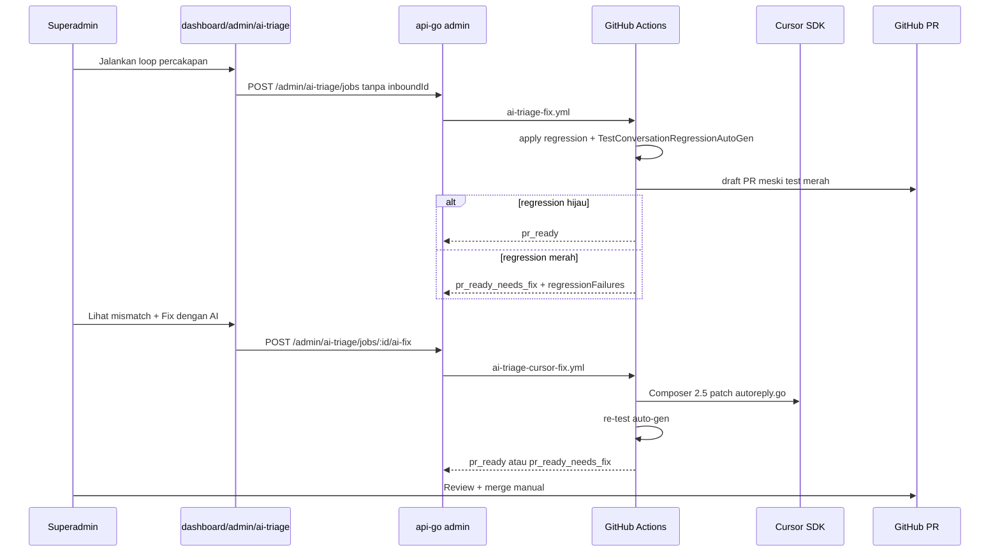

# Next Development: AI Triage Loop (Loop Engineering Otomatis)

Dokumen rencana pengembangan berikutnya untuk loop engineering otomatis WABantu.
Kamu hanya flag percakapan aneh di konsol superadmin; sistem analisa, generate test, fix, dan buat PR draft.

**Stack:** Encore Cloud gratis + GitHub Actions gratis + **Cursor SDK** (Composer 2.5, trigger manual). Tidak perlu Encore Pro.

---

## Mengganggu server utama?

**Tidak**, dengan desain isolasi ini. Loop **tidak menyentuh hot path** WA (`webhook` → `ai-jobs` / `payment-proof-jobs`).

| Aktivitas | Dampak produksi |
|-----------|-----------------|
| `encore test` di GitHub Actions | Nol — runner terpisah |
| Analyzer fetch message | Read-only ringan, 1 conversation/job |
| Cron scan `usage_event` | Read-only, 1x/jam, LIMIT 50 |
| Simulator in-memory | CPU sementara, hanya superadmin |
| Merge PR fix + deploy | Sengaja — deploy bugfix normal |

**Guardrails wajib:**

1. Triage API = **SELECT only** pada schema tenant
2. Tidak publish ke Pub/Sub `ai-jobs` / `payment-proof-jobs`
3. Job async — handler return cepat, heavy work di GHA
4. Rate limit max 3 concurrent jobs, `tag:super_admin`
5. Cron batch kecil, bukan full table scan



---

## Scale & safety guardrails (jutaan message)

Loop triage **tidak** memindai seluruh tabel `message`. Volume global aman selama setiap operasi tetap **scoped + dibatasi**.

### Prinsip

| Layer | Tabel | Skala operasi triage |
|-------|-------|----------------------|
| Hot path | `message` | Setiap pesan WA masuk — **tidak disentuh** triage |
| Cold path — cron | `usage_event` | ~1 baris per AI reply; scan jam terakhir saja |
| Cold path — analyzer | `message` | Hanya `conversation_id` yang diflag; puluhan–ratusan baris |

`usage_event` lebih kecil dari `message` (tidak semua pesan punya baris AI activity). Index yang sudah ada: `idx_usage_event_type_created` pada `(event_type, created_at)`; `message` punya `idx_message_conv_created`.

### Query wajib (implementasi)

**Cron mencurigakan (Fase 5)** — jangan full scan:

```sql
SELECT id, metadata, created_at
FROM "{tenant_schema}".usage_event
WHERE event_type = 'ai_activity'
  AND created_at >= now() - interval '1 hour'
ORDER BY created_at DESC
LIMIT 50;
```

- Jalankan **per tenant aktif** dengan cap total baris lintas tenant (mis. max 200/jam).
- Cron hanya **mengisi daftar UI** — tidak auto-trigger GHA tanpa klik superadmin.

**Analyzer (Fase 1)** — wajib filter conversation:

```sql
SELECT id, direction, body, metadata, created_at
FROM "{tenant_schema}".message
WHERE conversation_id = $1
ORDER BY created_at ASC
LIMIT 200;
```

- **Dilarang:** `SELECT` tanpa `conversation_id`, scan lintas tenant dalam satu job, atau `COUNT(*)` full table untuk anomaly.

**API list anomalies** — pagination + `LIMIT` (default 50, max 100).

### Batas konkuren & antrian

| Guardrail | Nilai | Alasan |
|-----------|-------|--------|
| Job triage concurrent | Max 3 | Lindungi DB + GitHub API |
| Pesan per analisa | Max 200 | Cukup untuk konteks routing; hindari load chat panjang |
| Cron frequency | 1×/jam | Batas cron Encore free + beban read rendah |
| Dispatch GHA | 1 workflow per job | `ai_triage_job`; lihat [Status job](#status-job-ai_triage_job) |
| Stale reclaim | pending > 3 menit, running/fix_running > 2 jam | Bebaskan slot zombie otomatis |
| Akses API | `super_admin` only | Tidak expose ke tenant owner |

### Risiko di scale besar & mitigasi

| Risiko | Mitigasi |
|--------|----------|
| `usage_event` membengkak (tahun+) | Retention opsional untuk row triage (mis. 90 hari); rollup anomaly sudah tersimpan di `ai_triage_job` |
| Banyak tenant × cron | Cap global per run; prioritas tenant dengan anomaly rate tinggi (v2) |
| Chat sangat panjang (>200 pesan) | Analyzer pakai 200 pesan terakhir saja (`ORDER BY created_at DESC LIMIT 200` lalu reverse) |
| GHA spam PR draft | Human wajib klik "Jalankan loop"; cron tidak dispatch otomatis |
| Index tidak dipakai | Review `EXPLAIN` saat implementasi; jangan query tanpa filter `event_type` / `conversation_id` |

### Checklist review sebelum merge implementasi

- [x] Semua query triage punya `LIMIT` eksplisit
- [x] Tidak ada `Publish` ke `ai-jobs` / `payment-proof-jobs` dari package triage
- [x] Job concurrent dicek di DB sebelum dispatch GHA
- [ ] Test load: tenant mock 10k `usage_event` + cron → selesai <5 detik read-only
- [ ] Test analyzer: conversation 500 pesan → hanya fetch 200, tidak timeout

### Status job (`ai_triage_job`)

| Status | Arti |
|--------|------|
| `pending` | Job dibuat, menunggu dispatch GHA |
| `running` | Workflow `ai-triage-fix.yml` berjalan |
| `pr_ready` | Draft PR siap, regression auto-gen **hijau** |
| `pr_ready_needs_fix` | Draft PR ada, regression **merah** — siap **Fix dengan AI** |
| `fix_running` | Workflow `ai-triage-cursor-fix.yml` (Composer 2.5) berjalan |
| `failed` | Workflow gagal total (bukan sekadar test merah) |

Maks **3 job aktif** (`pending` + `running` + `fix_running`). `CreateAITriageJob` ditolak jika tidak ada mismatch routing deterministik.

---

## Requirement

| Yang diinginkan | Yang tidak diinginkan |
|-----------------|----------------------|
| UI di WABantu superadmin | Manual tambah case di `conversation_regression_test.go` tiap bug |
| Satu klik per **percakapan** → analisa semua turn routing | Loop per baris inbound terpisah |
| Draft PR + laporan mismatch terstruktur | Hanya log mentah tanpa konteks |
| **Fix dengan AI** (Composer 2.5) saat regression merah | Auto-merge PR tanpa human |
| Kamu cuma **approve merge** di GitHub | — |

---

## Arsitektur

- **Encore Cloud gratis:** API triage + cron scan + job DB
- **GitHub Actions gratis:** test, fix, buat PR draft
- **Dua PR terpisah:** `api-go` (`feat/ai-triage-loop`) + `web-frontend` (`feat/ai-triage-console`)

### Alur UI (lengkap)



### Dua jenis masalah (jangan dicampur)

| Sumber | Contoh | Loop routing fix? |
|--------|--------|-------------------|
| **Simulator vs produksi** (`metadata.path`) | Path `order_flow` di prod, simulator expect `consulting` | **Ya** — ini target loop + regression |
| **LLM judge** (tab AI Review) | `wrong_answer`, `hallucination`, harga salah | **Tidak** — isi balasan LLM; review manual atau eval terpisah |

Tab **AI Review** tetap punya tombol loop per percakapan untuk cek routing tersembunyi, bukan fix isi balasan Haiku.

### Fondasi yang sudah ada

| Asset | Lokasi |
|-------|--------|
| Konsol superadmin | `web-frontend/app/(dashboard)/dashboard/admin/page.tsx` |
| Log AI per path | `api-go/usage/ai_activity.go` |
| Simulator routing | `api-go/ai/conversation_sim.go` |
| Async job polling | `api-go/tenant/migrate_jobs.go` |
| Regression runner (golden) | `api-go/scripts/run-ai-regression-tests.sh` |
| Regression runner (auto-gen saja) | `api-go/scripts/run-triage-autogen-tests.sh` |
| Parse failure GHA | `api-go/scripts/parse-regression-failures.py` |
| Cursor fix script | `api-go/scripts/triage-cursor-fix.mjs` |
| Golden regression | `api-go/ai/conversation_regression_test.go` |
| Auto-gen regression | `api-go/ai/conversation_regression_auto_gen_test.go` |

---

## Fase implementasi

### Fase 1 — Analyzer ✅

**File:** `api-go/ai/triage.go`, `triage_test.go`

- [x] `AnalyzeConversation` — replay multi-turn, bandingkan `metadata.path` vs simulator
- [x] `GenerateRegressionCases` — output ke `conversation_regression_auto_gen_test.go` dengan **`priorInputs`** (konteks turn sebelumnya)
- [x] `CountRegressionMismatches`, `EnrichAnalysisResult` (fixHints)
- [x] Allowlist path non-deterministik: `llm`, `llm_grounded`, `llm_tools`
- [x] Tolak job jika tidak ada mismatch deterministik

**Analysis JSON** (disimpan di `ai_triage_job.analysis_json`):

```json
{
  "mismatches": [{
    "inboundId": "...",
    "userText": "...",
    "actualPath": "consulting",
    "expectedPath": "order_flow",
    "priorTurns": ["halo", "..."],
    "turnIndex": 2
  }],
  "regressionFailures": [{
    "caseName": "triage_abc_0",
    "gotPath": "order_flow",
    "wantPath": "consulting",
    "replyPreview": "..."
  }],
  "fixHints": {
    "likelyFiles": ["ai/autoreply.go", "ai/conversation_sim.go"],
    "catalogSource": "tenant_db",
    "testUsesFixture": "newOmahSimulator"
  },
  "cursorAgentId": "...",
  "cursorFixGithubRunUrl": "..."
}
```

**Catatan catalog:** analyzer pakai `BuildSimulatorFromTenant` (DB live); test GHA pakai `newOmahSimulator()` (fixture). Gap ini bisa menyebabkan false positive — Composer fix harus review diff manual.

### Fase 2 — Job API ✅

**File:** `api-go/admin/ai_triage.go`, `ai_triage_internal.go`

- [x] Migration `ai_triage_job` di public schema
- [x] `GET /api/v1/admin/ai-triage/anomalies`
- [x] `POST /api/v1/admin/ai-triage/jobs` — `conversationId` wajib, `inboundId` opsional (fokus 1 turn)
- [x] `GET /api/v1/admin/ai-triage/jobs/:id`
- [x] `POST /api/v1/admin/ai-triage/jobs/:id/ai-fix` — dispatch Composer fix (Fase 8)
- [x] Internal: `GET/POST /api/v1/internal/ai-triage/jobs/:id` (+ `/complete`)
- [x] Stale job reclaim (pending 3 menit, running/fix_running 2 jam)
- [x] Dispatch `workflow_dispatch` via Encore secret `GitHubActionsToken`

### Fase 3 — GitHub Actions (triage-fix) ✅

- [x] `.github/workflows/ai-triage-fix.yml` — fetch job → apply regression → **hanya** `TestConversationRegressionAutoGen` → draft PR → callback
- [x] Regression merah **tidak memblokir** PR — status `pr_ready_needs_fix`
- [x] Artifact GHA `mismatch-report-{jobId}` (`triage_job.json`, `regression_failures.json`, log)
- [x] `.github/workflows/ai-regression.yml` — gate golden suite tiap PR ke `master`
- [x] `scripts/triage-apply.go` — tulis `conversation_regression_auto_gen_test.go` (replay `priorInputs`)
- [x] `scripts/parse-regression-failures.py` — parse output test → `regressionFailures`

**GitHub repo secrets (wabantu-api-go):**

| Secret | Isi |
|--------|-----|
| `GitHubActionsToken` | Encore secret — dispatch workflow dari API |
| `AI_INTERNAL_TOKEN` | Sama dengan Encore secret `AiInternalToken` |
| `ENCORE_STAGING_API_URL` | Base URL staging tanpa `/api/v1` |
| `ENCORE_AUTH_KEY` | Encore Cloud Auth Key (untuk `encore test` di GHA) |
| `GITHUB_PAT` | (Opsional) PAT scope `repo` jika `GITHUB_TOKEN` diblokir membuat PR |
| `CURSOR_API_KEY` | Cursor Dashboard → Integrations (untuk Fase 8) |

**Catatan:** `ai-triage-fix.yml` **tidak** mengubah `autoreply.go` — hanya regression file + draft PR.

### Fase 4 — UI Superadmin ✅

**File:** `web-frontend/app/(dashboard)/dashboard/admin/ai-triage/page.tsx`

- [x] `/dashboard/admin/ai-triage` — tab Mencurigakan, AI Review, Laporan, Investigasi
- [x] **Jalankan loop per percakapan** (group by `conversationId`, tanpa `inboundId`)
- [x] Investigasi: default seluruh percakapan; checkbox "Hanya turn ini" untuk `inboundId`
- [x] Refresh manual (tombol Perbarui) — tidak auto-poll 3 detik
- [x] `JobStatusPanel` — mismatch, regression failures, fix hints, link PR/GHA
- [x] Tombol **Fix dengan AI** (Fase 8)

### Fase 5 — Cron auto-scan (~0.5 hari, api-go) ✅

- [x] Cron `ai-triage-anomaly-scan` 1×/jam (`0 * * * *`)
- [x] Tabel system `ai_triage_anomaly` — snapshot read-only per tenant
- [x] Cap 50/tenant, 200 global; `GET anomalies` baca snapshot + fallback live
- Ikuti query & cap di § [Scale & safety guardrails](#scale--safety-guardrails-jutaan-message)

### Fase 6 — LLM-as-judge window scan (~2 hari, api-go + web-frontend) ✅

- `POST /api/v1/admin/ai-triage/llm-scans` — scan read-only pasangan pesan dalam rentang waktu (max 6 jam, 30 turn)
- `GET /api/v1/admin/ai-triage/llm-scans/:id` — poll status + findings
- Haiku judge: flag balasan bermasalah (wrong_answer, off_topic, hallucination, dll.)
- UI tab **AI Review** — datetime picker + tabel flagged + **loop per percakapan** (bukan per baris)
- **Tidak** auto-dispatch GHA; komplementer dengan simulator routing (Fase 1–3)
- Loop di tab ini = routing only, bukan fix `wrong_answer` / `hallucination`

### Fase 7 — Human report dari Inbox (~1 hari, api-go + web-frontend) ✅

- Tabel system `ai_triage_report` — laporan manual per balasan AI (immutable snapshot user/reply text)
- `POST/GET /api/v1/inbox/messages/:id/report` — tenant staff + superadmin (impersonate); rate limit 20/hari (tenant) / 50/hari (superadmin)
- `GET/PATCH /api/v1/admin/ai-triage/reports` — antrian review superadmin
- Pub/Sub `ai-triage-report-judge` — Haiku judge async saat report dibuat (konteks, bukan keputusan final)
- UI Inbox: tombol **Report** pada balasan `ai`/`system`
- UI tab **Laporan** — konfirmasi / abaikan / **loop per percakapan**

### Fase 8 — Cursor Composer fix + laporan terstruktur ✅

**api-go:**

- [x] `.github/workflows/ai-triage-cursor-fix.yml` — checkout branch PR → Cursor SDK → patch routing → re-test → push
- [x] `scripts/triage-cursor-fix.mjs` — `Agent.prompt` model `composer-2.5`, scope `ai/autoreply.go` + `ai/conversation_sim.go`
- [x] `POST /api/v1/admin/ai-triage/jobs/:id/ai-fix` — trigger manual dari UI
- [x] Simpan `cursorAgentId`, `cursorFixGithubRunUrl` di analysis job

**web-frontend:**

- [x] Tombol **Fix dengan AI** di `JobStatusPanel` (status `pr_ready_needs_fix` atau `failed` dengan mismatch)
- [x] Tampilkan `regressionFailures`, `priorTurns`, link Cursor fix run

**Human in the loop (wajib):**

- Draft PR tetap **draft** sampai superadmin review diff
- Composer bisa salah — re-trigger fix atau edit manual
- Merge tidak otomatis

**Scale ke banyak masalah:**

- Triage queue memfilter insiden (bukan scan semua pesan)
- **Batch per percakapan** — satu job, banyak regression case, satu PR
- Golden suite (`conversation_regression_test.go`) tetap kecil; auto-gen = quarantine sampai hijau

---

## Urutan deploy

1. api-go Fase 1+2 → deploy Encore
2. GHA Fase 3 → test `workflow_dispatch` manual
3. web-frontend Fase 4 → E2E dari UI
4. Cron Fase 5
5. Fase 6 LLM scan → Fase 7 human report
6. Fase 8 Composer fix — set `CURSOR_API_KEY` di GitHub, merge api-go + web

**Status:** Fase 1–8 diimplementasikan. PR utama: api-go #88, web-frontend #58 (lihat GitHub).

---

## Setup sekali (gratis)

```bash
# Encore — dispatch workflow dari API
encore secret set --env=staging GitHubActionsToken
encore secret set --env=prod GitHubActionsToken

# GitHub repo wabantu-api-go → Settings → Secrets
# AI_INTERNAL_TOKEN, ENCORE_STAGING_API_URL, ENCORE_AUTH_KEY
# GITHUB_PAT (opsional), CURSOR_API_KEY (Fase 8)
```

Branch protection `master`: require check **AI Regression** (`ai-regression.yml` — golden suite).

---

## Yang ditunda (bukan next dev)

- Auto-merge PR tanpa human
- Auto-deploy setelah merge
- Regression isi balasan LLM (golden reply text dari LLM judge findings)
- Catalog snapshot embed di test GHA (saat ini fixture vs tenant DB masih bisa mismatch)
- Integration test 3280 di CI
- Batch loop banyak percakapan berbeda dalam satu klik

---

## Workflow manual (fallback darurat)

Jika GHA down atau hotfix cepat:

```bash
cd api-go
# Golden cases (manual):
# edit ai/conversation_regression_test.go
./scripts/run-ai-regression-tests.sh

# Auto-gen saja (sama seperti triage-fix GHA):
./scripts/run-triage-autogen-tests.sh
```

Lihat juga: [WHATSAPP_BUYER_BEHAVIOR_TESTS.md](./WHATSAPP_BUYER_BEHAVIOR_TESTS.md)
