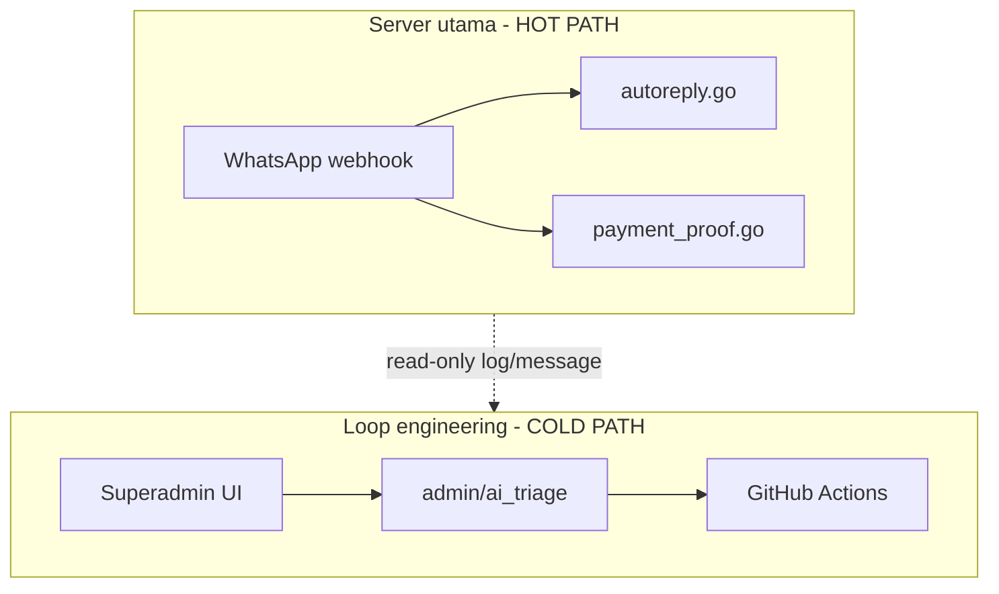
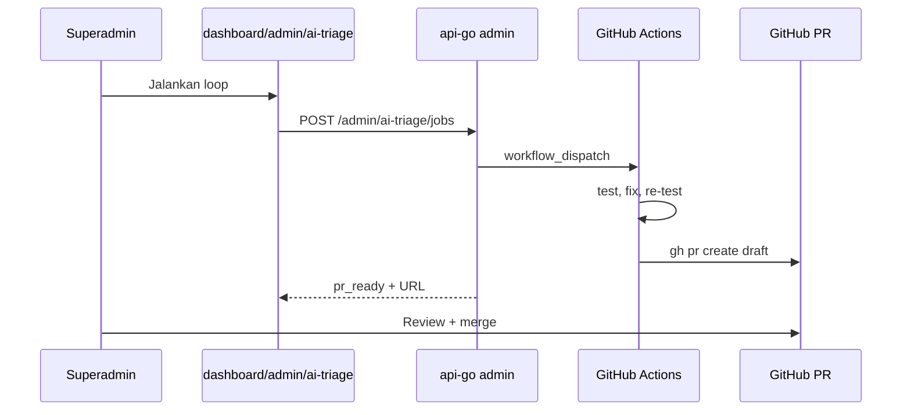

# Next Development: AI Triage Loop (Loop Engineering Otomatis)

Dokumen rencana pengembangan berikutnya untuk loop engineering otomatis WABantu.
Kamu hanya flag percakapan aneh di konsol superadmin; sistem analisa, generate test, fix, dan buat PR draft.

**Stack:** Encore Cloud gratis + GitHub Actions gratis. Tidak perlu Encore Pro atau Cursor Automation.

---

## Mengganggu server utama?

**Tidak**, dengan desain isolasi ini. Loop **tidak menyentuh hot path** WA (`webhook` → `ai-jobs` / `payment-proof-jobs`).

| Aktivitas | Dampak produksi |
|-----------|-----------------|
| `encore test` di GitHub Actions | Nol — runner terpisah |
| Analyzer fetch message | Read-only ringan, 1 conversation/job |
| Cron scan `usage_event` | Read-only, 1x/jam, LIMIT 50 |
| Simulator in-memory | CPU sementara, hanya superadmin |
| Merge PR fix + deploy | Sengaja — deploy bugfix normal |

**Guardrails wajib:**

1. Triage API = **SELECT only** pada schema tenant
2. Tidak publish ke Pub/Sub `ai-jobs` / `payment-proof-jobs`
3. Job async — handler return cepat, heavy work di GHA
4. Rate limit max 3 concurrent jobs, `tag:super_admin`
5. Cron batch kecil, bukan full table scan



---

## Scale & safety guardrails (jutaan message)

Loop triage **tidak** memindai seluruh tabel `message`. Volume global aman selama setiap operasi tetap **scoped + dibatasi**.

### Prinsip

| Layer | Tabel | Skala operasi triage |
|-------|-------|----------------------|
| Hot path | `message` | Setiap pesan WA masuk — **tidak disentuh** triage |
| Cold path — cron | `usage_event` | ~1 baris per AI reply; scan jam terakhir saja |
| Cold path — analyzer | `message` | Hanya `conversation_id` yang diflag; puluhan–ratusan baris |

`usage_event` lebih kecil dari `message` (tidak semua pesan punya baris AI activity). Index yang sudah ada: `idx_usage_event_type_created` pada `(event_type, created_at)`; `message` punya `idx_message_conv_created`.

### Query wajib (implementasi)

**Cron mencurigakan (Fase 5)** — jangan full scan:

```sql
SELECT id, metadata, created_at
FROM "{tenant_schema}".usage_event
WHERE event_type = 'ai_activity'
  AND created_at >= now() - interval '1 hour'
ORDER BY created_at DESC
LIMIT 50;
```

- Jalankan **per tenant aktif** dengan cap total baris lintas tenant (mis. max 200/jam).
- Cron hanya **mengisi daftar UI** — tidak auto-trigger GHA tanpa klik superadmin.

**Analyzer (Fase 1)** — wajib filter conversation:

```sql
SELECT id, direction, body, metadata, created_at
FROM "{tenant_schema}".message
WHERE conversation_id = $1
ORDER BY created_at ASC
LIMIT 200;
```

- **Dilarang:** `SELECT` tanpa `conversation_id`, scan lintas tenant dalam satu job, atau `COUNT(*)` full table untuk anomaly.

**API list anomalies** — pagination + `LIMIT` (default 50, max 100).

### Batas konkuren & antrian

| Guardrail | Nilai | Alasan |
|-----------|-------|--------|
| Job triage concurrent | Max 3 | Lindungi DB + GitHub API |
| Pesan per analisa | Max 200 | Cukup untuk konteks routing; hindari load chat panjang |
| Cron frequency | 1×/jam | Batas cron Encore free + beban read rendah |
| Dispatch GHA | 1 workflow per job | Queue `ai_triage_job`; status `pending` → `running` → `completed` / `failed` |
| Akses API | `super_admin` only | Tidak expose ke tenant owner |

### Risiko di scale besar & mitigasi

| Risiko | Mitigasi |
|--------|----------|
| `usage_event` membengkak (tahun+) | Retention opsional untuk row triage (mis. 90 hari); rollup anomaly sudah tersimpan di `ai_triage_job` |
| Banyak tenant × cron | Cap global per run; prioritas tenant dengan anomaly rate tinggi (v2) |
| Chat sangat panjang (>200 pesan) | Analyzer pakai 200 pesan terakhir saja (`ORDER BY created_at DESC LIMIT 200` lalu reverse) |
| GHA spam PR draft | Human wajib klik "Jalankan loop"; cron tidak dispatch otomatis |
| Index tidak dipakai | Review `EXPLAIN` saat implementasi; jangan query tanpa filter `event_type` / `conversation_id` |

### Checklist review sebelum merge implementasi

- [ ] Semua query triage punya `LIMIT` eksplisit
- [ ] Tidak ada `Publish` ke `ai-jobs` / `payment-proof-jobs` dari package triage
- [ ] Job concurrent dicek di DB atau Redis sebelum dispatch GHA
- [ ] Test load: tenant mock 10k `usage_event` + cron → selesai <5 detik read-only
- [ ] Test analyzer: conversation 500 pesan → hanya fetch 200, tidak timeout

---

## Requirement

| Yang diinginkan | Yang tidak diinginkan |
|-----------------|----------------------|
| UI di WABantu superadmin | Manual tambah case di `conversation_regression_test.go` |
| Klik aneh / pilih percakapan → jalan sendiri | Paste chat ke Cursor tiap bug |
| Full otomatis sampai PR draft | Hanya laporan tanpa fix |
| Kamu cuma **approve merge** di GitHub | — |

---

## Arsitektur

- **Encore Cloud gratis:** API triage + cron scan + job DB
- **GitHub Actions gratis:** test, fix, buat PR draft
- **Dua PR terpisah:** `api-go` (`feat/ai-triage-loop`) + `web-frontend` (`feat/ai-triage-console`)

### Alur UI



### Fondasi yang sudah ada

| Asset | Lokasi |
|-------|--------|
| Konsol superadmin | `web-frontend/app/(dashboard)/dashboard/admin/page.tsx` |
| Log AI per path | `api-go/usage/ai_activity.go` |
| Simulator routing | `api-go/ai/conversation_sim.go` |
| Async job polling | `api-go/tenant/migrate_jobs.go` |
| Regression runner | `api-go/scripts/run-ai-regression-tests.sh` |
| Golden regression | `api-go/ai/conversation_regression_test.go` |

---

## Fase implementasi

### Fase 1 — Analyzer (~1 hari, api-go)

**File:** `api-go/ai/triage.go`, `triage_test.go`

- `AnalyzeConversation` — read-only fetch messages, bandingkan `metadata.path` vs `ConversationSimulator.Turn()`
- `GenerateRegressionCases` — output Go untuk `conversation_regression_auto_gen_test.go`
- Allowlist path non-deterministik: `llm`, `llm_grounded`, `llm_tools`

### Fase 2 — Job API (~0.5 hari, api-go)

**File:** `api-go/admin/ai_triage.go`

- Migration `ai_triage_job` di public schema (`tenant/tenant.go` + `schema_patch.go`)
- `GET /api/v1/admin/ai-triage/anomalies`
- `POST /api/v1/admin/ai-triage/jobs`
- `GET /api/v1/admin/ai-triage/jobs/:id`
- Dispatch `workflow_dispatch` via secret `GitHubActionsToken`

### Fase 3 — GitHub Actions (~1 hari, api-go)

- [x] `.github/workflows/ai-triage-fix.yml` — fetch job → apply regression → test → draft PR → callback Encore
- [x] `.github/workflows/ai-regression.yml` — gate tiap PR ke `master`
- [x] `scripts/triage-apply.go` — tulis `conversation_regression_auto_gen_test.go`
- [x] Internal API: `GET/POST /api/v1/internal/ai-triage/jobs/:id` (+ `/complete`)

**GitHub repo secrets (wabantu-api-go):**

| Secret | Isi |
|--------|-----|
| `AI_INTERNAL_TOKEN` | Sama dengan Encore secret `AiInternalToken` |
| `ENCORE_STAGING_API_URL` | Base URL staging tanpa `/api/v1` (mis. `https://staging-wabantu-viko-8vni.encr.app`) |
| `ENCORE_AUTH_KEY` | Auth key dari Encore Cloud → App Settings → Auth Keys (untuk `encore test` di GHA) |
| `GITHUB_PAT` | (Opsional) PAT dengan scope `repo` jika org memblokir `GITHUB_TOKEN` membuat PR — atau aktifkan **Settings → Actions → Allow GitHub Actions to create and approve pull requests** |

**Catatan:** Workflow tidak auto-fix `autoreply.go` — hanya draft PR berisi regression cases; routing fix manual review.

### Fase 4 — UI Superadmin (~1 hari, web-frontend)

- `/dashboard/admin/ai-triage`
- Tab Mencurigakan + Investigasi + tombol Jalankan loop + link PR
- Link dari halaman AI Activity

### Fase 5 — Cron auto-scan (~0.5 hari, api-go) ✅

- [x] Cron `ai-triage-anomaly-scan` 1×/jam (`0 * * * *`)
- [x] Tabel system `ai_triage_anomaly` — snapshot read-only per tenant
- [x] Cap 50/tenant, 200 global; `GET anomalies` baca snapshot + fallback live
- Ikuti query & cap di § [Scale & safety guardrails](#scale--safety-guardrails-jutaan-message)

### Fase 6 — LLM-as-judge window scan (~2 hari, api-go + web-frontend) ✅

- `POST /api/v1/admin/ai-triage/llm-scans` — scan read-only pasangan pesan dalam rentang waktu (max 6 jam, 30 turn)
- `GET /api/v1/admin/ai-triage/llm-scans/:id` — poll status + findings
- Haiku judge: flag balasan bermasalah (wrong_answer, off_topic, hallucination, dll.)
- UI tab **AI Review** — datetime picker + tabel flagged + link ke Jalankan loop
- **Tidak** auto-dispatch GHA; komplementer dengan simulator routing (Fase 1–3)

### Fase 7 — Human report dari Inbox (~1 hari, api-go + web-frontend) ✅

- Tabel system `ai_triage_report` — laporan manual per balasan AI (immutable snapshot user/reply text)
- `POST/GET /api/v1/inbox/messages/:id/report` — tenant staff + superadmin (impersonate); rate limit 20/hari (tenant) / 50/hari (superadmin)
- `GET/PATCH /api/v1/admin/ai-triage/reports` — antrian review superadmin
- Pub/Sub `ai-triage-report-judge` — Haiku judge async saat report dibuat (konteks, bukan keputusan final)
- UI Inbox: tombol **Report** pada balasan `ai`/`system`
- UI tab **Laporan** di `/dashboard/admin/ai-triage` — konfirmasi / abaikan / jalankan loop

---

## Urutan deploy

1. api-go Fase 1+2 → deploy Encore
2. GHA Fase 3 → test `workflow_dispatch` manual
3. web-frontend Fase 4 → E2E dari UI
4. Cron Fase 5
5. Fase 6 LLM scan → Fase 7 human report (api-go dulu, lalu web)

**Estimasi total:** ~4–5 hari kerja.

---

## Setup sekali (gratis)

```bash
# GitHub PAT: repo wabantu-api-go, permissions contents + pull_requests + actions
encore secret set --env=staging GitHubActionsToken
encore secret set --env=prod GitHubActionsToken
```

Branch protection `master`: require check **AI Regression** setelah Fase 3 merge.

---

## Yang ditunda (bukan next dev)

- Auto-merge PR tanpa human
- Auto-deploy setelah merge
- Integration test 3280 di CI
- Tier 5 production closed-loop penuh

---

## Workflow manual (fallback darurat)

Jika GHA down atau hotfix cepat:

```bash
cd api-go
# tambah case di ai/conversation_regression_test.go
./scripts/run-ai-regression-tests.sh
```

Lihat juga: [WHATSAPP_BUYER_BEHAVIOR_TESTS.md](./WHATSAPP_BUYER_BEHAVIOR_TESTS.md)
