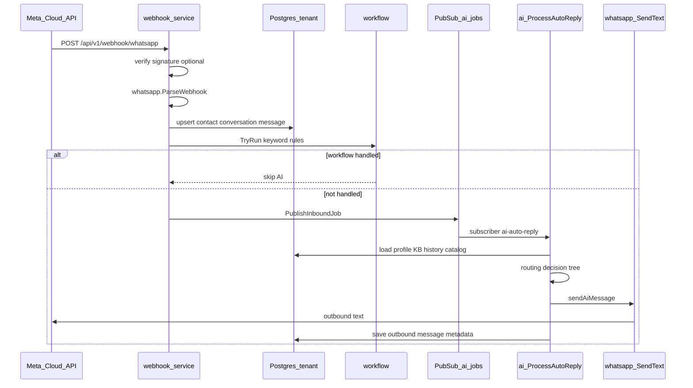
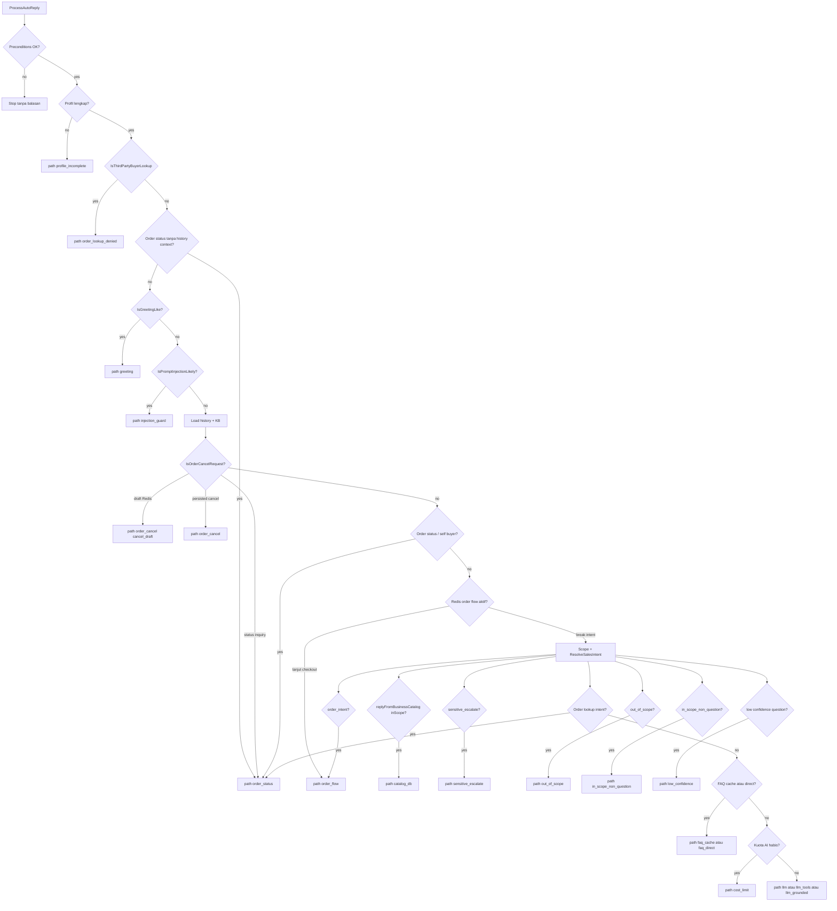

# WhatsApp Inbound → AI Routing

Panduan referensi **runtime**: bagaimana pesan masuk dari Meta sampai balasan AI terkirim, bagaimana intent dideteksi, dan path metadata apa yang tercatat.

> **Indeks semua docs:** [README.md](./README.md)  
> **Onboarding developer:** [APP_FLOW_GUIDE.md](../APP_FLOW_GUIDE.md) · [DEVELOPER_DOCUMENTATION.md](../DEVELOPER_DOCUMENTATION.md)

---

## Ringkasan end-to-end



| Tahap | Package / file | Fungsi utama |
|-------|----------------|--------------|
| HTTP webhook | `webhook/webhook.go` | `handleMetaWebhook`, `receiveWebhook`, `ingestMessage` |
| Parse payload | `whatsapp/whatsapp.go` | `ParseWebhook`, `VerifyWebhookSignature` |
| Antrian AI | `ai/inbound_jobs.go` | `PublishInboundJob`, `handleInboundAI` |
| Orchestrator | `ai/autoreply.go` | `ProcessAutoReply` |
| Kirim balasan | `ai/autoreply.go` | `sendAiMessage` → `whatsapp.SendText` |

**Endpoint webhook (alias):**

- `POST /api/v1/webhook/whatsapp`
- `POST /api/v1/whatsapp/webhook/meta`
- `POST /webhook/whatsapp` (legacy)

---

## Fase 1 — Webhook ingress

Urutan di `webhook.ingestMessage` (`webhook/webhook.go`):

| # | Langkah | Detail |
|---|---------|--------|
| 1 | Verifikasi signature | Header `X-Hub-Signature-256` vs `meta_app_secret` channel (jika header ada) |
| 2 | Parse payload | `whatsapp.ParseWebhook(body)` → slice `InboundMessage` |
| 3 | Resolve tenant | `resolveInboundChannel` via `system.whatsapp_inbound_map` (`meta_phone_number_id` → schema `t_<slug>`) |
| 4 | Idempotent insert | Skip jika `message.external_id` sudah ada |
| 5 | Upsert data | `upsertContact` → `upsertConversation` → `insertMessage` (direction `in`) |
| 6 | Update preview | `conversation.unread_count`, `last_message_preview`, status `open` |
| 7 | Workflow | `workflow.TryRun` — jika keyword match → **tidak** publish job AI |
| 8 | Publish AI job | `ai.PublishInboundJob` → topic Pub/Sub **`ai-jobs`** |
| 9 | Side effects | Summarize (jika perlu), SSE inbox realtime, `leads.CaptureFromMessage` |

**Workflow intercept:** Jika rule workflow menangani pesan (balasan tetap / handoff), AI auto-reply **tidak** dijalankan untuk pesan itu.

---

## Fase 2 — Pub/Sub job AI

File: `ai/inbound_jobs.go`

| Item | Nilai |
|------|-------|
| Topic | `ai-jobs` (`InboundAIJobs`) |
| Subscriber | `ai-auto-reply` |
| Retry | Encore `MaxRetries: 3` + counter Redis per `inboundMessageId` |
| Max attempt | 4 (`maxInboundAIAttempts`) |
| Gagal total | `FallbackAutoReplyJob` → path `auto_fallback`, pause AI opsional |

Payload job:

```json
{
  "tenantSchema": "t_slug",
  "conversationId": "uuid",
  "inboundMessageId": "uuid",
  "inboundType": "text"
}
```

Entry point handler: `ProcessAutoReplyJob` → `AutoReplyService.ProcessAutoReply`.

---

## Fase 3 — Preconditions (`ProcessAutoReply`)

Sebelum routing intent, pipeline **berhenti tanpa balasan** (atau error) jika:

| Kondisi | Efek |
|---------|------|
| `conversation.ai_handled = false` | Handoff ke staff — error `AI_HANDOFF_PAUSED` |
| Bukan pesan `in` dari `contact` | Skip |
| Tipe media tidak diproses | `inboundTextForAutoReply` false (mis. audio tanpa caption) — lihat `ai/inbound_media.go` |
| `business_profile.ai_enabled = false` | Skip |
| Channel bukan `meta_cloud` / tidak `connected` | Skip |
| `access_token` atau `meta_phone_number_id` kosong | Skip |
| Profil bisnis tidak lengkap | Balas default → **`path: profile_incomplete`** |

Teks yang diproses:

- Pesan `text` — body langsung
- `image` / `video` / `document` — **hanya jika ada caption**
- Audio tanpa transkripsi — tidak diproses AI

---

## Fase 4 — Decision tree routing

Urutan **mencerminkan kode** di `ai/autoreply.go` → `ProcessAutoReply`. Beberapa cabang muncul lebih dari sekali (early vs setelah load history) — disengaja.



### Catatan urutan penting

1. **Third-party buyer lookup** (`pembeli dengan nama X`) dicek **sebelum** greeting dan FAQ — path `order_lookup_denied`, tanpa LLM.
2. **Order status** (`IsOrderStatusInquiry`, `IsSelfBuyerOrderLookup`) dicek **sebelum** greeting agar `"halo, punya pesanan aktif?"` tidak dianggap sapaan murni.
3. Pesan dengan **`wantsOrderContextFromHistory`** (`pesanan tadi`, `yang barusan`) **tidak** di-route early — butuh history chat untuk parse `WB-` dari outbound.
4. Guard order lookup diulang **sebelum FAQ cache** agar FAQ tidak hijack intent order.
5. **Katalog DB** (`catalog_reply.go`) diprioritaskan sebelum classifier out-of-scope untuk pertanyaan list/harga produk.

---

## Tabel deteksi intent

| Fungsi deteksi | File | Contoh pemicu | Path metadata | LLM? |
|----------------|------|---------------|---------------|------|
| `IsThirdPartyBuyerLookup` | `ai/order_customer.go` | `pembeli dengan nama Lavana Snack ada?` | `order_lookup_denied` | Tidak |
| `IsOrderStatusInquiry` | `ai/order_customer.go` | `pesanan saya`, `status pesanan`, `masih punya pesanan?` | `order_status` | Tidak |
| `IsSelfBuyerOrderLookup` | `ai/order_customer.go` | `pembeli atas nama saya`, `Nama: supriyanto` + pembeli | `order_status` | Tidak |
| `IsOrderCancelRequest` | `ai/order_customer.go` | `batalkan pesanan`, `batal`, `ga jadi` | `order_cancel` | Tidak |
| `ShouldCancelPersistedOrder` | `ai/order_customer.go` | `batalkan` eksplisit ke order DB | `order_cancel` | Tidak |
| `IsGreetingLike` | `ai/greeting.go` | `halo`, `selamat pagi` | `greeting` | Tidak |
| `IsGreetingFeedback` | `ai/greeting.go` | `makasih min` setelah sapaan | `greeting` | Tidak |
| `IsPromptInjectionLikely` | `ai/safety.go` | Upaya manipulasi sistem | `injection_guard` | Tidak |
| `replyFromBusinessCatalog` | `ai/catalog_reply.go` | `list produk`, `harga kaos L`, caption foto produk | `catalog_db` | Tidak |
| `ResolveSalesIntent` | `ai/sales_intent.go` | Menggabungkan sinyal → `SalesState` / topic | Mempengaruhi classifier label | — |
| `classifyMessage` | `ai/autoreply.go` | Keyword sensitif, out-of-scope | `sensitive_escalate`, `out_of_scope`, dll. | Tidak |
| `handleOrderFlow` | `ai/order_flow.go` | Lanjut checkout Redis (qty, alamat, dll.) | `order_flow` | Sebagian (konsultasi) |
| `tryFAQDirectAnswer` | `ai/classifier_routing.go` | Match KB kuat; **skip** order lookup | `faq_direct` | Tidak |
| FAQ cache Redis | `ai/autoreply.go` | Pertanyaan pernah dijawab | `faq_cache` | Tidak |
| Anthropic + routing | `ai/routing.go`, `ai/classifier_routing.go` | Pertanyaan in-scope tanpa jawaban deterministik | `llm`, `llm_tools`, `llm_grounded` | Ya |
| Kuota habis | `ai/autoreply.go` | Limit token/bulan | `cost_limit` | Tidak |
| Retry habis | `ai/inbound_jobs.go` | Error berulang | `auto_fallback` | Tidak |

Deep dive order chat: [ORDER_CUSTOMER_CHAT.md](./ORDER_CUSTOMER_CHAT.md)  
Ownership: [ORDER_OWNERSHIP_RESEARCH.md](./ORDER_OWNERSHIP_RESEARCH.md)

---

## Tabel path metadata (`message.metadata.path`)

Semua konstanta di `ai/reply_meta.go`:

| Path | Arti singkat | `llmUsed` |
|------|--------------|-----------|
| `profile_incomplete` | Profil bisnis belum lengkap | false |
| `greeting` | Sapaan / feedback sapaan | false |
| `injection_guard` | Prompt injection ditolak | false |
| `sensitive_escalate` | Eskalasi CS (keyword sensitif) | false |
| `out_of_scope` | Di luar scope bisnis | false |
| `in_scope_non_question` | In-scope tapi bukan pertanyaan | false |
| `low_confidence` | Classifier confidence rendah | false |
| `order_flow` | State machine checkout Redis | false* |
| `order_cancel` | Batalkan draft atau order DB | false |
| `order_status` | Cek status pesanan scoped | false |
| `order_lookup_denied` | Cari pembeli orang lain ditolak | false |
| `catalog_db` | Jawaban dari `business_catalog_item` | false |
| `consulting` | Balasan konsultasi ringan | false |
| `faq_cache` | Jawaban dari cache Redis | false |
| `faq_direct` | Jawaban KB tanpa LLM | false |
| `llm` | Balasan Anthropic (Haiku/Sonnet) | true |
| `llm_tools` | LLM + tool katalog | true |
| `llm_grounded` | LLM dengan grounding KB | true |
| `cost_limit` | Kuota AI habis | false |
| `auto_fallback` | Fallback setelah retry gagal | false |

\* Order flow mayoritas deterministik; beberapa cabang konsultasi memakai path `consulting`.

Field audit lain di metadata: `reason`, `orderId`, `orderAction`, `model`, `tier`.

Log terstruktur: `AI job: outcome` via `AiReplyMeta.LogAndRecord`.

---

## Resolve order status (subset routing)

Prioritas di `resolvePersistedOrderStatus` (`ai/order_customer.go`):

1. Nomor `WB-...` eksplisit di pesan
2. `WB-...` dari history outbound (`pesanan tadi`, dll.)
3. Hint penerima `Nama:` / `HP:` — match `shipping_address` order scoped
4. Pesanan aktif / terbaru milik chat (`conversation_id` + `contact_id`)

Query **tidak pernah** global by nama customer lain.

---

## Cara debug & jawab pertanyaan

### 1. Lihat metadata pesan di inbox

Buka pesan outbound → `metadata.path` dan `metadata.llmUsed`. Ini jawaban paling cepat untuk “kenapa dapat jawaban ini?”.

### 2. Log Encore

```bash
cd api-go && encore run
```

Cari baris:

- `processing inbound AI job` — job masuk
- `AI job: inbound text` — teks yang diproses
- `AI job: scope check` / `AI job: classifier` — keputusan scope
- `AI job: outcome` — path final

### 3. Trigger manual (dev)

```bash
curl -X POST http://localhost:4000/api/v1/internal/ai/auto-reply \
  -H "Content-Type: application/json" \
  -H "X-Ai-Internal-Token: $AI_INTERNAL_TOKEN" \
  -d '{"tenantId":"...","tenantSchema":"t_slug","conversationId":"...","inboundMessageId":"..."}'
```

Secret: `AiInternalToken` (sama dengan `AI_INTERNAL_TOKEN` di `api/.env`).

### 4. Simulator tanpa DB penuh

`ConversationSimulator.Turn` di `ai/conversation_sim.go` — mirror routing early (greeting, order status, third-party deny) untuk test unit.

### 5. Test intent

```bash
encore test ./ai/ -run 'BuyerLookup|OrderStatus|Greeting' -count=1
```

---

## File kunci (quick reference)

| File | Peran |
|------|-------|
| `webhook/webhook.go` | Ingest webhook, publish job |
| `whatsapp/whatsapp.go` | Parse & kirim pesan Meta |
| `ai/inbound_jobs.go` | Pub/Sub queue |
| `ai/autoreply.go` | Orchestrator utama |
| `ai/order_customer.go` | Intent order status/cancel/lookup |
| `ai/order_flow.go` | Checkout state machine (Redis) |
| `ai/catalog_reply.go` | Jawaban katalog DB |
| `ai/greeting.go` | Sapaan |
| `ai/safety.go` | Injection & scope sensitif |
| `ai/sales_intent.go` | `ResolveSalesIntent` |
| `ai/product_scope.go` | Scope bisnis |
| `ai/classifier_routing.go` | FAQ direct, model routing |
| `ai/routing.go` | Haiku vs Sonnet per plan |
| `ai/reply_meta.go` | Konstanta path metadata |
| `ai/inbound_media.go` | Caption media → teks untuk AI |
| `workflow/` | Keyword rules sebelum AI |

---

## Deep link

| Topik | Dokumen |
|-------|---------|
| Order via chat | [ORDER_CUSTOMER_CHAT.md](./ORDER_CUSTOMER_CHAT.md) |
| Ownership | [ORDER_OWNERSHIP_RESEARCH.md](./ORDER_OWNERSHIP_RESEARCH.md) |
| Riset frasa buyer | [ORDER_STATUS_BUYER_RESEARCH.md](./ORDER_STATUS_BUYER_RESEARCH.md) |
| Roadmap fase WA | [WHATSAPP_INBOX_MEDIA_PAYMENT_STOCK.md](./WHATSAPP_INBOX_MEDIA_PAYMENT_STOCK.md) |
| Fitur shipped | [docs-development-shipped/](../docs-development-shipped/) |
| Kuota & model AI | [LIMITS_AND_QUOTAS.md](../LIMITS_AND_QUOTAS.md) |

---

## Changelog

| Tanggal | Perubahan |
|---------|-----------|
| 2026-06-14 | Dokumen kanonik routing webhook → AI |
